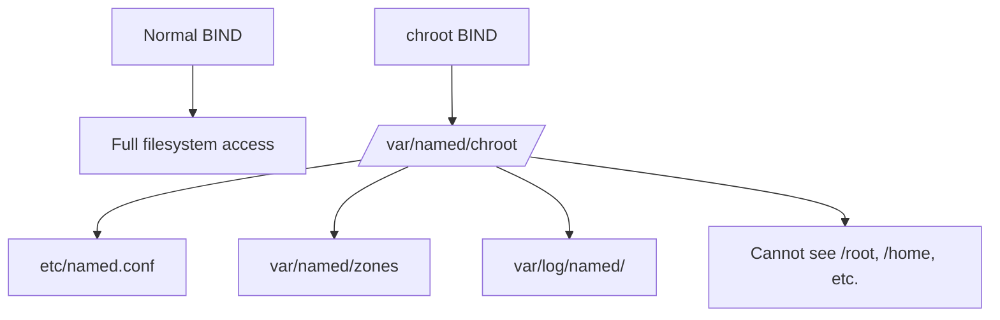

# How to Run BIND in a chroot Environment on RHEL 9

Author: [nawazdhandala](https://www.github.com/nawazdhandala)

Tags: RHEL, BIND, chroot, DNS Security, Linux

Description: Secure your BIND DNS server on RHEL 9 by running it in a chroot jail, limiting the damage if the service is ever compromised.

---

Running BIND in a chroot environment means the named process sees a restricted view of the filesystem. If someone exploits a vulnerability in BIND, they're trapped in the chroot directory and can't access the rest of the system. It's not bulletproof security, but it adds a meaningful layer of defense. RHEL 9 makes this pretty easy with the `bind-chroot` package.

## What chroot Does

A chroot changes the apparent root directory for a process. When BIND runs in a chroot at `/var/named/chroot`, it sees that directory as `/`. It cannot access anything outside that tree.



## Installing bind-chroot

Install the chroot package alongside BIND:

```bash
dnf install bind bind-chroot bind-utils -y
```

The `bind-chroot` package creates the chroot directory structure and provides a systemd service unit that runs named inside the chroot.

## Understanding the chroot Directory Structure

After installation, the chroot lives at `/var/named/chroot`. The package sets up the necessary directory layout:

```bash
ls -la /var/named/chroot/
```

Key paths inside the chroot:

| chroot Path | Maps to |
|-------------|---------|
| `/var/named/chroot/etc/named.conf` | BIND configuration |
| `/var/named/chroot/var/named/` | Zone files |
| `/var/named/chroot/var/log/named/` | Log files |
| `/var/named/chroot/run/named/` | PID file |

## Migrating Existing Configuration

If you already have a BIND configuration, copy it into the chroot:

Copy the main configuration:

```bash
cp /etc/named.conf /var/named/chroot/etc/named.conf
```

Copy zone files:

```bash
cp /var/named/*.zone /var/named/chroot/var/named/
cp /var/named/*.rev /var/named/chroot/var/named/
cp /var/named/named.ca /var/named/chroot/var/named/
cp /var/named/named.localhost /var/named/chroot/var/named/
cp /var/named/named.loopback /var/named/chroot/var/named/
```

If you have additional config files:

```bash
cp -r /etc/named/ /var/named/chroot/etc/named/
```

## Setting Up the chroot Environment

Create necessary directories inside the chroot:

```bash
mkdir -p /var/named/chroot/var/log/named
mkdir -p /var/named/chroot/var/named/data
mkdir -p /var/named/chroot/var/named/dynamic
mkdir -p /var/named/chroot/var/named/slaves
mkdir -p /var/named/chroot/run/named
```

Set ownership:

```bash
chown -R named:named /var/named/chroot/var/named
chown -R named:named /var/named/chroot/var/log/named
chown named:named /var/named/chroot/run/named
```

## Configuring named.conf for chroot

The configuration file paths inside the chroot are relative to the chroot root. Since BIND sees `/var/named/chroot` as `/`, paths in named.conf remain the same as a non-chroot setup:

```bash
cat > /var/named/chroot/etc/named.conf << 'EOF'
options {
    listen-on port 53 { any; };
    listen-on-v6 port 53 { any; };
    directory "/var/named";
    dump-file "/var/named/data/cache_dump.db";
    statistics-file "/var/named/data/named_stats.txt";

    allow-query { localhost; 10.0.0.0/8; 192.168.0.0/16; };
    recursion yes;
    allow-recursion { localhost; 10.0.0.0/8; 192.168.0.0/16; };

    dnssec-validation auto;
    managed-keys-directory "/var/named/dynamic";
    pid-file "/run/named/named.pid";
    session-keyfile "/run/named/session.key";
};

logging {
    channel default_log {
        file "/var/log/named/default.log" versions 3 size 5m;
        severity info;
        print-time yes;
    };
    category default { default_log; };
};

zone "." IN {
    type hint;
    file "named.ca";
};

zone "example.com" IN {
    type primary;
    file "example.com.zone";
    allow-update { none; };
};
EOF
```

Notice the paths look normal. BIND doesn't know it's in a chroot.

## Switching to the chroot Service

Stop the regular named service and start the chroot version:

```bash
systemctl stop named
systemctl disable named

systemctl enable --now named-chroot
```

Verify it's running:

```bash
systemctl status named-chroot
```

Check that DNS is responding:

```bash
dig @localhost example.com
```

## Verifying the chroot

Confirm the process is running inside the chroot:

```bash
# Find the named PID
pidof named

# Check the root directory of the process
ls -la /proc/$(pidof named)/root
```

The root link should point to `/var/named/chroot`.

## Managing the chroot BIND

Day-to-day management is almost identical to non-chroot BIND. The main difference is file locations.

Edit zone files inside the chroot:

```bash
vi /var/named/chroot/var/named/example.com.zone
```

Check configuration:

```bash
named-checkconf -t /var/named/chroot /etc/named.conf
```

The `-t` flag tells named-checkconf to use the chroot directory as the root.

Validate zone files:

```bash
named-checkzone example.com /var/named/chroot/var/named/example.com.zone
```

Reload after changes:

```bash
rndc reload
```

The `rndc` command works the same way regardless of chroot.

## Troubleshooting

**Service fails to start:** Check the journal for errors:

```bash
journalctl -u named-chroot --no-pager -n 30
```

Common issues are missing files or wrong permissions inside the chroot.

**Permission denied errors:** Make sure the named user owns the right directories:

```bash
chown -R named:named /var/named/chroot/var/named
chown -R named:named /var/named/chroot/var/log/named
```

**SELinux denials:** The bind-chroot package includes the necessary SELinux policies, but if you've customized your setup:

```bash
ausearch -m avc -ts recent | grep named
```

**Missing device files:** BIND needs access to `/dev/random` and `/dev/null`. The chroot package usually handles this, but verify:

```bash
ls -la /var/named/chroot/dev/
```

## Limitations of chroot

Keep in mind that chroot is not a container. A process running as root inside a chroot can escape it. BIND mitigates this by dropping privileges to the named user. Combined with SELinux, the defense is solid. But don't treat chroot as a replacement for keeping BIND updated and properly configured. It's one layer in a defense-in-depth approach.

Running BIND in a chroot is a sensible hardening measure that costs almost nothing in terms of performance or management overhead. The bind-chroot package does most of the heavy lifting, and once it's set up, you barely notice the difference.
