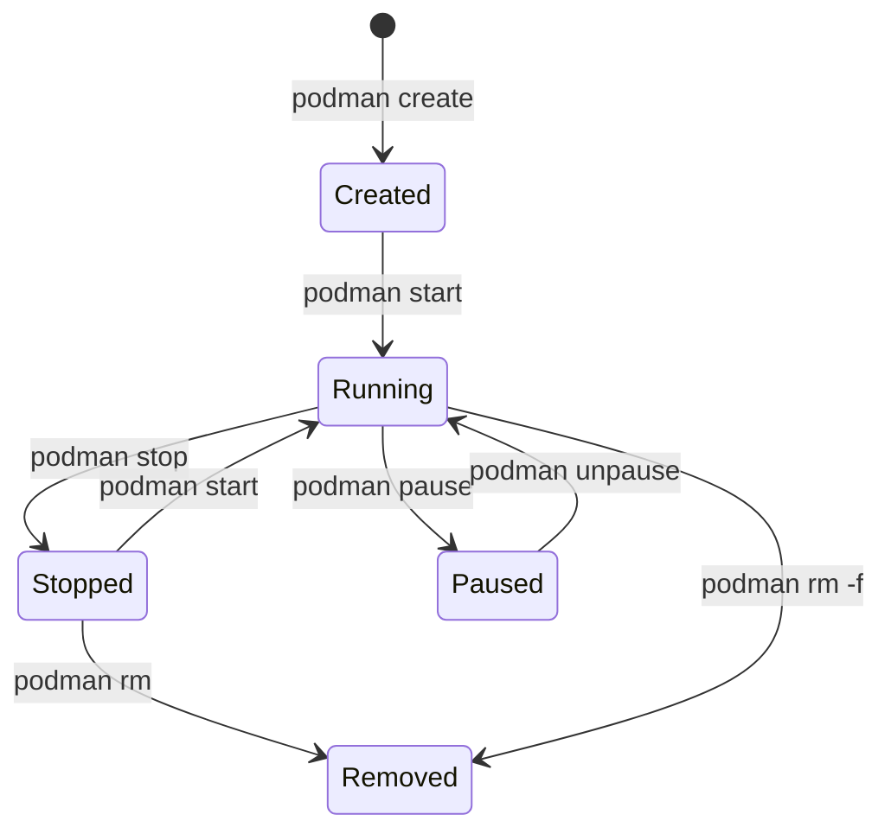

# How to Run Your First Container with Podman on RHEL 9

Author: [nawazdhandala](https://www.github.com/nawazdhandala)

Tags: RHEL, Podman, Containers, Linux

Description: Step-by-step tutorial on running, managing, and troubleshooting your first container with Podman on RHEL 9, covering essential commands every sysadmin should know.

---

So you have Podman installed on your RHEL 9 box and want to get a container running. Good news - if you have any Docker experience, most commands translate directly. Podman was designed as a drop-in replacement, so `podman run` behaves almost identically to `docker run`.

Let me walk you through running your first container and the essential commands you will use daily.

## Pulling a Container Image

Before running anything, you need an image. Let us grab the Red Hat Universal Base Image:

# Pull UBI 9 from the Red Hat registry
```bash
podman pull registry.access.redhat.com/ubi9/ubi
```

If you have configured `docker.io` in your registries, you can also pull from Docker Hub:

# Pull nginx from Docker Hub
```bash
podman pull docker.io/library/nginx:latest
```

# List all downloaded images
```bash
podman images
```

## Running Your First Container

The simplest way to run a container is the `podman run` command:

# Run a container interactively with a shell
```bash
podman run -it --name myubi registry.access.redhat.com/ubi9/ubi /bin/bash
```

The flags here:
- `-i` keeps STDIN open for interactive use
- `-t` allocates a pseudo-TTY
- `--name myubi` gives the container a friendly name

You are now inside the container. Run a few commands to poke around:

```bash
cat /etc/redhat-release
hostname
whoami
exit
```

## Running a Container in the Background

Most production containers run detached in the background:

# Run nginx in the background, mapping port 8080 on the host to port 80 in the container
```bash
podman run -d --name webserver -p 8080:80 docker.io/library/nginx:latest
```

# Verify it is running
```bash
podman ps
```

# Test the web server
```bash
curl http://localhost:8080
```

You should see the default nginx welcome page HTML.

## Container Lifecycle Management

Here are the commands you will use constantly:



# Stop a running container gracefully (sends SIGTERM, then SIGKILL after timeout)
```bash
podman stop webserver
```

# Start a stopped container
```bash
podman start webserver
```

# Restart a container
```bash
podman restart webserver
```

# Pause and unpause a container (freezes processes using cgroups)
```bash
podman pause webserver
podman unpause webserver
```

# Remove a stopped container
```bash
podman stop webserver
podman rm webserver
```

# Force remove a running container
```bash
podman rm -f webserver
```

## Viewing Container Logs

When something goes wrong - and it will - logs are your first stop:

# View all logs for a container
```bash
podman logs webserver
```

# Follow logs in real-time (like tail -f)
```bash
podman logs -f webserver
```

# Show only the last 50 lines
```bash
podman logs --tail 50 webserver
```

# Show logs with timestamps
```bash
podman logs -t webserver
```

## Executing Commands Inside a Running Container

Need to poke around inside a running container? Use `exec`:

# Open a shell inside the running container
```bash
podman exec -it webserver /bin/bash
```

# Run a single command without entering the container
```bash
podman exec webserver cat /etc/nginx/nginx.conf
```

# Run a command as a specific user
```bash
podman exec --user nginx webserver whoami
```

## Passing Environment Variables

Many containers need configuration through environment variables:

# Pass environment variables at runtime
```bash
podman run -d --name mydb \
  -e MYSQL_ROOT_PASSWORD=secretpass \
  -e MYSQL_DATABASE=myapp \
  -p 3306:3306 \
  docker.io/library/mariadb:latest
```

# Verify the variables are set inside the container
```bash
podman exec mydb env | grep MYSQL
```

## Inspecting Containers

The `inspect` command gives you the full JSON detail of a container:

# Get all details about a container
```bash
podman inspect webserver
```

# Get just the IP address
```bash
podman inspect --format '{{.NetworkSettings.IPAddress}}' webserver
```

# Get the container's state
```bash
podman inspect --format '{{.State.Status}}' webserver
```

## Resource Usage Monitoring

Keep an eye on what your containers are consuming:

# Show real-time resource usage for all running containers
```bash
podman stats
```

# Show stats for a specific container without streaming
```bash
podman stats --no-stream webserver
```

This shows CPU, memory, network I/O, and block I/O, similar to `docker stats`.

## Copying Files Between Host and Container

Sometimes you need to move files in or out:

# Copy a file from host to container
```bash
podman cp /tmp/myconfig.conf webserver:/etc/nginx/conf.d/
```

# Copy a file from container to host
```bash
podman cp webserver:/var/log/nginx/access.log /tmp/
```

## Cleaning Up

Containers and images accumulate over time. Clean up regularly:

# Remove all stopped containers
```bash
podman container prune
```

# Remove all unused images
```bash
podman image prune
```

# Nuclear option - remove everything (containers, images, volumes)
```bash
podman system prune -a
```

## Running Containers That Restart Automatically

If you want a container to restart on failure or reboot, combine with systemd (covered in a later post) or use the `--restart` flag:

# Restart the container unless it was explicitly stopped
```bash
podman run -d --name webserver --restart unless-stopped -p 8080:80 docker.io/library/nginx:latest
```

Note that `--restart` policies require the Podman service to be running. For production, systemd integration with Quadlet is the better approach.

## Troubleshooting Common Issues

**Container exits immediately:** Check the logs with `podman logs <name>`. The most common cause is a missing entrypoint or a command that finishes instantly.

**Port already in use:** Check what is using the port with `ss -tlnp | grep 8080` and either stop that service or choose a different port.

**Permission denied:** If running rootless, make sure your user has the right subuid/subgid mappings. Check with `podman unshare cat /proc/self/uid_map`.

**Image pull fails:** Verify your registry configuration in `/etc/containers/registries.conf` and check that you are authenticated if pulling from a private registry.

## Summary

You now have the fundamentals of running containers with Podman on RHEL 9. The workflow is straightforward: pull an image, run it, manage its lifecycle, and check logs when things go sideways. In the next posts, we will cover rootless containers, building images, and more advanced topics.
