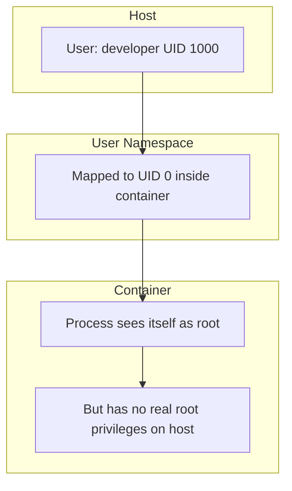

# How to Run Rootless Containers with Podman on RHEL 9

Author: [nawazdhandala](https://www.github.com/nawazdhandala)

Tags: RHEL, Podman, Rootless, Security, Linux

Description: Learn how to run containers as a regular user without root privileges on RHEL 9 using Podman's rootless mode, improving security and reducing attack surface.

---

Running containers as root has always been a security concern. If a container escape happens and you are running as root, the attacker gets root on your host. Podman on RHEL 9 solves this by letting you run containers as a regular, unprivileged user. No daemon, no root, no sweat.

I have been running rootless containers in production for a while now, and the only time I miss rootful mode is when I need to bind to ports below 1024. Even that is fixable.

## How Rootless Containers Work

Rootless containers use Linux user namespaces to map your regular UID to UID 0 inside the container. The process thinks it is root, but on the host, it is running as your unprivileged user.



## Prerequisites

Before you can run rootless containers, your user needs subordinate UID and GID ranges defined.

# Check if your user has subuid/subgid mappings
```bash
grep $USER /etc/subuid
grep $USER /etc/subgid
```

You should see something like `developer:100000:65536`. If not, add them:

# Add subordinate UID/GID ranges for your user
```bash
sudo usermod --add-subuids 100000-165535 --add-subgids 100000-165535 $USER
```

After adding the mappings, migrate Podman's storage:

```bash
podman system migrate
```

## Running Your First Rootless Container

Just run Podman as your regular user, no sudo needed:

# Pull and run a container as a regular user
```bash
podman pull registry.access.redhat.com/ubi9/ubi-minimal
podman run --rm -it registry.access.redhat.com/ubi9/ubi-minimal /bin/bash
```

Inside the container, check your identity:

```bash
whoami
id
```

You will see `root` inside the container, but on the host, the process runs as your user. Verify this by opening another terminal:

# On the host, check the actual process owner
```bash
ps aux | grep -i "ubi-minimal"
```

The process owner will be your regular user, not root.

## Understanding the UID Mapping

The subuid range you configured determines how UIDs inside the container map to UIDs on the host:

# View the current UID mapping inside the Podman namespace
```bash
podman unshare cat /proc/self/uid_map
```

This shows three columns: the UID inside the namespace, the UID on the host, and the range size.

# See how a specific container UID maps to a host UID
```bash
podman top <container-id> huser user
```

This shows both the host user (huser) and the container user (user) side by side.

## Storage for Rootless Containers

Rootless containers store data differently than rootful ones:

- Rootful storage: `/var/lib/containers/storage/`
- Rootless storage: `~/.local/share/containers/storage/`

# Check where your rootless images and containers are stored
```bash
podman info --format '{{.Store.GraphRoot}}'
```

If your home directory is on a small partition, you can redirect storage by creating a user-level config:

```bash
mkdir -p ~/.config/containers
```

# Create a user-level storage config
```bash
cat > ~/.config/containers/storage.conf << 'EOF'
[storage]
driver = "overlay"
graphroot = "/data/containers/storage"
EOF
```

After changing storage location, reset:

```bash
podman system reset
```

## Handling Port Binding Below 1024

By default, unprivileged users cannot bind to ports below 1024. If you try, you will get a permission error:

```bash
podman run -d -p 80:80 docker.io/library/nginx:latest
# Error: rootlessport cannot expose privileged port 80
```

Fix this by lowering the unprivileged port start:

# Allow unprivileged users to bind to port 80 and above
```bash
sudo sysctl -w net.ipv4.ip_unprivileged_port_start=80
```

# Make it persistent across reboots
```bash
echo "net.ipv4.ip_unprivileged_port_start=80" | sudo tee /etc/sysctl.d/99-unprivileged-ports.conf
sudo sysctl --system
```

## Enabling Lingering for Rootless Services

By default, user services (including rootless containers managed by systemd) stop when the user logs out. Enable lingering to keep them running:

# Enable lingering so containers survive logout
```bash
sudo loginctl enable-linger $USER
```

# Verify lingering is enabled
```bash
loginctl show-user $USER --property=Linger
```

This is critical for any rootless container you want running as a service.

## Rootless Networking

Rootless containers use `slirp4netns` or `pasta` for networking instead of the CNI/netavark bridge that rootful containers use.

# Check which network mode rootless containers are using
```bash
podman info --format '{{.Host.NetworkBackend}}'
```

On RHEL 9, `pasta` is the default rootless network handler. It provides better performance than `slirp4netns`:

# Run a container with the default pasta network
```bash
podman run -d --name web -p 8080:80 docker.io/library/nginx:latest
```

## File Permissions with Rootless Containers

When you mount host directories into rootless containers, permissions can be tricky. The container's root user maps to your host UID, but other container UIDs map to your subordinate range.

# Mount a directory with proper permissions
```bash
mkdir -p ~/container-data
podman run -v ~/container-data:/data:Z registry.access.redhat.com/ubi9/ubi ls -la /data
```

The `:Z` suffix tells Podman to relabel the directory for SELinux compatibility.

If the container process runs as a non-root user internally, you may need to adjust ownership:

# Change ownership inside the user namespace
```bash
podman unshare chown 1000:1000 ~/container-data
```

## Rootless Container Resource Limits

With cgroups v2 on RHEL 9, rootless containers can set resource limits:

# Run with memory and CPU limits as a regular user
```bash
podman run --rm --memory 256m --cpus 0.5 registry.access.redhat.com/ubi9/ubi-minimal stress-ng --vm 1 --vm-bytes 200M --timeout 10s
```

# Verify cgroups v2 is active
```bash
stat -fc %T /sys/fs/cgroup/
```

If it returns `cgroup2fs`, you are on v2 and rootless resource limits will work.

## Debugging Rootless Container Issues

When things go wrong with rootless containers, check these:

# Verify your user namespace setup
```bash
podman unshare cat /proc/self/uid_map
podman unshare cat /proc/self/gid_map
```

# Check for namespace-related errors
```bash
podman system info 2>&1 | grep -i error
```

# Reset rootless storage if things get corrupted
```bash
podman system reset
```

Common problems and fixes:
- **ERRO[0000] cannot find UID/GID:** Run `podman system migrate` after updating subuid/subgid.
- **Permission denied on volume mounts:** Use the `:Z` SELinux label or `podman unshare chown`.
- **Container cannot reach network:** Check that `pasta` or `slirp4netns` is installed.

## Comparing Rootless and Rootful Containers

| Feature | Rootless | Rootful |
|---------|----------|---------|
| Ports below 1024 | Needs sysctl change | Works by default |
| Network performance | Slightly lower | Native |
| Security | Better isolation | Root on host |
| Storage location | User home dir | /var/lib/containers |
| cgroups limits | Supported on v2 | Full support |

## Summary

Rootless containers on RHEL 9 with Podman give you solid container isolation without running anything as root. The setup takes a few minutes, and the security benefits are significant. For most workloads, rootless mode should be your default. Save rootful mode for the edge cases where you truly need it.
