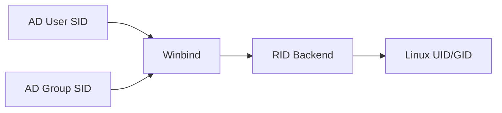

# How to Integrate Samba with Active Directory on RHEL Using Winbind

Author: [nawazdhandala](https://www.github.com/nawazdhandala)

Tags: RHEL, Samba, Active Directory, Winbind, Linux

Description: Use Winbind to integrate Samba with Active Directory on RHEL for seamless domain user authentication and ID mapping on file shares.

---

## What Winbind Does

Winbind is the component of Samba that handles communication with Active Directory. It translates Windows SIDs to Linux UIDs/GIDs, authenticates users against AD, and makes domain users and groups visible to the Linux system. This lets you use AD credentials for Samba share access and even for SSH logins.

## Prerequisites

- RHEL with root access
- A Windows Active Directory domain
- DNS pointing to the AD domain controller
- Time synchronized with AD (within 5 minutes)

## Step 1 - Install Packages

```bash
# Install Samba and Winbind packages
sudo dnf install -y samba samba-winbind samba-winbind-clients \
    samba-client krb5-workstation oddjob oddjob-mkhomedir
```

## Step 2 - Configure DNS and Time

```bash
# Set DNS to the AD domain controller
sudo nmcli connection modify ens192 ipv4.dns "192.168.1.5"
sudo nmcli connection modify ens192 ipv4.dns-search "example.com"
sudo nmcli connection up ens192

# Verify DNS
host example.com
host _ldap._tcp.example.com

# Sync time with AD
sudo dnf install -y chrony
echo "server dc1.example.com iburst" | sudo tee -a /etc/chrony.conf
sudo systemctl restart chronyd
```

## Step 3 - Configure Kerberos

Edit /etc/krb5.conf:

```ini
[libdefaults]
    default_realm = EXAMPLE.COM
    dns_lookup_realm = false
    dns_lookup_kdc = true

[realms]
    EXAMPLE.COM = {
        kdc = dc1.example.com
        admin_server = dc1.example.com
    }

[domain_realm]
    .example.com = EXAMPLE.COM
    example.com = EXAMPLE.COM
```

Test Kerberos:

```bash
# Get a Kerberos ticket
kinit administrator@EXAMPLE.COM
klist
```

## Step 4 - Configure Samba and Winbind

Edit /etc/samba/smb.conf:

```ini
[global]
    workgroup = EXAMPLE
    realm = EXAMPLE.COM
    security = ads

    # Winbind configuration
    winbind use default domain = yes
    winbind enum users = yes
    winbind enum groups = yes
    winbind refresh tickets = yes
    winbind offline logon = yes

    # ID mapping
    idmap config * : backend = tdb
    idmap config * : range = 3000-7999
    idmap config EXAMPLE : backend = rid
    idmap config EXAMPLE : range = 10000-999999

    # Template for domain users
    template homedir = /home/%U
    template shell = /bin/bash

[shared]
    path = /srv/samba/shared
    writable = yes
    valid users = @"Domain Users"
```

## Step 5 - Join the Domain

```bash
# Join the AD domain
sudo net ads join -U administrator

# Verify the join
sudo net ads testjoin
```

## Step 6 - Configure NSS and PAM

Tell the system to use Winbind for user/group lookups:

```bash
# Configure authselect to use winbind
sudo authselect select winbind with-mkhomedir --force

# Enable oddjobd for automatic home directory creation
sudo systemctl enable --now oddjobd
```

## Step 7 - Start Winbind

```bash
# Enable and start Winbind and Samba
sudo systemctl enable --now winbind smb

# Verify Winbind can communicate with AD
wbinfo -t    # Test trust secret
wbinfo -u    # List domain users
wbinfo -g    # List domain groups
```

## ID Mapping Explained



The RID backend algorithmically converts Windows SIDs to Linux UIDs/GIDs. This is deterministic, meaning the same SID always maps to the same UID on all servers using the same configuration.

### ID Mapping Range

The range must not overlap between backends:

```ini
# Default backend for unknown domains
idmap config * : range = 3000-7999

# Your domain's backend
idmap config EXAMPLE : range = 10000-999999
```

## Step 8 - Test User Lookups

```bash
# Look up a domain user
id jdoe

# Should output something like:
# uid=10501(jdoe) gid=10513(domain users) groups=10513(domain users)

# Look up a domain group
getent group "Domain Users"

# Authenticate as a domain user
wbinfo -a 'jdoe%password'
```

## Step 9 - Test Share Access

```bash
# Connect to the share as a domain user
smbclient //localhost/shared -U jdoe

# From a Windows client, use domain credentials
# \\rhel-server\shared with EXAMPLE\jdoe credentials
```

## Configuring Share Access with AD Groups

```ini
[projects]
    path = /srv/samba/projects
    writable = yes
    valid users = @"Domain Users"
    write list = @"Project Admins"
    read list = @"Domain Users"
```

## Troubleshooting Winbind

```bash
# Check Winbind status
sudo systemctl status winbind

# Test trust relationship
wbinfo -t

# Ping Winbind daemon
wbinfo -p

# Check for errors
journalctl -u winbind --since "10 minutes ago"

# Clear Winbind cache if stale
sudo net cache flush

# Restart Winbind after changes
sudo systemctl restart winbind
```

Common issues:
- DNS not resolving the AD domain
- Clock skew too large (check chronyd)
- Wrong realm or workgroup in smb.conf
- Overlapping ID mapping ranges

## Wrap-Up

Winbind provides tight integration between Samba and Active Directory on RHEL. Once configured, domain users can access Samba shares with their AD credentials, and Linux systems can resolve AD users and groups natively. The RID ID mapping backend provides consistent UID/GID mapping across multiple Linux servers. Take care with DNS, time sync, and ID mapping ranges, and the integration works reliably.
