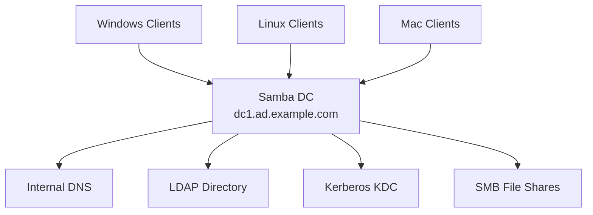

# How to Set Up Samba as a Domain Controller on RHEL

Author: [nawazdhandala](https://www.github.com/nawazdhandala)

Tags: RHEL, Samba, Domain Controller, Linux

Description: Configure Samba as an Active Directory domain controller on RHEL, providing AD-compatible authentication services for mixed Linux and Windows environments.

---

## Samba as a Domain Controller

Samba can function as a full Active Directory domain controller, providing authentication, group policy, and directory services compatible with Windows clients. This is useful for environments that need AD functionality without Windows Server licensing, or for lab and development environments.

Note: Red Hat does not officially support Samba as an AD DC on RHEL. For production use, consider FreeIPA or Windows Server. This guide is intended for lab, testing, and specific use cases where Samba AD is the right choice.

## Prerequisites

- RHEL with root access
- A static IP address
- A valid hostname matching the intended domain
- Samba built with AD DC support (may require compilation from source or third-party packages)

## Step 1 - Install Samba AD DC Packages

The RHEL Samba packages may not include AD DC functionality. You may need to install from source:

```bash
# Install build dependencies
sudo dnf install -y gcc make python3-devel gnutls-devel libacl-devel \
    openldap-devel pam-devel readline-devel krb5-devel libtasn1-devel \
    libattr-devel jansson-devel libtirpc-devel rpcsvc-proto-devel \
    docbook-style-xsl gpgme-devel python3-gpg lmdb-devel

# Install standard Samba packages
sudo dnf install -y samba samba-client samba-dc krb5-workstation
```

## Step 2 - Set the Hostname

```bash
# Set a fully qualified hostname
sudo hostnamectl set-hostname dc1.ad.example.com

# Verify
hostname -f
```

## Step 3 - Provision the Domain

Remove any existing smb.conf before provisioning:

```bash
# Back up and remove existing config
sudo mv /etc/samba/smb.conf /etc/samba/smb.conf.bak

# Provision the domain
sudo samba-tool domain provision \
    --server-role=dc \
    --use-rfc2307 \
    --dns-backend=SAMBA_INTERNAL \
    --realm=AD.EXAMPLE.COM \
    --domain=AD \
    --adminpass='P@ssw0rd123'
```

The provision command creates:
- A new smb.conf configured for DC operation
- An internal LDAP database with the domain structure
- A Kerberos configuration
- DNS zones for the domain

## Step 4 - Configure Kerberos

The provisioning creates a krb5.conf. Copy it:

```bash
# Copy the generated Kerberos config
sudo cp /var/lib/samba/private/krb5.conf /etc/krb5.conf
```

## Step 5 - Start the Samba DC Service

The Samba DC runs as a single `samba` process, not the separate smbd/nmbd services:

```bash
# Disable standard Samba services
sudo systemctl disable --now smb nmb winbind

# Start the Samba DC service
sudo systemctl enable --now samba

# Check status
sudo systemctl status samba
```

## Step 6 - Verify the Domain Controller

```bash
# Test Kerberos authentication
kinit administrator@AD.EXAMPLE.COM

# List the Kerberos ticket
klist

# Test DNS
host -t SRV _ldap._tcp.ad.example.com localhost
host -t SRV _kerberos._tcp.ad.example.com localhost

# Test LDAP connectivity
sudo samba-tool domain level show
```

## Domain Architecture



## Step 7 - Configure the Firewall

```bash
# Open required ports for AD DC
sudo firewall-cmd --permanent --add-service=samba
sudo firewall-cmd --permanent --add-service=samba-dc
sudo firewall-cmd --permanent --add-service=dns
sudo firewall-cmd --permanent --add-service=kerberos
sudo firewall-cmd --permanent --add-service=ldap
sudo firewall-cmd --permanent --add-service=ldaps
sudo firewall-cmd --permanent --add-port=3268/tcp  # Global Catalog
sudo firewall-cmd --permanent --add-port=3269/tcp  # Global Catalog SSL
sudo firewall-cmd --reload
```

## Step 8 - Managing Users and Groups

```bash
# Create a domain user
sudo samba-tool user create jdoe --given-name=John --surname=Doe

# List users
sudo samba-tool user list

# Create a group
sudo samba-tool group add developers

# Add user to group
sudo samba-tool group addmembers developers jdoe

# List groups
sudo samba-tool group list

# Reset a password
sudo samba-tool user setpassword jdoe
```

## Step 9 - Join Windows Clients

On a Windows machine:

1. Set the DNS server to the Samba DC IP
2. Open System Properties, click "Change" next to computer name
3. Select "Domain" and enter `AD.EXAMPLE.COM`
4. Enter administrator credentials when prompted
5. Restart the computer

## Creating File Shares on the DC

```ini
# Add shares to smb.conf (after the auto-generated DC sections)
[shared]
    path = /srv/samba/shared
    read only = no
    valid users = @"AD\Domain Users"
```

Set up the directory:

```bash
sudo mkdir -p /srv/samba/shared
sudo chmod 2775 /srv/samba/shared
```

## Group Policy Support

Samba supports Group Policy Objects (GPOs):

```bash
# List GPOs
sudo samba-tool gpo listall

# Create a new GPO
sudo samba-tool gpo create "Custom Policy"

# Link a GPO to an OU
sudo samba-tool gpo setlink "OU=Workstations,DC=ad,DC=example,DC=com" \
    "{GPO-GUID}"
```

## DNS Management

```bash
# List DNS zones
sudo samba-tool dns zonelist dc1.ad.example.com

# Add a DNS record
sudo samba-tool dns add dc1.ad.example.com ad.example.com \
    server1 A 192.168.1.20

# Query DNS
sudo samba-tool dns query dc1.ad.example.com ad.example.com @ ALL
```

## Troubleshooting

```bash
# Check the DC status
sudo samba-tool domain level show

# Verify replication (if multi-DC)
sudo samba-tool drs showrepl

# Check database integrity
sudo samba-tool dbcheck

# View Samba logs
journalctl -u samba
sudo tail -f /var/log/samba/log.samba
```

## Wrap-Up

Running Samba as a domain controller on RHEL provides AD-compatible services for mixed environments. While not officially supported by Red Hat for production DC use, it works well for testing, development, and specific deployment scenarios. The samba-tool command handles user management, DNS, GPOs, and domain administration. For production Active Directory needs on Linux, evaluate FreeIPA as the Red Hat-supported alternative.
