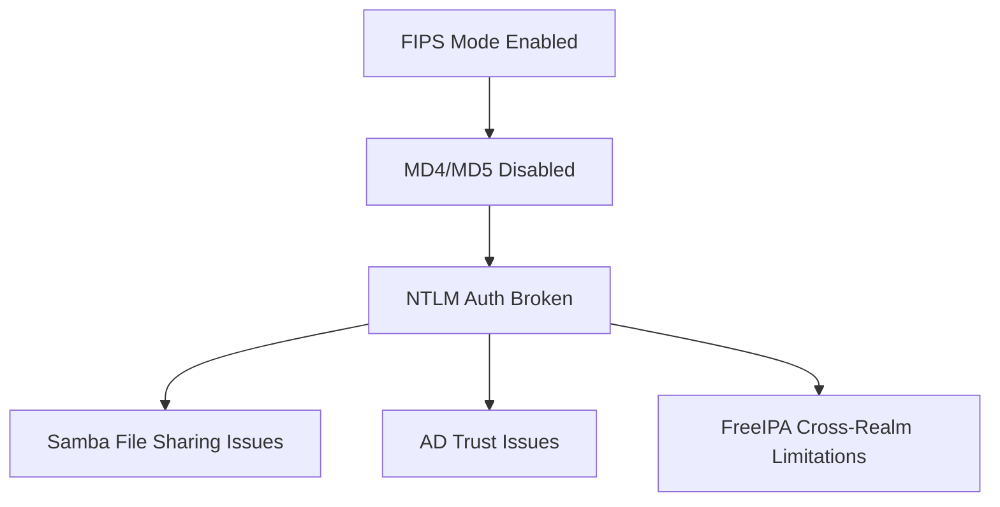

# How to Handle Samba and FreeIPA Compatibility in FIPS Mode on RHEL 9

Author: [nawazdhandala](https://www.github.com/nawazdhandala)

Tags: RHEL, FIPS, Samba, FreeIPA, Linux

Description: Navigate the compatibility challenges of running Samba and FreeIPA on RHEL 9 with FIPS mode enabled, including workarounds for NTLM and AD trust limitations.

---

Samba and FreeIPA are two of the most common services that have trouble in FIPS mode. The root cause is the same for both: they rely on older cryptographic protocols that FIPS does not allow. NTLM authentication, which is fundamental to Windows domain integration, uses MD4 and MD5 internally. These algorithms are not FIPS-approved, so enabling FIPS breaks the most common authentication path between Linux and Windows.

This guide covers the practical workarounds and configurations you need.

## The Core Problem



NTLM authentication hashes passwords with MD4 and uses MD5 in the challenge-response exchange. Since FIPS mode disables both algorithms, any authentication flow that relies on NTLM will fail.

## Samba in FIPS Mode

### What Works

- Kerberos authentication between Linux clients and Samba servers
- Samba as a member of an Active Directory domain (using Kerberos)
- SMB3 encryption (uses AES, which is FIPS-approved)

### What Does Not Work

- NTLM authentication (NTLMv1 and NTLMv2)
- Samba as an Active Directory Domain Controller
- Legacy SMB1 connections

### Configure Samba for FIPS Compatibility

```bash
# Configure Samba to use Kerberos instead of NTLM
cat >> /etc/samba/smb.conf << 'EOF'

[global]
    # Force Kerberos authentication
    kerberos method = secrets and keytab

    # Disable NTLM authentication
    ntlm auth = disabled

    # Use strong encryption
    smb encrypt = required

    # Minimum SMB protocol version
    server min protocol = SMB2_10

    # Use AES encryption for Kerberos
    kerberos encryption types = aes256-cts-hmac-sha1-96 aes128-cts-hmac-sha1-96
EOF

# Test the configuration
testparm

# Restart Samba
systemctl restart smb nmb
```

### Join an AD Domain in FIPS Mode

```bash
# Install required packages
dnf install -y samba-common-tools samba-winbind samba-winbind-clients krb5-workstation

# Configure Kerberos
cat > /etc/krb5.conf.d/fips-ad.conf << 'EOF'
[libdefaults]
    default_realm = EXAMPLE.COM
    dns_lookup_realm = true
    dns_lookup_kdc = true
    permitted_enctypes = aes256-cts-hmac-sha1-96 aes128-cts-hmac-sha1-96

[realms]
    EXAMPLE.COM = {
        kdc = dc01.example.com
        admin_server = dc01.example.com
    }
EOF

# Join the domain using Kerberos (not NTLM)
# First, get a Kerberos ticket
kinit administrator@EXAMPLE.COM

# Join using the Kerberos ticket
net ads join -k

# Verify the join
net ads testjoin
```

### Client Access to Samba Shares in FIPS Mode

```bash
# Mount a Samba share using Kerberos
# Get a Kerberos ticket first
kinit user@EXAMPLE.COM

# Mount using sec=krb5
mount -t cifs //server.example.com/share /mnt/share \
  -o sec=krb5,vers=3.0

# Or add to /etc/fstab
# //server.example.com/share /mnt/share cifs sec=krb5,vers=3.0 0 0
```

## FreeIPA in FIPS Mode

FreeIPA generally works well in FIPS mode because it primarily uses Kerberos. However, there are some specific areas that need attention.

### Install FreeIPA Server in FIPS Mode

```bash
# Ensure FIPS is enabled before installing IPA
fips-mode-setup --check

# Install FreeIPA server
dnf install -y ipa-server ipa-server-dns

# Run the IPA server installation
# The installer will automatically use FIPS-compatible settings
ipa-server-install \
  --realm EXAMPLE.COM \
  --domain example.com \
  --ds-password 'DirectoryManagerPassword' \
  --admin-password 'AdminPassword' \
  --setup-dns --auto-forwarders \
  --no-ntp
```

### FreeIPA Client Enrollment in FIPS Mode

```bash
# Install FreeIPA client
dnf install -y ipa-client

# Enroll the client
ipa-client-install \
  --realm EXAMPLE.COM \
  --domain example.com \
  --server ipa.example.com \
  --mkhomedir
```

### AD Trust with FreeIPA in FIPS Mode

This is the tricky part. Cross-realm trusts with Active Directory use protocols that include NTLM components:

```bash
# Check if AD trust components are installed
rpm -qa | grep ipa-server-trust

# AD trusts in FIPS mode have limitations:
# - The trust establishment itself may fail if the AD DC
#   does not support Kerberos-only trust negotiation
# - NTLM fallback will not work
# - Users from the AD side must authenticate via Kerberos

# If you need AD trusts in FIPS mode, ensure your AD DCs
# support AES Kerberos encryption types
# In AD, enable AES encryption for the trust account
```

### Configure FreeIPA Kerberos Encryption Types

```bash
# Verify IPA is using FIPS-approved encryption types
ipa config-show | grep "encryption types"

# If needed, update the allowed encryption types
ipa config-mod --ipaconfigstring='KDC:enctypes=aes256-cts-hmac-sha1-96 aes128-cts-hmac-sha1-96'
```

## Workarounds for NTLM-Dependent Workflows

### Option 1: Proxy Authentication

If you have applications that require NTLM, put a reverse proxy in front that handles Kerberos on one side and NTLM on the other. The proxy runs on a non-FIPS system.

### Option 2: Separate Authentication Tiers

Isolate NTLM-dependent services on systems without FIPS mode and use network segmentation to limit the risk.

### Option 3: Migrate Away from NTLM

The long-term solution is to migrate everything to Kerberos:

```bash
# Check if any services are still using NTLM
grep -r "ntlm" /etc/samba/ /etc/sssd/ 2>/dev/null

# Audit NTLM usage on the network
# Enable NTLM auditing on your AD domain controllers
```

## Testing Samba and FreeIPA After FIPS Changes

```bash
# Test Samba authentication
smbclient -L //server.example.com -k

# Test FreeIPA
kinit admin
ipa user-find --all

# Test SSH with Kerberos
ssh -o GSSAPIAuthentication=yes user@server.example.com

# Verify Kerberos tickets
klist
```

The bottom line is that FIPS mode and NTLM are fundamentally incompatible. Plan your migration to Kerberos-based authentication before enabling FIPS, not after. It is much easier to fix authentication issues when you have both NTLM and Kerberos available than when NTLM is completely disabled.
