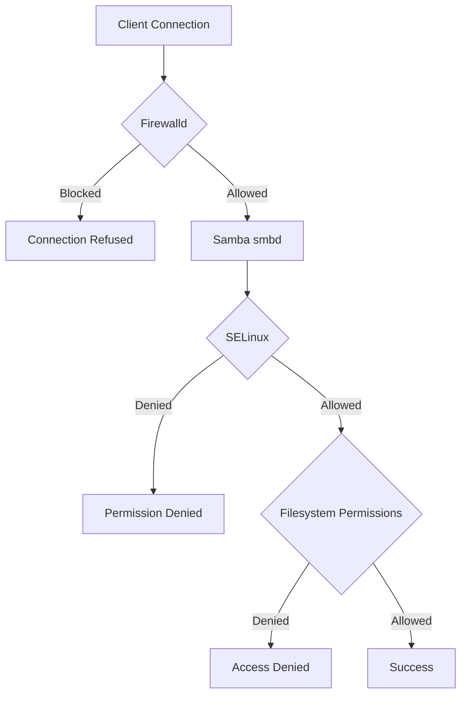

# How to Configure Samba with SELinux and Firewalld on RHEL

Author: [nawazdhandala](https://www.github.com/nawazdhandala)

Tags: RHEL, Samba, SELinux, firewalld, Linux

Description: Get Samba working correctly with SELinux enforcing and firewalld active on RHEL, covering file contexts, booleans, ports, and troubleshooting.

---

## The Two Gatekeepers

On RHEL, Samba must satisfy both SELinux and firewalld to function correctly. SELinux controls what processes can access which files. Firewalld controls which network traffic reaches those processes. Getting both right is essential.

## Firewalld Configuration

### Basic Samba Firewall Rules

```bash
# Add the Samba service to the default zone
sudo firewall-cmd --permanent --add-service=samba
sudo firewall-cmd --reload

# Verify
sudo firewall-cmd --list-services
```

The "samba" service opens ports 139/TCP (NetBIOS) and 445/TCP (SMB over TCP).

### Restricting Samba to Specific Networks

```bash
# Allow Samba only from a specific subnet
sudo firewall-cmd --permanent --add-rich-rule='rule family="ipv4" source address="192.168.1.0/24" service name="samba" accept'
sudo firewall-cmd --reload

# If you also need NetBIOS name resolution
sudo firewall-cmd --permanent --add-port=137/udp
sudo firewall-cmd --permanent --add-port=138/udp
sudo firewall-cmd --reload
```

### Using a Dedicated Zone

```bash
# Create a zone for Samba clients
sudo firewall-cmd --permanent --new-zone=samba-clients
sudo firewall-cmd --permanent --zone=samba-clients --add-source=192.168.1.0/24
sudo firewall-cmd --permanent --zone=samba-clients --add-service=samba
sudo firewall-cmd --reload

# Verify the zone
sudo firewall-cmd --zone=samba-clients --list-all
```

## SELinux Configuration

### Essential SELinux Booleans

```bash
# Allow Samba to export user home directories
sudo setsebool -P samba_enable_home_dirs on

# Allow Samba to share any file/directory on the system
sudo setsebool -P samba_export_all_rw on

# For read-only exports
sudo setsebool -P samba_export_all_ro on

# Allow Samba to run scripts
sudo setsebool -P samba_run_unconfined on
```

View all Samba-related booleans:

```bash
# List all Samba SELinux booleans
sudo getsebool -a | grep samba
```

### Setting File Contexts

Shared directories need the `samba_share_t` context:

```bash
# Set the Samba context on a share directory
sudo semanage fcontext -a -t samba_share_t "/srv/samba/shared(/.*)?"
sudo restorecon -Rv /srv/samba/shared

# Verify the context
ls -Zd /srv/samba/shared
```

For home directories shared via the [homes] section:

```bash
# Home directories use the user_home_t context by default
# Enable the boolean instead
sudo setsebool -P samba_enable_home_dirs on
```

### Context Types for Samba

| Context | Use Case |
|---------|----------|
| `samba_share_t` | Standard Samba file shares |
| `public_content_t` | Read-only public content |
| `public_content_rw_t` | Read-write public content |
| `user_home_t` | User home directories |

## Troubleshooting SELinux Denials

### Step 1 - Check for AVC Denials

```bash
# Search for Samba-related denials
sudo ausearch -m avc -c smbd --start recent

# Or use the audit log directly
sudo grep "denied.*smbd" /var/log/audit/audit.log
```

### Step 2 - Use sealert for Analysis

```bash
# Install if needed
sudo dnf install -y setroubleshoot-server

# Analyze audit log
sudo sealert -a /var/log/audit/audit.log
```

sealert provides specific commands to fix each denial.

### Step 3 - Generate Custom Policy (Last Resort)

```bash
# Generate a policy module from recent denials
sudo ausearch -m avc -c smbd --start recent | audit2allow -M my_samba

# Review the policy
cat my_samba.te

# Apply it
sudo semodule -i my_samba.pp
```

## Decision Flow



## Testing the Configuration

### Test Firewall

```bash
# From a client, check if port 445 is reachable
nc -zv 192.168.1.10 445

# If blocked, check firewall logs
sudo dmesg | grep -i "REJECT\|DROP"
```

### Test SELinux

```bash
# Temporarily set permissive mode to test without SELinux blocking
sudo setenforce 0

# Try accessing the share
smbclient //localhost/shared -U smbuser

# Re-enable enforcing
sudo setenforce 1

# If it works in permissive but not enforcing, SELinux is the issue
```

### Test Filesystem Permissions

```bash
# Check Linux permissions on the share directory
ls -la /srv/samba/shared

# Test as the Samba user
sudo -u smbuser touch /srv/samba/shared/test
```

## Common Issues and Fixes

| Symptom | Likely Cause | Fix |
|---------|-------------|-----|
| Connection refused | Firewalld blocking | `firewall-cmd --add-service=samba` |
| Permission denied (SELinux) | Wrong file context | `semanage fcontext` + `restorecon` |
| Permission denied (Linux) | Filesystem permissions | `chmod`/`chown` on share directory |
| Can browse but not write | Missing write boolean | `setsebool -P samba_export_all_rw on` |

## Wrap-Up

Getting Samba to work with both SELinux and firewalld on RHEL requires attention to three layers: network access (firewalld), mandatory access control (SELinux), and traditional filesystem permissions. Configure each layer methodically, test after each change, and use the diagnostic tools (ausearch, sealert, testparm) to identify issues quickly. Once everything is aligned, the system is both functional and secure.
