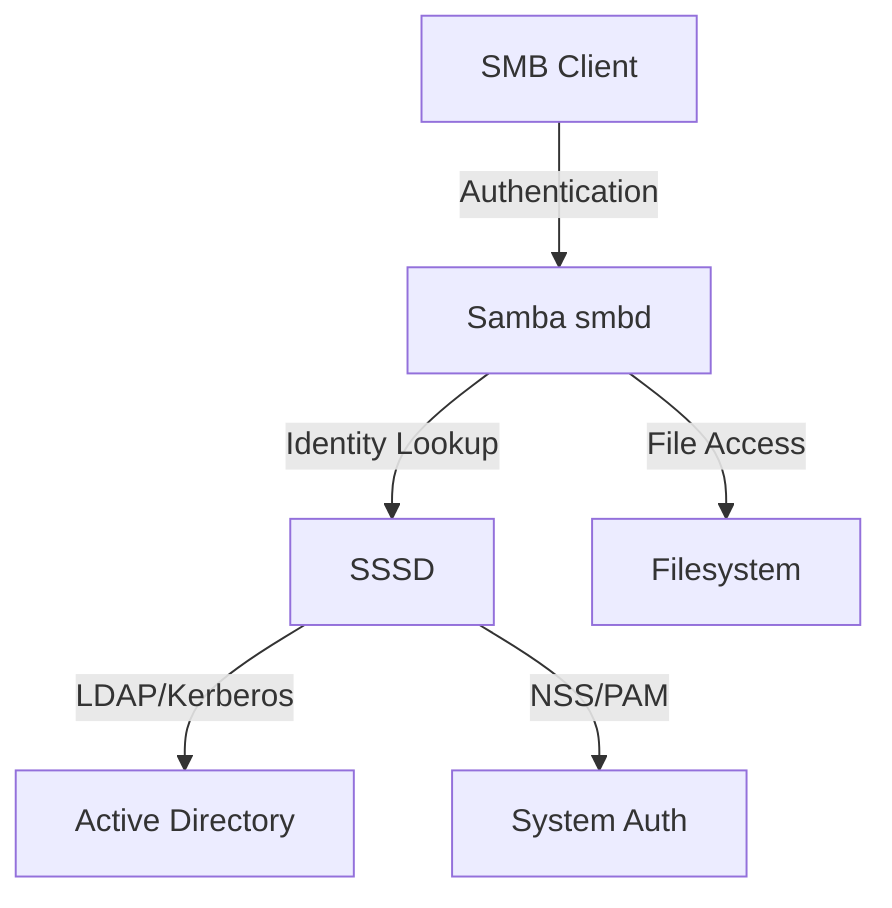

# How to Configure Samba with SSSD for AD-Authenticated File Sharing on RHEL

Author: [nawazdhandala](https://www.github.com/nawazdhandala)

Tags: RHEL, Samba, SSSD, Active Directory, Linux

Description: Set up Samba file sharing on RHEL using SSSD for Active Directory authentication, providing an alternative to Winbind for AD-integrated environments.

---

## SSSD vs. Winbind

SSSD (System Security Services Daemon) is another way to integrate Linux with Active Directory. While Winbind is Samba's native AD integration, SSSD is a general-purpose identity and authentication daemon that works with multiple backends (AD, LDAP, FreeIPA).

When to use SSSD over Winbind:
- You already use SSSD for system authentication
- You want a single daemon for both login and Samba authentication
- You need offline caching for laptop users
- You use FreeIPA as your identity provider

## Prerequisites

- RHEL with root access
- An Active Directory domain
- DNS configured to resolve the AD domain

## Step 1 - Install Packages

```bash
# Install SSSD, Samba, and AD integration tools
sudo dnf install -y sssd sssd-ad sssd-tools samba samba-client \
    realmd adcli krb5-workstation oddjob oddjob-mkhomedir
```

## Step 2 - Join the Domain

```bash
# Discover the domain
sudo realm discover example.com

# Join the domain
sudo realm join example.com -U administrator

# Verify
sudo realm list
```

## Step 3 - Configure SSSD

After joining with realm, SSSD should be configured automatically. Verify /etc/sssd/sssd.conf:

```ini
[sssd]
domains = example.com
config_file_version = 2
services = nss, pam

[domain/example.com]
ad_domain = example.com
krb5_realm = EXAMPLE.COM
realmd_tags = manages-system joined-with-adcli
cache_credentials = True
id_provider = ad
access_provider = ad
fallback_homedir = /home/%u
default_shell = /bin/bash

# Use short names (jdoe instead of jdoe@example.com)
use_fully_qualified_names = False
```

Restart SSSD:

```bash
sudo systemctl restart sssd
```

## Step 4 - Test SSSD User Resolution

```bash
# Look up an AD user
id jdoe

# List AD users
getent passwd jdoe

# List AD groups
getent group "Domain Users"
```

## Step 5 - Configure Samba to Use SSSD

The key to making Samba work with SSSD is the ID mapping configuration. Edit /etc/samba/smb.conf:

```ini
[global]
    workgroup = EXAMPLE
    realm = EXAMPLE.COM
    security = ads

    # Use SSSD for ID mapping
    idmap config * : backend = tdb
    idmap config * : range = 3000-7999
    idmap config EXAMPLE : backend = sss
    idmap config EXAMPLE : range = 200000-2147483647

    # Kerberos authentication method
    kerberos method = secrets and keytab

    # Do not use Winbind - SSSD handles identity
    # Leave winbind service stopped

[shared]
    path = /srv/samba/shared
    writable = yes
    valid users = @"domain users"
```

## Step 6 - Generate the Samba Keytab

```bash
# Generate a Kerberos keytab for Samba
sudo net ads keytab create -U administrator

# Verify the keytab
sudo klist -k /etc/krb5.keytab
```

## Step 7 - Start Services

```bash
# Enable Samba (do NOT start winbind when using SSSD)
sudo systemctl enable --now smb

# Make sure SSSD is running
sudo systemctl enable --now sssd

# Enable home directory creation
sudo systemctl enable --now oddjobd
```

## Architecture



## Step 8 - Configure SELinux and Firewall

```bash
# SELinux booleans
sudo setsebool -P samba_export_all_rw on

# Set file context on shares
sudo semanage fcontext -a -t samba_share_t "/srv/samba/shared(/.*)?"
sudo restorecon -Rv /srv/samba/shared

# Firewall
sudo firewall-cmd --permanent --add-service=samba
sudo firewall-cmd --reload
```

## Step 9 - Test Share Access

```bash
# Test from the server
smbclient //localhost/shared -U jdoe

# From a Windows client
# Connect to \\rhel-server\shared with domain credentials

# Verify user mapping
sudo smbstatus
```

## Handling Group Permissions

When using SSSD, AD group names are available in Samba:

```ini
[finance]
    path = /srv/samba/finance
    writable = yes
    valid users = @"finance team"
    write list = @"finance admins"
```

Set directory permissions to match:

```bash
sudo mkdir -p /srv/samba/finance
sudo chgrp "finance team" /srv/samba/finance
sudo chmod 2775 /srv/samba/finance
```

## Troubleshooting

### SSSD Issues

```bash
# Check SSSD status
sudo systemctl status sssd

# Clear SSSD cache
sudo sss_cache -E

# Test user lookup
getent passwd jdoe

# Debug mode
sudo sssd -d 6 -i
```

### Samba Issues

```bash
# Validate configuration
testparm

# Check Samba logs
sudo tail -f /var/log/samba/log.smbd

# Test domain join
sudo net ads testjoin
```

### Common Problems

| Issue | Cause | Fix |
|-------|-------|-----|
| User not found | SSSD cache | `sudo sss_cache -E` |
| Permission denied | ID mapping | Check idmap config in smb.conf |
| Kerberos failure | Keytab | Regenerate with `net ads keytab create` |
| SSSD not starting | Config error | Check /etc/sssd/sssd.conf syntax |

## SSSD vs. Winbind Comparison

| Feature | SSSD | Winbind |
|---------|------|---------|
| Identity provider | AD, LDAP, FreeIPA | AD only (via Samba) |
| Offline caching | Yes | Limited |
| Configuration | sssd.conf | smb.conf |
| Samba ID mapping | sss backend | rid/ad backend |
| System integration | Full (NSS, PAM, sudo) | Limited |

## Wrap-Up

Using SSSD with Samba on RHEL provides a clean separation between identity management (SSSD) and file sharing (Samba). This approach works well when SSSD is already in use for system authentication, as it avoids running both SSSD and Winbind simultaneously. The key configuration piece is the `idmap config EXAMPLE : backend = sss` setting in smb.conf, which tells Samba to use SSSD for ID mapping instead of Winbind.
