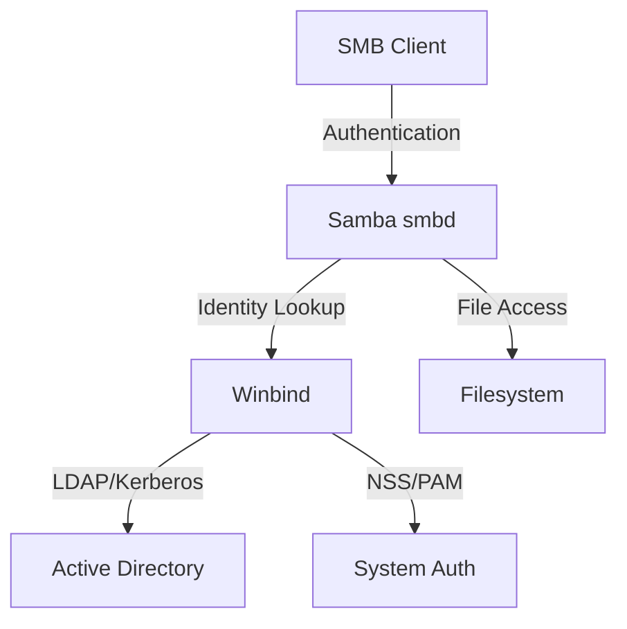

# How to Configure Samba with SSSD for AD-Authenticated File Sharing on RHEL

Author: [nawazdhandala](https://www.github.com/nawazdhandala)

Tags: RHEL, Samba, SSSD, Active Directory, Linux

Description: Set up Samba file sharing on RHEL using SSSD for Active Directory authentication, providing an alternative to Winbind for AD-integrated environments.

---

## SSSD vs. Winbind

SSSD (System Security Services Daemon) is another way to integrate Linux with Active Directory. While Winbind is Samba's native AD integration, SSSD is a general-purpose identity and authentication daemon that works with multiple backends (AD, LDAP, FreeIPA).

On RHEL, use Winbind for Samba file servers joined directly to AD. Red Hat supports SSSD for system identity and authentication, but Samba AD domain member servers require Winbind for domain users and groups.

When SSSD is still the right choice:
- You already use SSSD for system authentication
- You need offline caching for laptop users
- You use FreeIPA as your identity provider

## Prerequisites

- RHEL with root access
- An Active Directory domain
- DNS configured to resolve the AD domain

## Step 1 - Install Packages

```bash
# Install Samba, Winbind, and AD integration tools

sudo dnf install -y realmd oddjob oddjob-mkhomedir samba samba-client \
    samba-winbind samba-winbind-clients samba-common-tools \
    samba-winbind-krb5-locator krb5-workstation \
    policycoreutils-python-utils firewalld
```

## Step 2 - Join the Domain

```bash
# Discover the domain
sudo realm discover example.com

# Join the domain using Samba membership and Winbind
sudo realm join --membership-software=samba --client-software=winbind \
    example.com -U administrator

# Verify
sudo realm list
```

## Step 3 - Configure Winbind

After joining with realm, Samba and Winbind should be configured automatically. Verify /etc/samba/smb.conf and adjust the ID mapping range for your environment:

```ini
[global]
    workgroup = EXAMPLE
    realm = EXAMPLE.COM
    security = ads
    kerberos method = secrets and keytab

    idmap config * : backend = tdb
    idmap config * : range = 10000-999999
    idmap config EXAMPLE : backend = rid
    idmap config EXAMPLE : range = 2000000-2999999

    template shell = /bin/bash
    template homedir = /home/%U
```

Verify and reload Samba:

```bash
testparm
sudo smbcontrol all reload-config
```

## Step 4 - Test Winbind User Resolution

```bash
# Look up an AD user
id "EXAMPLE\jdoe"

# List AD users
getent passwd "EXAMPLE\jdoe"

# List AD groups
getent group "EXAMPLE\Domain Users"
```

## Step 5 - Configure the Samba Share

Edit /etc/samba/smb.conf and add the share:

```ini
[global]
    workgroup = EXAMPLE
    realm = EXAMPLE.COM
    security = ads

    # Use Winbind for ID mapping
    idmap config * : backend = tdb
    idmap config * : range = 10000-999999
    idmap config EXAMPLE : backend = rid
    idmap config EXAMPLE : range = 2000000-2999999

    # Kerberos authentication method
    kerberos method = secrets and keytab

[shared]
    path = /srv/samba/shared
    read only = no
    valid users = @"EXAMPLE\Domain Users"
```

## Step 6 - Validate the Samba Configuration

```bash
# Validate the configuration
testparm

# Test the domain join
sudo net ads testjoin
```

## Step 7 - Start Services

```bash
# Enable Winbind before starting Samba
sudo systemctl enable --now winbind

# Enable Samba
sudo systemctl enable --now smb

# Enable home directory creation
sudo systemctl enable --now oddjobd
```

## Architecture


```mermaid
graph TD
    Client[SMB Client] -->|Authentication| Samba[Samba smbd]
    Samba -->|Identity Lookup| Winbind[Winbind]
    Winbind -->|LDAP/Kerberos| AD[Active Directory]
    Samba -->|File Access| FS[Filesystem]
    Winbind -->|NSS/PAM| System[System Auth]
```

## Step 8 - Configure SELinux and Firewall

```bash
# Create the share directory
sudo mkdir -p /srv/samba/shared

# SELinux booleans
sudo setsebool -P samba_export_all_rw on

# Set file context on shares
sudo semanage fcontext -a -t samba_share_t "/srv/samba/shared(/.*)?"
sudo restorecon -Rv /srv/samba/shared

# Firewall
sudo firewall-cmd --permanent --add-service=samba
sudo firewall-cmd --reload
```

## Step 9 - Test Share Access

```bash
# Test from the server
smbclient //localhost/shared -U "EXAMPLE\jdoe"

# From a Windows client
# Connect to \\rhel-server\shared with domain credentials

# Verify user mapping
sudo smbstatus
```

## Handling Group Permissions

When using Winbind, AD group names are available in Samba:

```ini
[finance]
    path = /srv/samba/finance
    read only = no
    valid users = @"EXAMPLE\finance team"
    write list = @"EXAMPLE\finance admins"
```

Set directory permissions to match:

```bash
sudo mkdir -p /srv/samba/finance
sudo chgrp 'EXAMPLE\finance team' /srv/samba/finance
sudo chmod 2775 /srv/samba/finance
```

## Troubleshooting

### Winbind Issues

```bash
# Check Winbind status
sudo systemctl status winbind

# Clear Samba and Winbind cache
sudo net cache flush

# Test user lookup
getent passwd "EXAMPLE\jdoe"

# List domain users and groups
wbinfo -u
wbinfo -g
```

### Samba Issues

```bash
# Validate configuration
testparm

# Check Samba logs
sudo tail -f /var/log/samba/log.smbd

# Test domain join
sudo net ads testjoin
```

### Common Problems

| Issue | Cause | Fix |
|-------|-------|-----|
| User not found | Winbind cache or service state | `sudo net cache flush` and check `systemctl status winbind` |
| Permission denied | ID mapping | Check idmap config in smb.conf |
| Kerberos failure | Domain join or machine account issue | Check `net ads testjoin` |
| Winbind not starting | Config error | Check /etc/samba/smb.conf syntax with `testparm` |

## SSSD vs. Winbind Comparison

| Feature | SSSD | Winbind |
|---------|------|---------|
| Identity provider | AD, LDAP, FreeIPA | AD only (via Samba) |
| Offline caching | Yes | Limited |
| Configuration | sssd.conf | smb.conf |
| Samba ID mapping | Not supported for RHEL AD member file servers | rid/ad backend |
| System integration | Full (NSS, PAM, sudo) | NSS/PAM for domain users and Samba |

## Wrap-Up

Using Winbind with Samba on RHEL provides the supported path for an AD-authenticated file server. SSSD remains a good choice for general system authentication, but Samba domain member servers on RHEL need Winbind so that smbd can resolve domain users and groups correctly. The key configuration piece is the `idmap config EXAMPLE : backend = rid` or `idmap config EXAMPLE : backend = ad` setting in smb.conf, depending on whether you generate IDs from RIDs or store POSIX IDs in AD.
