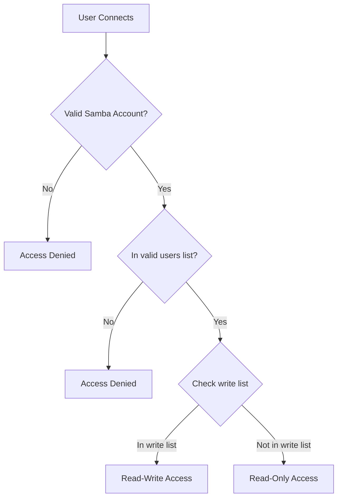

# How to Configure Samba User Authentication and Permissions on RHEL 9

Author: [nawazdhandala](https://www.github.com/nawazdhandala)

Tags: RHEL, Samba, Authentication, Permissions, Linux

Description: Configure Samba user authentication and file permissions on RHEL 9, covering local user management, password policies, and access control for shares.

---

## Authentication in Samba

Samba supports multiple authentication modes. On RHEL 9, the most common is "user" mode, where clients must provide a valid username and password to access shares. Samba maintains its own password database (tdbsam) separate from the system's /etc/shadow.

## Security Modes

The `security` setting in smb.conf determines how Samba authenticates users:

```ini
[global]
    # user - Samba handles authentication locally
    security = user

    # ads - Authentication via Active Directory
    # security = ads
```

## Managing Samba Users

### Create a Samba User

Every Samba user must have a corresponding Linux system account:

```bash
# Create a system account (no login shell, no home directory needed for share access)
sudo useradd -M -s /sbin/nologin smbuser

# Set the Samba password (separate from the system password)
sudo smbpasswd -a smbuser
```

### List Samba Users

```bash
# List all Samba users in the database
sudo pdbedit -L

# Show detailed information
sudo pdbedit -L -v
```

### Disable/Enable a Samba User

```bash
# Disable a Samba account
sudo smbpasswd -d smbuser

# Enable a disabled account
sudo smbpasswd -e smbuser
```

### Remove a Samba User

```bash
# Remove from Samba database
sudo smbpasswd -x smbuser

# Optionally remove the system account
sudo userdel smbuser
```

## Group-Based Access Control

Use Linux groups to manage access to shares:

```bash
# Create groups for different access levels
sudo groupadd samba_readonly
sudo groupadd samba_writers
sudo groupadd samba_admins

# Add users to groups
sudo usermod -aG samba_writers smbuser1
sudo usermod -aG samba_admins smbuser2
```

Configure share access with groups:

```ini
[projects]
    path = /srv/samba/projects
    browseable = yes

    # Allow these users/groups
    valid users = @samba_writers @samba_admins

    # Read-only for writers, full control for admins
    read list = @samba_readonly
    write list = @samba_writers @samba_admins
    admin users = @samba_admins
```

## Permission Model



## File Permission Masks

Control how Linux permissions are set on files created through Samba:

```ini
[projects]
    path = /srv/samba/projects

    # Permission masks for new files
    create mask = 0664       # Files get rw-rw-r--
    force create mode = 0664 # Always apply these bits

    # Permission masks for new directories
    directory mask = 2775      # Dirs get rwxrwsr-x
    force directory mode = 2775

    # Force all files to be owned by this group
    force group = samba_writers
```

### Setting Up the Directory

```bash
# Set ownership and permissions on the share directory
sudo chown root:samba_writers /srv/samba/projects
sudo chmod 2775 /srv/samba/projects
```

The setgid bit (2) on the directory ensures new files inherit the group, keeping permissions consistent.

## Per-User Shares

Automatically create per-user shares:

```ini
[homes]
    comment = Home Directories
    browseable = no
    writable = yes
    valid users = %S
    create mask = 0700
    directory mask = 0700
```

When user "jdoe" connects, they automatically see a share called "jdoe" pointing to their home directory.

## Password Policies

Configure password complexity and expiration:

```bash
# Set minimum password length
sudo pdbedit -P "min password length" -C 8

# Set password history
sudo pdbedit -P "password history" -C 5

# View current policies
sudo pdbedit -P "min password length"
sudo pdbedit -P "password history"
```

## Denying Specific Users

```ini
[confidential]
    path = /srv/samba/confidential
    valid users = @samba_admins
    invalid users = tempuser baduser
```

`invalid users` takes precedence over `valid users`.

## Host-Based Restrictions

Restrict share access by client IP:

```ini
[restricted]
    path = /srv/samba/restricted
    hosts allow = 192.168.1.0/24 10.0.0.0/8
    hosts deny = ALL
```

## Testing Permissions

```bash
# Test authentication
smbclient //localhost/projects -U smbuser1

# At the smbclient prompt, test operations
smb: \> ls
smb: \> put /tmp/test.txt test.txt
smb: \> mkdir testdir
smb: \> quit

# Check resulting Linux permissions
ls -la /srv/samba/projects/
```

## Auditing Access

Enable access auditing in smb.conf:

```ini
[global]
    vfs objects = full_audit
    full_audit:prefix = %u|%I|%S
    full_audit:success = connect disconnect mkdir rmdir open read write rename unlink
    full_audit:failure = connect
    full_audit:facility = local5
    full_audit:priority = notice
```

This logs all file operations to syslog, which you can redirect to a dedicated log file via rsyslog.

## Wrap-Up

Samba authentication and permissions on RHEL 9 involve three layers: Samba user accounts (smbpasswd/pdbedit), share-level access control (valid users, write list), and filesystem permissions (create mask, force group). Getting all three aligned is the key to a well-functioning Samba setup. Use groups for scalable access management, and test permissions from a client before going to production.
