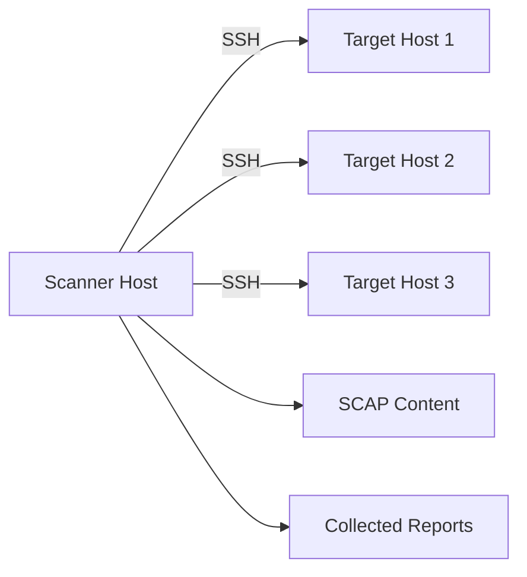

# How to Scan Remote RHEL Hosts for Compliance with oscap-ssh

Author: [nawazdhandala](https://www.github.com/nawazdhandala)

Tags: RHEL, oscap-ssh, Remote Scanning, Compliance, Linux

Description: Use oscap-ssh to scan remote RHEL servers for compliance without installing SCAP content on each target host.

---

When you manage dozens or hundreds of RHEL servers, installing and maintaining OpenSCAP content on every one of them is tedious. oscap-ssh solves this by letting you run compliance scans from a central scanning station. The SCAP content stays on your scanner, and the tool handles transferring what is needed to the target system over SSH.

## How oscap-ssh Works



oscap-ssh connects to the target system via SSH, transfers the necessary SCAP content, runs the scan remotely, and collects the results back to your scanning station.

## Prerequisites

### On the scanner host

```bash
# Install OpenSCAP with SSH support
dnf install -y openscap-scanner openscap-utils scap-security-guide

# Verify oscap-ssh is available
which oscap-ssh
```

### On each target host

```bash
# Only the scanner needs to be installed (not the content)
dnf install -y openscap-scanner

# The target does NOT need scap-security-guide installed
# oscap-ssh will transfer the content
```

### SSH access

```bash
# Set up SSH key-based authentication for scanning
ssh-keygen -t ed25519 -f ~/.ssh/scanner_key -N ""

# Copy the key to each target
ssh-copy-id -i ~/.ssh/scanner_key sysadmin@target-host

# Test the connection
ssh -i ~/.ssh/scanner_key sysadmin@target-host hostname
```

## Scan a Single Remote Host

```bash
# Basic remote scan
oscap-ssh sysadmin@target-host.example.com 22 \
  xccdf eval \
  --profile xccdf_org.ssgproject.content_profile_stig \
  --results /var/log/compliance/target-host-results.xml \
  --report /var/log/compliance/target-host-report.html \
  /usr/share/xml/scap/ssg/content/ssg-rhel9-ds.xml
```

The syntax is similar to regular `oscap`, with the addition of `user@host port` before the subcommand.

## Scan with SSH Key Authentication

```bash
# Use a specific SSH key
OSCAP_SSH_KEY=~/.ssh/scanner_key \
oscap-ssh sysadmin@target-host.example.com 22 \
  xccdf eval \
  --profile xccdf_org.ssgproject.content_profile_stig \
  --results /var/log/compliance/target-results.xml \
  --report /var/log/compliance/target-report.html \
  /usr/share/xml/scap/ssg/content/ssg-rhel9-ds.xml
```

## Scan Multiple Hosts

Create a script to scan your entire fleet:

```bash
cat > /usr/local/bin/fleet-compliance-scan.sh << 'SCRIPT'
#!/bin/bash
DATE=$(date +%Y%m%d)
REPORT_DIR="/var/log/compliance/fleet/${DATE}"
CONTENT="/usr/share/xml/scap/ssg/content/ssg-rhel9-ds.xml"
PROFILE="xccdf_org.ssgproject.content_profile_stig"
SSH_USER="sysadmin"
SSH_PORT=22

mkdir -p "$REPORT_DIR"

# List of target hosts
HOSTS=(
    "web01.example.com"
    "web02.example.com"
    "db01.example.com"
    "app01.example.com"
)

echo "=== Fleet Compliance Scan ===" | tee "${REPORT_DIR}/summary.txt"
echo "Date: $(date)" | tee -a "${REPORT_DIR}/summary.txt"
echo "" | tee -a "${REPORT_DIR}/summary.txt"

for HOST in "${HOSTS[@]}"; do
    HOSTNAME=$(echo "$HOST" | cut -d. -f1)
    echo "Scanning ${HOST}..."

    oscap-ssh "${SSH_USER}@${HOST}" "$SSH_PORT" \
      xccdf eval \
      --profile "$PROFILE" \
      --results "${REPORT_DIR}/${HOSTNAME}-results.xml" \
      --report "${REPORT_DIR}/${HOSTNAME}-report.html" \
      "$CONTENT" 2>/dev/null || true

    if [ -f "${REPORT_DIR}/${HOSTNAME}-results.xml" ]; then
        PASS=$(grep -c 'result="pass"' "${REPORT_DIR}/${HOSTNAME}-results.xml")
        FAIL=$(grep -c 'result="fail"' "${REPORT_DIR}/${HOSTNAME}-results.xml")
        echo "  ${HOST}: ${PASS} pass, ${FAIL} fail" | tee -a "${REPORT_DIR}/summary.txt"
    else
        echo "  ${HOST}: SCAN FAILED" | tee -a "${REPORT_DIR}/summary.txt"
    fi
done

echo "" | tee -a "${REPORT_DIR}/summary.txt"
echo "Reports saved to: ${REPORT_DIR}" | tee -a "${REPORT_DIR}/summary.txt"
SCRIPT
chmod +x /usr/local/bin/fleet-compliance-scan.sh
```

## Parallel Scanning

Scanning hosts sequentially is slow. Run scans in parallel:

```bash
cat > /usr/local/bin/parallel-compliance-scan.sh << 'SCRIPT'
#!/bin/bash
DATE=$(date +%Y%m%d)
REPORT_DIR="/var/log/compliance/fleet/${DATE}"
CONTENT="/usr/share/xml/scap/ssg/content/ssg-rhel9-ds.xml"
PROFILE="xccdf_org.ssgproject.content_profile_stig"
SSH_USER="sysadmin"
MAX_PARALLEL=5

mkdir -p "$REPORT_DIR"

scan_host() {
    local HOST=$1
    local HOSTNAME=$(echo "$HOST" | cut -d. -f1)

    oscap-ssh "${SSH_USER}@${HOST}" 22 \
      xccdf eval \
      --profile "$PROFILE" \
      --results "${REPORT_DIR}/${HOSTNAME}-results.xml" \
      --report "${REPORT_DIR}/${HOSTNAME}-report.html" \
      "$CONTENT" 2>/dev/null

    if [ -f "${REPORT_DIR}/${HOSTNAME}-results.xml" ]; then
        PASS=$(grep -c 'result="pass"' "${REPORT_DIR}/${HOSTNAME}-results.xml")
        FAIL=$(grep -c 'result="fail"' "${REPORT_DIR}/${HOSTNAME}-results.xml")
        echo "${HOST}: ${PASS} pass, ${FAIL} fail"
    else
        echo "${HOST}: SCAN FAILED"
    fi
}

# Read hosts from a file
while IFS= read -r HOST; do
    scan_host "$HOST" &

    # Limit parallel processes
    while [ $(jobs -r | wc -l) -ge $MAX_PARALLEL ]; do
        wait -n
    done
done < /etc/compliance/hosts.txt

# Wait for all remaining jobs
wait

echo "All scans complete. Reports in: $REPORT_DIR"
SCRIPT
chmod +x /usr/local/bin/parallel-compliance-scan.sh
```

## Generate Fleet-Wide Summary

```bash
cat > /usr/local/bin/fleet-summary.sh << 'SCRIPT'
#!/bin/bash
REPORT_DIR="$1"
if [ -z "$REPORT_DIR" ]; then
    echo "Usage: $0 <report-directory>"
    exit 1
fi

echo "Host,Pass,Fail,Score"
for RESULT in "${REPORT_DIR}"/*-results.xml; do
    HOSTNAME=$(basename "$RESULT" | sed 's/-results.xml//')
    PASS=$(grep -c 'result="pass"' "$RESULT" 2>/dev/null || echo 0)
    FAIL=$(grep -c 'result="fail"' "$RESULT" 2>/dev/null || echo 0)
    TOTAL=$((PASS + FAIL))
    [ "$TOTAL" -gt 0 ] && SCORE=$((PASS * 100 / TOTAL)) || SCORE=0
    echo "${HOSTNAME},${PASS},${FAIL},${SCORE}%"
done
SCRIPT
chmod +x /usr/local/bin/fleet-summary.sh
```

## Troubleshooting oscap-ssh

### Connection issues

```bash
# Test SSH connectivity
ssh -v sysadmin@target-host hostname

# Ensure the target has openscap-scanner installed
ssh sysadmin@target-host "rpm -q openscap-scanner"
```

### Sudo requirements

Some scan checks need root access on the target:

```bash
# Configure sudo on the target for the scanning user
# On the target host:
echo "sysadmin ALL=(root) NOPASSWD: /usr/bin/oscap" >> /etc/sudoers.d/oscap-scanning
```

### Large content transfer

```bash
# If the content transfer is slow, pre-install the content on targets
# Then use a local path reference instead
ssh sysadmin@target-host "dnf install -y scap-security-guide"
```

oscap-ssh turns compliance scanning from a per-server task into a centralized operation. Set up a scanning station, schedule regular fleet scans, and use the collected reports to track compliance across your entire infrastructure.
