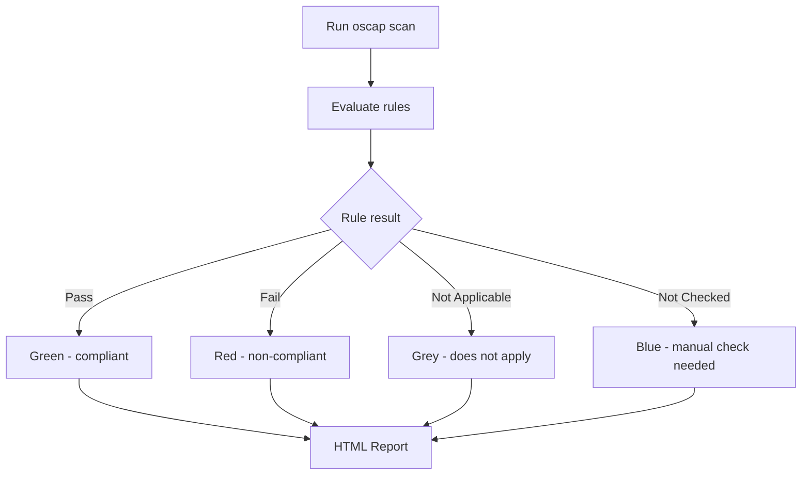

# How to Scan RHEL Systems Against the CIS Benchmark with OpenSCAP

Author: [nawazdhandala](https://www.github.com/nawazdhandala)

Tags: RHEL, CIS, OpenSCAP, Compliance, Linux

Description: Learn how to use OpenSCAP to scan your RHEL systems against the CIS benchmark, interpret the results, and generate compliance reports.

---

The Center for Internet Security (CIS) benchmarks are the gold standard for system hardening. They provide a detailed set of configuration recommendations that have been reviewed by security professionals worldwide. On RHEL, you can check your systems against the CIS benchmark using OpenSCAP, which comes with the SCAP Security Guide that includes CIS profiles out of the box.

## Install OpenSCAP and the SCAP Security Guide

```bash
# Install the scanner and content
dnf install -y openscap-scanner scap-security-guide

# Verify the installation
oscap --version

# List available RHEL content
ls /usr/share/xml/scap/ssg/content/ssg-rhel9-*
```

## Understand the Available CIS Profiles

The SCAP Security Guide ships with multiple CIS profiles:

```bash
# List all available profiles for RHEL
oscap info /usr/share/xml/scap/ssg/content/ssg-rhel9-ds.xml | grep -A1 "Profile"
```

The CIS-related profiles you will typically see are:

- **xccdf_org.ssgproject.content_profile_cis** - CIS Level 2 Server
- **xccdf_org.ssgproject.content_profile_cis_server_l1** - CIS Level 1 Server
- **xccdf_org.ssgproject.content_profile_cis_workstation_l1** - CIS Level 1 Workstation
- **xccdf_org.ssgproject.content_profile_cis_workstation_l2** - CIS Level 2 Workstation

## Run Your First CIS Scan

```bash
# Run a CIS Level 1 Server scan with HTML report output
oscap xccdf eval \
  --profile xccdf_org.ssgproject.content_profile_cis_server_l1 \
  --results /tmp/cis-l1-results.xml \
  --report /tmp/cis-l1-report.html \
  /usr/share/xml/scap/ssg/content/ssg-rhel9-ds.xml

# The exit code tells you the overall result:
# 0 = all rules passed
# 2 = at least one rule failed
echo "Exit code: $?"
```



## Interpret the Results

The HTML report is the easiest way to review findings. Open it in a browser:

```bash
# If you have a desktop environment or can transfer the file
# The report is at /tmp/cis-l1-report.html

# From the command line, get a quick summary
oscap xccdf eval \
  --profile xccdf_org.ssgproject.content_profile_cis_server_l1 \
  /usr/share/xml/scap/ssg/content/ssg-rhel9-ds.xml 2>&1 | \
  grep -E "^Title|^Result" | paste - - | head -20
```

### Understanding result types

- **pass** - The system meets this requirement
- **fail** - The system does not meet this requirement and needs remediation
- **notapplicable** - The rule does not apply to this system configuration
- **notchecked** - The rule requires manual verification

## Extract Specific Failures

To focus on what needs fixing:

```bash
# Extract only failed rules from the results XML
oscap xccdf generate report \
  --result-id "" \
  /tmp/cis-l1-results.xml > /tmp/cis-full-report.html

# List just the failed rules
oscap xccdf eval \
  --profile xccdf_org.ssgproject.content_profile_cis_server_l1 \
  /usr/share/xml/scap/ssg/content/ssg-rhel9-ds.xml 2>&1 | \
  grep -B1 "^Result.*fail" | grep "^Title"
```

## Generate a Fix Script

OpenSCAP can generate a remediation script based on the scan results:

```bash
# Generate a bash remediation script
oscap xccdf generate fix \
  --fix-type bash \
  --result-id "" \
  --output /tmp/cis-remediation.sh \
  /tmp/cis-l1-results.xml

# Review the script before running it
less /tmp/cis-remediation.sh

# Generate an Ansible remediation playbook
oscap xccdf generate fix \
  --fix-type ansible \
  --result-id "" \
  --output /tmp/cis-remediation.yml \
  /tmp/cis-l1-results.xml
```

Always review generated remediation scripts before executing them. They are a good starting point but may need adjustments for your environment.

## Run a CIS Level 2 Scan

CIS Level 2 includes everything in Level 1 plus additional controls that may affect system usability:

```bash
# Run CIS Level 2 Server scan
oscap xccdf eval \
  --profile xccdf_org.ssgproject.content_profile_cis \
  --results /tmp/cis-l2-results.xml \
  --report /tmp/cis-l2-report.html \
  /usr/share/xml/scap/ssg/content/ssg-rhel9-ds.xml
```

## Compare Results Over Time

Track your compliance progress by saving results with timestamps:

```bash
# Create a directory for compliance history
mkdir -p /var/log/compliance

# Run scans with timestamped output
DATE=$(date +%Y%m%d)
oscap xccdf eval \
  --profile xccdf_org.ssgproject.content_profile_cis_server_l1 \
  --results /var/log/compliance/cis-l1-${DATE}.xml \
  --report /var/log/compliance/cis-l1-${DATE}.html \
  /usr/share/xml/scap/ssg/content/ssg-rhel9-ds.xml
```

## Schedule Regular Scans

Set up a cron job or systemd timer for periodic scanning:

```bash
# Create a weekly scan script
cat > /usr/local/bin/cis-scan.sh << 'SCRIPT'
#!/bin/bash
DATE=$(date +%Y%m%d)
REPORT_DIR="/var/log/compliance"
mkdir -p "$REPORT_DIR"

oscap xccdf eval \
  --profile xccdf_org.ssgproject.content_profile_cis_server_l1 \
  --results "${REPORT_DIR}/cis-l1-${DATE}.xml" \
  --report "${REPORT_DIR}/cis-l1-${DATE}.html" \
  /usr/share/xml/scap/ssg/content/ssg-rhel9-ds.xml

# Count pass/fail
PASS=$(grep -c 'result="pass"' "${REPORT_DIR}/cis-l1-${DATE}.xml")
FAIL=$(grep -c 'result="fail"' "${REPORT_DIR}/cis-l1-${DATE}.xml")
echo "CIS L1 Scan on $(hostname): $PASS passed, $FAIL failed" | \
  mail -s "CIS Compliance Report - $(hostname)" root
SCRIPT
chmod +x /usr/local/bin/cis-scan.sh

# Add to cron for weekly execution
echo "0 3 * * 0 root /usr/local/bin/cis-scan.sh" >> /etc/crontab
```

## Tailoring the Profile

Not every CIS rule applies to every environment. You can create a tailoring file to customize which rules are evaluated:

```bash
# Generate a tailoring file that you can customize
# First, list all rule IDs in the profile
oscap info --profile xccdf_org.ssgproject.content_profile_cis_server_l1 \
  /usr/share/xml/scap/ssg/content/ssg-rhel9-ds.xml
```

For more complex tailoring, use SCAP Workbench (a graphical tool) to create a tailoring file that disables rules that do not apply to your environment.

Running CIS scans with OpenSCAP is one of the most straightforward ways to validate your RHEL hardening. Do it regularly, track the results, and work toward 100% compliance on the rules that matter for your environment.
