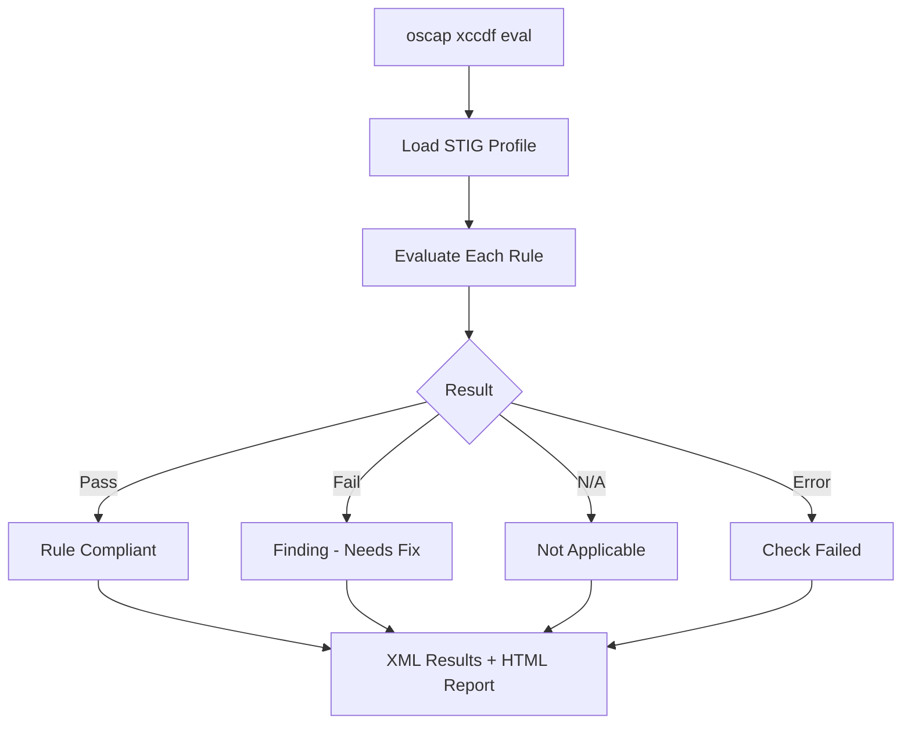

# How to Scan RHEL 9 for STIG Compliance Using OpenSCAP

Author: [nawazdhandala](https://www.github.com/nawazdhandala)

Tags: RHEL, STIG, OpenSCAP, Compliance, Linux

Description: Use OpenSCAP to scan RHEL 9 systems for DISA STIG compliance, generate reports, and identify security findings that need remediation.

---

Before you can fix STIG findings, you need to know what is failing. OpenSCAP is the standard tool for scanning RHEL 9 systems against the DISA STIG profile. It ships with Red Hat's SCAP Security Guide, which includes the official STIG content mapped to OpenSCAP rules. This means you can run a comprehensive STIG assessment without downloading anything extra from DISA.

## Install OpenSCAP and STIG Content

```bash
# Install the scanner and STIG content
dnf install -y openscap-scanner scap-security-guide

# Verify the STIG profile is included
oscap info /usr/share/xml/scap/ssg/content/ssg-rhel9-ds.xml | grep -i stig
```

You should see a profile like `xccdf_org.ssgproject.content_profile_stig` in the output.

## Run a STIG Compliance Scan

```bash
# Run the STIG scan with both XML results and HTML report
oscap xccdf eval \
  --profile xccdf_org.ssgproject.content_profile_stig \
  --results /var/log/compliance/stig-results.xml \
  --report /var/log/compliance/stig-report.html \
  /usr/share/xml/scap/ssg/content/ssg-rhel9-ds.xml

# The command returns exit code 2 if any rules failed
echo "Exit code: $?"
```



## Understand the Report

The HTML report organizes findings by STIG ID. Each finding includes:

- **Rule title** - What the control checks for
- **Severity** - High, Medium, or Low (maps to CAT I, II, III)
- **Result** - Pass, fail, or not applicable
- **Description** - What the vulnerability is
- **Fix text** - How to remediate the finding

### Get a quick summary from the command line

```bash
# Count results by type
echo "=== STIG Scan Summary ==="
echo "Passed:         $(grep -c 'result="pass"' /var/log/compliance/stig-results.xml)"
echo "Failed:         $(grep -c 'result="fail"' /var/log/compliance/stig-results.xml)"
echo "Not Applicable: $(grep -c 'result="notapplicable"' /var/log/compliance/stig-results.xml)"
echo "Error:          $(grep -c 'result="error"' /var/log/compliance/stig-results.xml)"
```

## Focus on CAT I (High Severity) Findings

CAT I findings are the most critical. Fix these first:

```bash
# Extract failed rules and their severity
oscap xccdf eval \
  --profile xccdf_org.ssgproject.content_profile_stig \
  /usr/share/xml/scap/ssg/content/ssg-rhel9-ds.xml 2>&1 | \
  grep -B1 "^Result.*fail" | grep "^Title"
```

Common CAT I findings on a default RHEL 9 installation include:

- FIPS mode not enabled
- Root login permitted via SSH
- Audit subsystem not properly configured
- Required packages not installed (like AIDE)

## Generate Remediation Scripts from Results

```bash
# Generate a bash script to fix all failures
oscap xccdf generate fix \
  --fix-type bash \
  --result-id "" \
  --output /tmp/stig-remediation.sh \
  /var/log/compliance/stig-results.xml

# Generate an Ansible playbook
oscap xccdf generate fix \
  --fix-type ansible \
  --result-id "" \
  --output /tmp/stig-remediation.yml \
  /var/log/compliance/stig-results.xml

# Review before executing
wc -l /tmp/stig-remediation.sh
```

## Scan with a Tailoring File

If certain STIG rules do not apply to your environment, create a tailoring file to exclude them:

```bash
# Run the scan with a tailoring file
oscap xccdf eval \
  --profile xccdf_org.ssgproject.content_profile_stig \
  --tailoring-file /path/to/stig-tailoring.xml \
  --results /var/log/compliance/stig-tailored-results.xml \
  --report /var/log/compliance/stig-tailored-report.html \
  /usr/share/xml/scap/ssg/content/ssg-rhel9-ds.xml
```

## Generate ARF Output for STIG Viewer

The DISA STIG Viewer and eMASS expect results in Asset Reporting Format (ARF):

```bash
# Generate ARF output
oscap xccdf eval \
  --profile xccdf_org.ssgproject.content_profile_stig \
  --results-arf /var/log/compliance/stig-arf.xml \
  /usr/share/xml/scap/ssg/content/ssg-rhel9-ds.xml || true

# This ARF file can be imported into STIG Viewer
# to generate a checklist (CKL) file
```

## Automate STIG Scanning

Set up automated weekly scans:

```bash
cat > /usr/local/bin/stig-scan.sh << 'SCRIPT'
#!/bin/bash
DATE=$(date +%Y%m%d)
REPORT_DIR="/var/log/compliance"
HOSTNAME=$(hostname -s)

mkdir -p "$REPORT_DIR"

# Run the STIG scan
oscap xccdf eval \
  --profile xccdf_org.ssgproject.content_profile_stig \
  --results "${REPORT_DIR}/stig-${HOSTNAME}-${DATE}.xml" \
  --report "${REPORT_DIR}/stig-${HOSTNAME}-${DATE}.html" \
  --results-arf "${REPORT_DIR}/stig-arf-${HOSTNAME}-${DATE}.xml" \
  /usr/share/xml/scap/ssg/content/ssg-rhel9-ds.xml 2>/dev/null || true

# Generate summary
PASS=$(grep -c 'result="pass"' "${REPORT_DIR}/stig-${HOSTNAME}-${DATE}.xml")
FAIL=$(grep -c 'result="fail"' "${REPORT_DIR}/stig-${HOSTNAME}-${DATE}.xml")

echo "${DATE},${HOSTNAME},${PASS},${FAIL}" >> "${REPORT_DIR}/stig-history.csv"

# Alert if failures exceed threshold
if [ "$FAIL" -gt 10 ]; then
    echo "STIG scan on ${HOSTNAME}: ${FAIL} failures detected" | \
      mail -s "STIG Alert - ${HOSTNAME}" security-team@example.com
fi
SCRIPT
chmod +x /usr/local/bin/stig-scan.sh

# Add to weekly cron
echo "0 3 * * 0 root /usr/local/bin/stig-scan.sh" >> /etc/crontab
```

## Compare Scans Over Time

Track your remediation progress:

```bash
# View scan history
if [ -f /var/log/compliance/stig-history.csv ]; then
    echo "Date,Hostname,Pass,Fail"
    cat /var/log/compliance/stig-history.csv
fi
```

## Clean Up Old Reports

```bash
# Remove reports older than 180 days
find /var/log/compliance -name "stig-*" -mtime +180 -delete
```

Regular STIG scanning with OpenSCAP gives you continuous visibility into your compliance posture. Run scans before and after remediation efforts, archive the reports for audit evidence, and set up alerts so you know immediately when compliance drifts.
