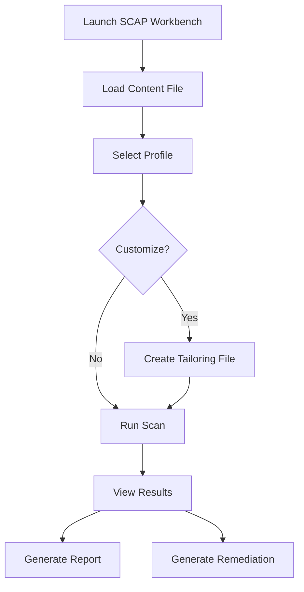

# How to Use SCAP Workbench for Graphical Compliance Scanning on RHEL

Author: [nawazdhandala](https://www.github.com/nawazdhandala)

Tags: RHEL, SCAP Workbench, Compliance, GUI, Linux

Description: Use SCAP Workbench to perform graphical compliance scanning on RHEL, create tailoring files, and customize security profiles without writing XML.

---

Not everyone wants to work from the command line. SCAP Workbench is a graphical tool that lets you load security profiles, customize which rules to apply, run scans, and generate reports, all through a point-and-click interface. It is particularly useful for creating tailoring files, which let you customize a standard profile to match your organization's specific requirements.

## Install SCAP Workbench

```bash
# Install SCAP Workbench and dependencies
dnf install -y scap-workbench scap-security-guide

# If running on a headless server, you will need
# X11 forwarding or a VNC session
# SSH with X forwarding:
# ssh -X user@server
```

## Launch SCAP Workbench

```bash
# Start SCAP Workbench
scap-workbench &

# Or with a specific content file
scap-workbench /usr/share/xml/scap/ssg/content/ssg-rhel9-ds.xml &
```



## Load Security Content

When SCAP Workbench opens:

1. Click "Load Content" or use File > Open
2. Navigate to `/usr/share/xml/scap/ssg/content/`
3. Select `ssg-rhel9-ds.xml`
4. The available profiles will appear in the dropdown

## Select a Profile

The profile dropdown shows all available security profiles:

- CIS Level 1 Server
- CIS Level 2 Server (labeled just "CIS")
- DISA STIG
- PCI-DSS
- OSPP (NIST 800-53)

Select the profile that matches your compliance requirements.

## Customize a Profile with Tailoring

This is where SCAP Workbench really shines. To customize a profile:

1. Select your base profile from the dropdown
2. Click "Customize" to create a tailoring file
3. A new window opens showing all rules in the profile
4. Uncheck rules that do not apply to your environment
5. Modify values (like minimum password length) by clicking on the value
6. Click "OK" to save your tailoring

### Example customizations

- **Disable USB storage rule** if your servers have authorized USB backup devices
- **Change password length** from the default to your organization's requirement
- **Skip GRUB password** if your servers use BMC/iDRAC for console security
- **Exclude specific audit rules** that conflict with your application

## Save the Tailoring File

After customizing:

```bash
# SCAP Workbench saves tailoring files to your home directory by default
# Move them to a standard location
mkdir -p /etc/scap/tailoring/
# Save from SCAP Workbench to: /etc/scap/tailoring/rhel9-stig-tailored.xml
```

## Run a Scan

1. Select your profile (with or without tailoring)
2. Choose the target: "Local Machine" for scanning the current system
3. Click "Scan"
4. Watch the progress as each rule is evaluated

The scan typically takes 2-5 minutes depending on the profile and system.

## View and Export Results

After the scan completes:

- **Results tab**: Shows pass/fail for each rule with color coding
- **Green**: Rule passed
- **Red**: Rule failed
- **Grey**: Rule not applicable

### Generate an HTML report

1. Click "Generate Report"
2. Choose the output location
3. The HTML report is identical to what `oscap` generates from the command line

### Generate remediation

1. Click "Generate Remediation"
2. Choose the output format (Bash, Ansible, or Puppet)
3. Save the remediation script

## Use Tailoring Files from the Command Line

Once you have created a tailoring file in SCAP Workbench, you can use it with the command-line `oscap` tool:

```bash
# Run a scan using the tailoring file
oscap xccdf eval \
  --profile xccdf_org.ssgproject.content_profile_stig_customized \
  --tailoring-file /etc/scap/tailoring/rhel9-stig-tailored.xml \
  --results /var/log/compliance/tailored-results.xml \
  --report /var/log/compliance/tailored-report.html \
  /usr/share/xml/scap/ssg/content/ssg-rhel9-ds.xml
```

The profile ID in the tailoring file will have a `_customized` suffix. Check the tailoring file to find the exact profile ID:

```bash
# Find the profile ID in the tailoring file
grep "Profile id=" /etc/scap/tailoring/rhel9-stig-tailored.xml
```

## Scan Remote Systems

SCAP Workbench can scan remote systems over SSH:

1. In the scan target, select "Remote Machine (SSH)"
2. Enter the hostname or IP address
3. Enter the SSH credentials
4. Click "Scan"

The remote system must have `openscap-scanner` installed.

## Best Practices

### Version control tailoring files

```bash
# Keep tailoring files in version control
cd /etc/scap/tailoring/
git init
git add *.xml
git commit -m "Initial tailoring files for RHEL"
```

### Document your exceptions

For each rule you disable in the tailoring file, document why:

```bash
# Create an exceptions document
cat > /etc/scap/tailoring/exceptions.txt << 'EOF'
Rule: xccdf_org.ssgproject.content_rule_grub2_password
Status: Disabled
Reason: Server console is protected by iDRAC with strong authentication
Approved by: Security Team - 2026-01-15

Rule: xccdf_org.ssgproject.content_rule_service_bluetooth_disabled
Status: Disabled
Reason: Bluetooth hardware not present in server
Approved by: Security Team - 2026-01-15
EOF
```

### Share tailoring files across your team

```bash
# Distribute tailoring files to all servers
# via configuration management (Ansible, Puppet, etc.)
# Then use oscap with the tailoring file for automated scans
```

SCAP Workbench makes compliance scanning accessible to people who prefer graphical tools. Its real value is in creating tailoring files that customize standard profiles for your environment. Create the tailoring in SCAP Workbench, then use `oscap` on the command line for automated scanning across your fleet.
