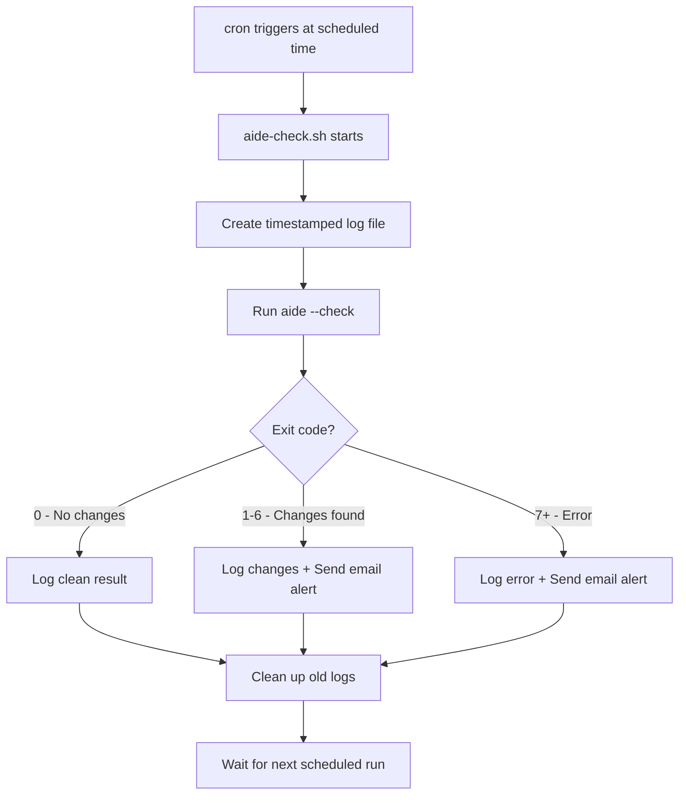

# How to Schedule Automated AIDE Integrity Checks with cron on RHEL

Author: [nawazdhandala](https://www.github.com/nawazdhandala)

Tags: RHEL, AIDE, cron, Automation, Linux

Description: Set up automated AIDE file integrity checks using cron on RHEL to continuously monitor your system for unauthorized changes without manual intervention.

---

Running AIDE manually is fine for one-off checks, but real security monitoring requires automation. You need AIDE running on a schedule, catching changes before they become incidents. On RHEL, cron is the most straightforward way to schedule these checks. This guide covers setting up automated AIDE scans with proper logging and output handling.

## Why Automate AIDE Checks

Manual integrity checks are unreliable. People forget, get busy, or skip checks when things seem fine. Automated scheduling ensures:

- Consistent, regular monitoring
- Changes are detected within hours, not weeks
- Audit trails show that checks actually ran
- Compliance requirements for regular integrity monitoring are met

## Basic cron Setup

The simplest approach is a cron job that runs AIDE daily and logs the output:

```bash
# Create a cron job for daily AIDE checks at 3 AM
sudo crontab -e
```

Add this line:

```
# Run AIDE integrity check daily at 3:00 AM and log results
0 3 * * * /usr/sbin/aide --check > /var/log/aide/aide-check-$(date +\%Y\%m\%d).log 2>&1
```

Before that works, create the log directory:

```bash
# Create the AIDE log directory
sudo mkdir -p /var/log/aide
sudo chmod 700 /var/log/aide
```

## Using a Wrapper Script

A cron one-liner works, but a wrapper script gives you more control over logging, error handling, and notifications:

```bash
# Create the AIDE check script
sudo tee /usr/local/sbin/aide-check.sh << 'SCRIPT'
#!/bin/bash
# AIDE automated integrity check script
# Runs aide --check and logs results with timestamps

LOGDIR="/var/log/aide"
LOGFILE="${LOGDIR}/aide-check-$(date +%Y%m%d-%H%M%S).log"
MAILTO="root"

# Make sure log directory exists
mkdir -p "${LOGDIR}"

# Run the check and capture both output and exit code
echo "AIDE check started: $(date)" > "${LOGFILE}"
echo "---" >> "${LOGFILE}"

/usr/sbin/aide --check >> "${LOGFILE}" 2>&1
EXIT_CODE=$?

echo "---" >> "${LOGFILE}"
echo "AIDE check finished: $(date)" >> "${LOGFILE}"
echo "Exit code: ${EXIT_CODE}" >> "${LOGFILE}"

# AIDE exit codes:
# 0 = no changes
# 1-6 = changes detected (added, removed, changed)
# 7+ = errors
if [ ${EXIT_CODE} -ne 0 ]; then
    # Send the report via mail
    mail -s "AIDE Alert: Changes detected on $(hostname)" "${MAILTO}" < "${LOGFILE}"
fi

# Clean up logs older than 90 days
find "${LOGDIR}" -name "aide-check-*.log" -mtime +90 -delete

exit ${EXIT_CODE}
SCRIPT

# Make it executable
sudo chmod 700 /usr/local/sbin/aide-check.sh
```

Now schedule the script with cron:

```bash
# Add the cron entry using the wrapper script
echo "0 3 * * * /usr/local/sbin/aide-check.sh" | sudo tee -a /var/spool/cron/root
```

Or use crontab directly:

```bash
# Edit root's crontab
sudo crontab -e
```

```
# Daily AIDE integrity check at 3 AM
0 3 * * * /usr/local/sbin/aide-check.sh
```

## Using /etc/cron.d for System-Level Scheduling

For a cleaner setup that survives user crontab resets, use `/etc/cron.d`:

```bash
# Create a dedicated cron file for AIDE
sudo tee /etc/cron.d/aide-check << 'EOF'
# AIDE file integrity check - runs daily at 3:00 AM
SHELL=/bin/bash
PATH=/sbin:/bin:/usr/sbin:/usr/bin
0 3 * * * root /usr/local/sbin/aide-check.sh
EOF

# Set proper permissions
sudo chmod 644 /etc/cron.d/aide-check
```

## Adjusting Check Frequency

Daily checks work for most environments. For higher-security systems, consider running checks more often:

```bash
# Every 6 hours
0 */6 * * * root /usr/local/sbin/aide-check.sh

# Every hour (for critical systems - note the I/O impact)
0 * * * * root /usr/local/sbin/aide-check.sh

# Twice daily - at 3 AM and 3 PM
0 3,15 * * * root /usr/local/sbin/aide-check.sh
```

Keep in mind that AIDE checks are I/O intensive. On systems with large filesystems or slow storage, frequent checks can impact performance. Monitor the check duration and adjust accordingly.

## Managing Check Duration

AIDE checks can take a while on large systems. You can measure the duration:

```bash
# Time a manual AIDE check
sudo time aide --check
```

If checks take too long, consider:

```bash
# Run with nice to lower CPU priority
0 3 * * * nice -n 19 /usr/local/sbin/aide-check.sh

# Run with ionice to lower I/O priority
0 3 * * * ionice -c 3 nice -n 19 /usr/local/sbin/aide-check.sh
```

## Log Rotation

Set up logrotate to manage AIDE logs:

```bash
# Create logrotate config for AIDE logs
sudo tee /etc/logrotate.d/aide << 'EOF'
/var/log/aide/aide-check-*.log {
    monthly
    rotate 12
    compress
    delaycompress
    missingok
    notifempty
}
EOF
```

## Verifying cron Execution

Check that your scheduled AIDE checks are actually running:

```bash
# Verify the cron job is listed
sudo crontab -l

# Check the cron log for AIDE execution
sudo journalctl -u crond --since "yesterday" | grep aide

# Check if AIDE log files are being created
ls -la /var/log/aide/
```

## Scheduling Workflow



## Testing the Automated Setup

Before relying on automated checks, test the whole pipeline:

```bash
# Run the script manually to verify it works
sudo /usr/local/sbin/aide-check.sh

# Check the exit code
echo $?

# Verify the log was created
ls -la /var/log/aide/

# Check the log contents
sudo cat /var/log/aide/aide-check-*.log | tail -20
```

Make a deliberate change and run again to confirm detection works:

```bash
# Create a file to trigger detection
sudo touch /etc/aide-cron-test

# Run the check
sudo /usr/local/sbin/aide-check.sh

# Check the latest log for the detection
sudo tail -30 /var/log/aide/aide-check-*.log

# Clean up
sudo rm /etc/aide-cron-test
```

## Handling Planned Maintenance

During planned changes (patching, deployments), you may want to skip AIDE checks or suppress alerts. One approach is to add a maintenance mode flag to your wrapper script:

```bash
# Add this near the top of aide-check.sh
MAINTENANCE_FILE="/var/run/aide-maintenance"
if [ -f "${MAINTENANCE_FILE}" ]; then
    echo "AIDE check skipped - maintenance mode active" >> "${LOGFILE}"
    exit 0
fi
```

Then toggle maintenance mode before and after changes:

```bash
# Enable maintenance mode before patching
sudo touch /var/run/aide-maintenance

# ... perform your changes ...

# Update the AIDE database
sudo aide --update
sudo cp /var/lib/aide/aide.db.new.gz /var/lib/aide/aide.db.gz

# Disable maintenance mode
sudo rm /var/run/aide-maintenance
```

This keeps your automated checks running reliably while avoiding false alarms during known changes.
