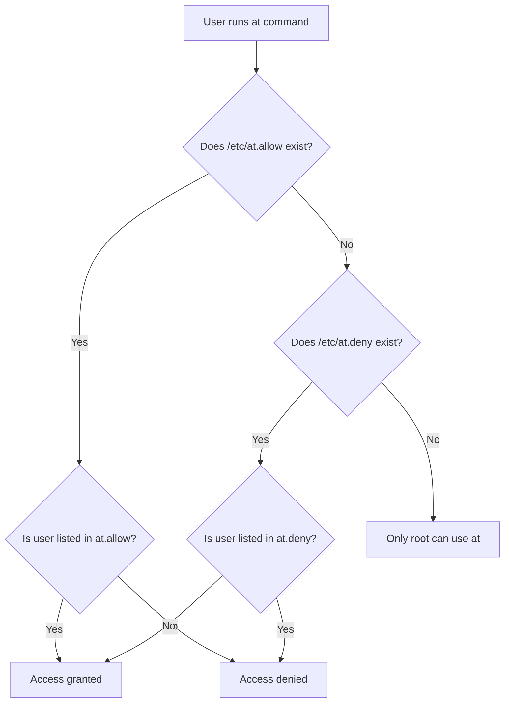

# How to Schedule One-Time Tasks with the at Command on RHEL 9

Author: [nawazdhandala](https://www.github.com/nawazdhandala)

Tags: RHEL, at Command, Scheduling, Linux, System Administration

Description: Learn how to schedule one-time tasks using the at command on RHEL 9, including managing the at queue, controlling user access, and using the batch command for load-aware execution.

---

## Why Use the at Command?

Cron is the go-to for recurring tasks, but sometimes you just need something to run once - maybe a database migration at 2 AM, a cleanup script after business hours, or a reminder to check on a deployment. That is where the `at` command comes in. It lets you schedule a one-time job to run at a specific time without any recurring schedule.

I have used `at` for years in production environments. It is perfect for those situations where you need to delay a task but do not want to create a cron entry that you will forget to remove later.

## Installing and Enabling the at Service

On RHEL 9, the `at` command is provided by the `at` package. If it is not already installed, grab it with dnf.

```bash
# Install the at package
sudo dnf install at -y
```

The `at` daemon (atd) needs to be running for scheduled jobs to execute.

```bash
# Start and enable the atd service so it survives reboots
sudo systemctl enable --now atd

# Verify it is running
sudo systemctl status atd
```

## Scheduling Your First Job

The basic syntax is straightforward. You type `at` followed by a time specification, then enter commands interactively. Press Ctrl+D when you are done.

```bash
# Schedule a job to run at 3:00 AM today (or tomorrow if 3 AM has passed)
at 3:00 AM
```

Once you hit Enter, you get an `at>` prompt where you type your commands:

```
at> /usr/local/bin/cleanup-logs.sh
at> echo "Log cleanup completed" | mail -s "Cleanup Done" admin@example.com
at> <EOT>   # Press Ctrl+D here
```

You can also pipe commands directly into `at`, which is much more useful in scripts.

```bash
# Schedule a job using a pipe - great for automation
echo "/usr/local/bin/backup-db.sh --full" | at 02:00 AM

# Schedule using a heredoc for multiple commands
at 11:30 PM <<'EOF'
/usr/local/bin/export-reports.sh
/usr/local/bin/send-reports.sh
EOF
```

## Time Specifications

The `at` command supports a wide range of time formats. Here are the ones I use most often.

```bash
# Specific time today (or next occurrence)
at 14:30
at 2:30 PM

# Specific date and time
at 2:30 PM March 15
at 14:30 2026-03-15

# Relative time from now
at now + 30 minutes
at now + 2 hours
at now + 1 day

# Named times
at midnight
at noon
at teatime    # 4:00 PM, if you were wondering

# Tomorrow at a specific time
at 9:00 AM tomorrow
```

## Managing the Job Queue

Once you have a few jobs queued up, you will want to keep track of them. The `atq` command lists all pending jobs.

```bash
# List all pending at jobs for the current user
atq
```

Output looks something like this:

```
3    Wed Mar  4 14:30:00 2026 a nawazdhandala
5    Thu Mar  5 02:00:00 2026 a nawazdhandala
7    Thu Mar  5 09:00:00 2026 a nawazdhandala
```

The first column is the job number, followed by the scheduled time, queue letter, and username.

To see what a specific job will actually do, use `at -c` with the job number.

```bash
# Display the full environment and commands for job number 3
at -c 3
```

This shows the complete environment that will be set up when the job runs, plus your commands at the bottom. It is worth checking if you are debugging why a job did not work as expected.

## Removing Scheduled Jobs

Changed your mind? Use `atrm` to delete a pending job.

```bash
# Remove job number 5 from the queue
atrm 5

# Verify it was removed
atq
```

You can also remove multiple jobs at once.

```bash
# Remove jobs 3, 5, and 7
atrm 3 5 7
```

## The batch Command

The `batch` command is a close relative of `at`. Instead of running at a specific time, it runs when the system load drops below a threshold (default is 1.5 on RHEL 9). This is excellent for resource-intensive tasks that should only run when the system is not busy.

```bash
# Schedule a heavy compression task to run when load is low
echo "tar czf /backup/archive-$(date +%Y%m%d).tar.gz /var/data/" | batch
```

You can adjust the load threshold by modifying the atd startup options.

```bash
# Edit the atd service to change the load threshold to 0.8
sudo systemctl edit atd
```

Add the following override:

```ini
[Service]
ExecStart=
ExecStart=/usr/sbin/atd -l 0.8
```

Then reload and restart:

```bash
# Apply the new load threshold
sudo systemctl daemon-reload
sudo systemctl restart atd
```

## Controlling Who Can Use at

Access control for the `at` command is handled through two files: `/etc/at.allow` and `/etc/at.deny`. The logic works like this:



Here is how to set it up in practice.

```bash
# Allow only specific users to use at
# Creating at.allow means ONLY listed users can use at
sudo bash -c 'echo "admin" > /etc/at.allow'
sudo bash -c 'echo "deploy" >> /etc/at.allow'

# Or, deny specific users while allowing everyone else
# Only works if at.allow does NOT exist
sudo bash -c 'echo "contractor1" > /etc/at.deny'
sudo bash -c 'echo "tempuser" >> /etc/at.deny'
```

Important: if `/etc/at.allow` exists, `/etc/at.deny` is completely ignored. Only users in `at.allow` can use the command. If neither file exists, only root can schedule `at` jobs.

## Practical Tips

**Job output goes to mail by default.** If your job produces any output (stdout or stderr), `at` will try to mail it to the user. If mail is not configured, that output just disappears. Redirect explicitly if you need it.

```bash
# Redirect both stdout and stderr to a log file
echo "/opt/scripts/nightly-job.sh > /var/log/nightly-job.log 2>&1" | at 01:00 AM
```

**The job runs with your current environment.** The `at` command captures your environment variables at the time you create the job. If you need a clean environment or a different one, handle that in the script itself.

```bash
# Source the profile explicitly in your at job
at now + 1 hour <<'EOF'
source /etc/profile
source ~/.bash_profile
/opt/scripts/deploy.sh
EOF
```

**Check /var/log/cron for at job logs.** On RHEL 9, both cron and at job activity is logged here.

```bash
# Check recent at job execution logs
sudo grep atd /var/log/cron | tail -20
```

## Summary

The `at` command is a simple but powerful tool for one-off scheduled tasks. It fills the gap between "I need to do this later" and "I need to do this on a recurring basis." Combined with `batch` for load-sensitive work and proper access controls through `at.allow` and `at.deny`, it is a reliable part of any sysadmin's toolkit on RHEL 9.
