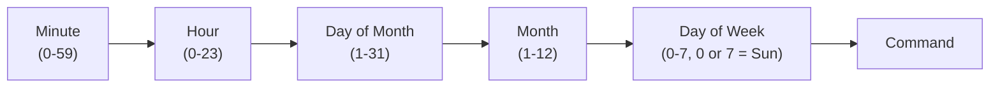
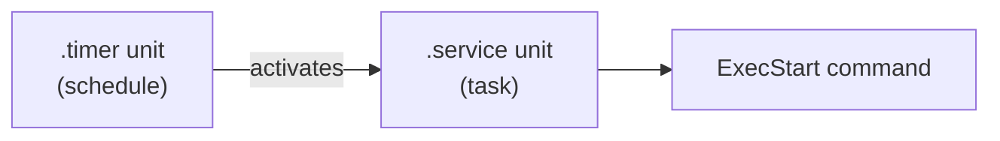

# How to Schedule Recurring Tasks with cron and systemd Timers on RHEL 9

Author: [nawazdhandala](https://www.github.com/nawazdhandala)

Tags: RHEL, cron, systemd Timers, Scheduling, Linux, Automation

Description: A practical comparison of cron and systemd timers on RHEL 9, with examples of both approaches for scheduling recurring tasks, plus guidance on when to use each.

---

Every Linux server has recurring tasks: backups, log rotation, certificate renewal, cleanup scripts, health checks. On RHEL 9, you have two solid options for scheduling these: the traditional cron daemon and the newer systemd timers. Both get the job done, but they have different strengths. This guide covers how to use each one and when to pick one over the other.

## Part 1: Scheduling with cron

Cron has been the standard task scheduler on Unix systems for decades. It's simple, well-understood, and available everywhere.

### The crontab Syntax

Each cron entry has five time fields followed by the command:

```
# minute  hour  day-of-month  month  day-of-week  command
  0       2     *             *      *            /opt/scripts/backup.sh
```



Special characters:
- `*` - Every value
- `,` - List of values (1,3,5)
- `-` - Range (1-5)
- `/` - Step (*/5 means every 5 units)

### Common cron Schedules

```bash
# Every 5 minutes
*/5 * * * * /opt/scripts/healthcheck.sh

# Every hour at minute 0
0 * * * * /opt/scripts/hourly-report.sh

# Every day at 2:30 AM
30 2 * * * /opt/scripts/backup.sh

# Every Monday at 6:00 AM
0 6 * * 1 /opt/scripts/weekly-cleanup.sh

# First day of every month at midnight
0 0 1 * * /opt/scripts/monthly-report.sh

# Every weekday at 8 AM and 5 PM
0 8,17 * * 1-5 /opt/scripts/check-stuff.sh
```

### Managing User Crontabs

Each user can have their own crontab. Jobs run as that user with that user's permissions.

```bash
# Edit your own crontab
crontab -e

# List your current crontab entries
crontab -l

# Remove your entire crontab (careful!)
crontab -r

# Edit another user's crontab (requires root)
sudo crontab -u jsmith -e

# List another user's crontab
sudo crontab -l -u jsmith
```

A well-organized user crontab should include comments and environment variables:

```bash
# Set the shell and PATH so scripts can find commands
SHELL=/bin/bash
PATH=/usr/local/bin:/usr/bin:/bin
MAILTO=admin@example.com

# Database backup - runs daily at 2 AM
0 2 * * * /opt/scripts/db-backup.sh >> /var/log/db-backup.log 2>&1

# Cleanup temp files older than 7 days - runs weekly on Sunday at 3 AM
0 3 * * 0 find /tmp -type f -mtime +7 -delete

# Certificate renewal check - runs daily at noon
0 12 * * * /opt/scripts/cert-check.sh >> /var/log/cert-check.log 2>&1
```

The `MAILTO` variable sends the job's output as email. If you don't want email, either redirect output to a log file (as shown above) or set `MAILTO=""`.

### System-Wide cron Directories

Besides user crontabs, RHEL 9 has system-wide cron directories:

| Location | Purpose |
|----------|---------|
| `/etc/crontab` | System crontab (includes a user field) |
| `/etc/cron.d/` | Drop-in files (same format as /etc/crontab) |
| `/etc/cron.hourly/` | Scripts run every hour |
| `/etc/cron.daily/` | Scripts run once a day |
| `/etc/cron.weekly/` | Scripts run once a week |
| `/etc/cron.monthly/` | Scripts run once a month |

For the drop-in directory `/etc/cron.d/`, files use the same format as `/etc/crontab` with an added user field:

```bash
# Create a cron drop-in file for a backup job
sudo tee /etc/cron.d/database-backup <<'EOF'
# Database backup - runs every night at 2 AM as the postgres user
SHELL=/bin/bash
PATH=/usr/local/bin:/usr/bin:/bin
0 2 * * * postgres /opt/scripts/pg-backup.sh >> /var/log/pg-backup.log 2>&1
EOF

# Set proper permissions
sudo chmod 644 /etc/cron.d/database-backup
```

For the periodic directories (`cron.daily`, `cron.weekly`, etc.), just drop an executable script in the directory:

```bash
# Create a daily cleanup script
sudo tee /etc/cron.daily/cleanup-logs <<'EOF'
#!/bin/bash
# Remove application logs older than 30 days
find /var/log/myapp -type f -name "*.log" -mtime +30 -delete
EOF

# Make it executable
sudo chmod 755 /etc/cron.daily/cleanup-logs
```

### Controlling cron Access

RHEL 9 uses `/etc/cron.allow` and `/etc/cron.deny` to control who can use cron:

```bash
# Only allow specific users to use cron
# (If cron.allow exists, only listed users can use cron)
sudo tee /etc/cron.allow <<'EOF'
root
jsmith
deploy
EOF
```

## Part 2: Scheduling with systemd Timers

systemd timers are the modern alternative to cron. They're more verbose to set up, but they offer features that cron can't match.

### How systemd Timers Work

A timer consists of two unit files:
1. A `.timer` unit that defines the schedule
2. A `.service` unit that defines what to run



### Creating a Basic Timer

Let's create a timer that runs a backup script daily at 2 AM.

First, create the service unit at `/etc/systemd/system/backup.service`:

```ini
[Unit]
Description=Daily database backup

[Service]
# Run the backup script
ExecStart=/opt/scripts/db-backup.sh
# Run as a specific user
User=postgres
# Set a timeout so the job doesn't run forever
TimeoutStartSec=3600
# Log output to the journal
StandardOutput=journal
StandardError=journal
```

Then create the timer unit at `/etc/systemd/system/backup.timer`:

```ini
[Unit]
Description=Run database backup daily at 2 AM

[Timer]
# Calendar-based schedule (like cron)
OnCalendar=*-*-* 02:00:00
# If the system was off when the timer should have fired, run it when it comes back
Persistent=true
# Add a random delay of up to 15 minutes to avoid thundering herd
RandomizedDelaySec=900

[Install]
# This makes the timer start at boot
WantedBy=timers.target
```

Enable and start the timer:

```bash
# Reload systemd to pick up the new unit files
sudo systemctl daemon-reload

# Enable the timer to start at boot
sudo systemctl enable backup.timer

# Start the timer now
sudo systemctl start backup.timer

# Verify the timer is active
systemctl list-timers --all | grep backup
```

### OnCalendar Syntax

The `OnCalendar` directive uses a flexible time specification format:

```bash
# Every day at 2 AM
OnCalendar=*-*-* 02:00:00

# Every Monday at 6 AM
OnCalendar=Mon *-*-* 06:00:00

# Every 15 minutes
OnCalendar=*:0/15

# First day of every month at midnight
OnCalendar=*-*-01 00:00:00

# Every weekday at 9 AM
OnCalendar=Mon..Fri *-*-* 09:00:00

# Twice a day at 8 AM and 8 PM
OnCalendar=*-*-* 08,20:00:00
```

You can test calendar expressions without creating a timer:

```bash
# Check when a calendar expression would next trigger
systemd-analyze calendar "*-*-* 02:00:00"

# Show the next 5 trigger times
systemd-analyze calendar --iterations=5 "Mon *-*-* 06:00:00"
```

### Monotonic Timers

Instead of calendar-based schedules, you can use monotonic timers that trigger relative to an event:

```ini
[Timer]
# 5 minutes after the timer unit is activated
OnActiveSec=5min

# 1 hour after the system boots
OnBootSec=1h

# Every 30 minutes after the timer is activated
OnActiveSec=30min
OnUnitActiveSec=30min
```

### Managing Timers

```bash
# List all active timers with their next trigger time
systemctl list-timers

# List all timers including inactive ones
systemctl list-timers --all

# Check the status of a specific timer
systemctl status backup.timer

# Check when a timer will next fire
systemctl show backup.timer --property=NextElapseUSecRealtime

# Manually trigger the associated service (without waiting for the timer)
sudo systemctl start backup.service

# View logs from the timer's service
journalctl -u backup.service --no-pager -n 50
```

## Part 3: Comparing cron and systemd Timers

| Feature | cron | systemd Timers |
|---------|------|----------------|
| Setup complexity | Simple (one line) | More files needed |
| Logging | Must redirect output manually | Automatic journal integration |
| Dependencies | None | Can depend on other units |
| Resource control | None | Full cgroup support (CPU, memory limits) |
| Missed runs | Lost if system was off | Persistent=true catches up |
| Random delay | Not built-in | RandomizedDelaySec |
| Monitoring | Check logs manually | systemctl list-timers, journalctl |
| Calendar syntax | 5-field cron format | Flexible OnCalendar format |
| User jobs | crontab per user | Possible but more complex |
| Transient jobs | Not supported | systemd-run for one-offs |

### When to Use cron

- Simple, one-off scheduled commands
- User-level scheduled tasks
- Quick scripts that don't need dependency management
- Environments where simplicity matters most
- Teams already comfortable with cron syntax

### When to Use systemd Timers

- Tasks that need dependency ordering (wait for network, database, etc.)
- Tasks that need resource limits (CPU, memory caps)
- When you want integrated logging through the journal
- When you need to catch up on missed runs after downtime
- When you want to avoid thundering herd with random delays

## Practical Examples

### Example: Log Cleanup with cron

```bash
# Edit the root crontab
sudo crontab -e
```

```bash
# Clean up application logs older than 30 days, every Sunday at 4 AM
0 4 * * 0 find /var/log/myapp -name "*.log" -mtime +30 -delete >> /var/log/cleanup.log 2>&1
```

### Example: Log Cleanup with systemd Timer

Create `/etc/systemd/system/log-cleanup.service`:

```ini
[Unit]
Description=Clean up old application logs

[Service]
Type=oneshot
ExecStart=/usr/bin/find /var/log/myapp -name "*.log" -mtime +30 -delete
```

Create `/etc/systemd/system/log-cleanup.timer`:

```ini
[Unit]
Description=Weekly log cleanup

[Timer]
OnCalendar=Sun *-*-* 04:00:00
Persistent=true

[Install]
WantedBy=timers.target
```

```bash
# Enable and start
sudo systemctl daemon-reload
sudo systemctl enable --now log-cleanup.timer
```

### Example: One-Off Scheduled Task with systemd-run

Need to schedule something quickly without creating unit files?

```bash
# Run a command 30 minutes from now
sudo systemd-run --on-active=30min /opt/scripts/one-time-task.sh

# Run a command at a specific time
sudo systemd-run --on-calendar="2026-03-05 15:00:00" /opt/scripts/deploy.sh

# Check transient timers
systemctl list-timers --all
```

## Debugging Scheduled Tasks

For cron jobs:

```bash
# Check the cron log
sudo journalctl -u crond --no-pager -n 30

# Verify crond is running
systemctl status crond

# Test your cron command manually first
# Run it exactly as cron would (with minimal PATH)
env -i PATH=/usr/bin:/bin /opt/scripts/backup.sh
```

For systemd timers:

```bash
# Check timer status and next trigger time
systemctl status backup.timer

# Check service logs for the last run
journalctl -u backup.service --no-pager -n 30

# Manually trigger the service to test it
sudo systemctl start backup.service

# Watch the service run in real time
journalctl -u backup.service -f
```

## Wrapping Up

Both cron and systemd timers are reliable scheduling tools on RHEL 9. Cron wins on simplicity - one line and you're done. systemd timers win on features - logging, dependencies, resource control, and catch-up runs. For most teams, the practical answer is to use both: cron for simple scripts and user-level tasks, and systemd timers for anything that needs the extra capabilities. Whatever you choose, always test your scheduled tasks manually first, monitor that they're actually running, and keep your scripts idempotent so a missed or duplicate run doesn't cause problems.
