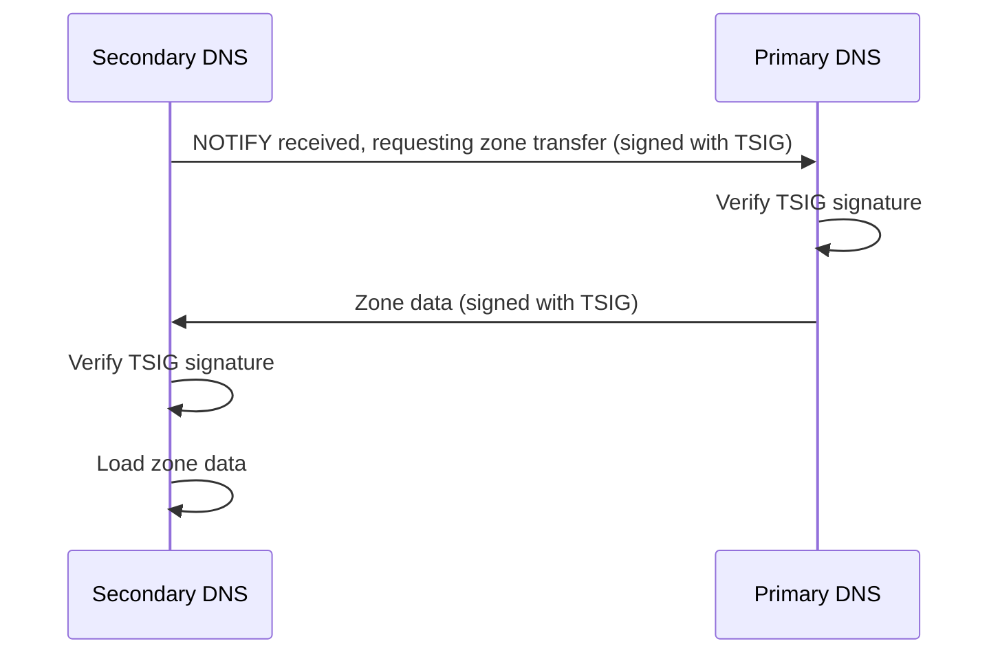

# How to Secure BIND DNS with TSIG Keys for Zone Transfers on RHEL 9

Author: [nawazdhandala](https://www.github.com/nawazdhandala)

Tags: RHEL, BIND, TSIG, DNS Security, Linux

Description: Protect your BIND zone transfers on RHEL 9 using TSIG (Transaction SIGnature) keys to authenticate and encrypt DNS communications between primary and secondary servers.

---

By default, zone transfers in BIND are controlled by IP-based ACLs. That works if you trust your network, but if someone spoofs a source IP or gains access to your network, they can pull your entire zone data. TSIG (Transaction SIGnature) adds cryptographic authentication to zone transfers, ensuring that only servers with the shared secret can participate.

## How TSIG Works

TSIG uses a shared secret key (HMAC) to sign DNS messages. Both the primary and secondary servers must have the same key. Every zone transfer request and response is authenticated with this key.



## Generating a TSIG Key

Use `tsig-keygen` to create a shared key:

```bash
tsig-keygen -a hmac-sha256 transfer-key > /etc/named/transfer-key.conf
```

View the generated key:

```bash
cat /etc/named/transfer-key.conf
```

It will look something like this:

```
key "transfer-key" {
    algorithm hmac-sha256;
    secret "YWJjZGVmMTIzNDU2Nzg5MGFiY2RlZjEyMzQ1Njc4OTA=";
};
```

Copy this file to your secondary server. The key must be identical on both:

```bash
scp /etc/named/transfer-key.conf root@192.168.1.11:/etc/named/transfer-key.conf
```

Set proper permissions on both servers:

```bash
chown root:named /etc/named/transfer-key.conf
chmod 640 /etc/named/transfer-key.conf
```

## Configuring the Primary Server

Include the key file and update the zone configuration to require TSIG:

```bash
cat > /etc/named.conf << 'EOF'
// Include the TSIG key
include "/etc/named/transfer-key.conf";

options {
    listen-on port 53 { any; };
    listen-on-v6 port 53 { any; };
    directory "/var/named";
    allow-query { any; };
    recursion no;
    dnssec-validation auto;
    pid-file "/run/named/named.pid";
    notify yes;
};

logging {
    channel default_log {
        file "/var/log/named/default.log" versions 3 size 5m;
        severity info;
        print-time yes;
    };
    category default { default_log; };
    category xfer-out { default_log; };
};

zone "." IN {
    type hint;
    file "named.ca";
};

zone "example.com" IN {
    type primary;
    file "example.com.zone";

    // Only allow transfers authenticated with the TSIG key
    allow-transfer { key transfer-key; };

    // Notify the secondary
    also-notify { 192.168.1.11; };
};

zone "1.168.192.in-addr.arpa" IN {
    type primary;
    file "192.168.1.rev";
    allow-transfer { key transfer-key; };
    also-notify { 192.168.1.11; };
};
EOF
```

Validate and reload:

```bash
named-checkconf /etc/named.conf
systemctl reload named
```

## Configuring the Secondary Server

Include the same key file and configure the zone to use it:

```bash
cat > /etc/named.conf << 'EOF'
// Include the same TSIG key
include "/etc/named/transfer-key.conf";

// Define the primary server with its TSIG key
server 192.168.1.10 {
    keys { transfer-key; };
};

options {
    listen-on port 53 { any; };
    listen-on-v6 port 53 { any; };
    directory "/var/named";
    allow-query { any; };
    recursion no;
    dnssec-validation auto;
    pid-file "/run/named/named.pid";
};

logging {
    channel default_log {
        file "/var/log/named/default.log" versions 3 size 5m;
        severity info;
        print-time yes;
    };
    category default { default_log; };
    category xfer-in { default_log; };
};

zone "." IN {
    type hint;
    file "named.ca";
};

zone "example.com" IN {
    type secondary;
    file "slaves/example.com.zone";
    masters { 192.168.1.10; };
    allow-transfer { none; };
};

zone "1.168.192.in-addr.arpa" IN {
    type secondary;
    file "slaves/192.168.1.rev";
    masters { 192.168.1.10; };
    allow-transfer { none; };
};
EOF
```

The `server` statement with `keys` tells BIND to sign all communication with that server using the specified TSIG key.

Validate and restart:

```bash
named-checkconf /etc/named.conf
systemctl restart named
```

## Testing TSIG-Authenticated Transfers

Force a zone transfer on the secondary:

```bash
rndc retransfer example.com
```

Check the logs on both servers:

```bash
# On the primary
tail -20 /var/log/named/default.log
```

You should see successful transfer messages. Failed TSIG authentication produces clear error messages.

Test that unauthenticated transfers are blocked. From a machine without the TSIG key:

```bash
dig @192.168.1.10 example.com AXFR
```

This should fail with a REFUSED response.

Test with the key (from a machine that has it):

```bash
dig @192.168.1.10 example.com AXFR -k /etc/named/transfer-key.conf
```

This should succeed and return the full zone.

## Using Multiple TSIG Keys

In larger environments, you might want different keys for different secondaries:

```bash
# Generate a key for each secondary
tsig-keygen -a hmac-sha256 secondary1-key > /etc/named/secondary1-key.conf
tsig-keygen -a hmac-sha256 secondary2-key > /etc/named/secondary2-key.conf
```

Then allow both keys in the zone configuration:

```
zone "example.com" IN {
    type primary;
    file "example.com.zone";
    allow-transfer { key secondary1-key; key secondary2-key; };
};
```

## Key Rotation

Periodically rotating TSIG keys is good practice. The process:

1. Generate a new key
2. Add the new key to both servers' configurations (keep the old key too)
3. Allow both keys for transfers
4. Update the secondary to use the new key
5. Remove the old key from both servers after confirming transfers work

## Troubleshooting

If transfers fail after adding TSIG, check these things:

The key name, algorithm, and secret must be identical on both servers:

```bash
# Compare keys
diff <(grep secret /etc/named/transfer-key.conf) <(ssh 192.168.1.11 "grep secret /etc/named/transfer-key.conf")
```

Make sure the secondary's `server` statement references the correct primary IP and key name:

```bash
named-checkconf /etc/named.conf
```

Check for time synchronization issues. TSIG includes timestamps, so clocks need to be reasonably in sync:

```bash
chronyc tracking
```

TSIG is a straightforward addition to your DNS infrastructure that eliminates the risk of unauthorized zone transfers. The setup takes about 15 minutes and the security benefit is significant.
