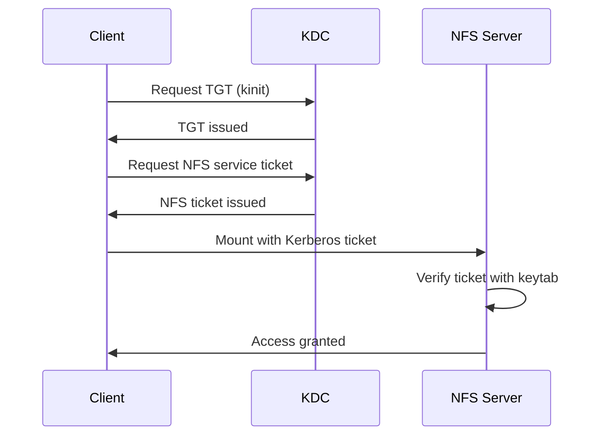

# How to Secure NFS Exports with Kerberos Authentication on RHEL

Author: [nawazdhandala](https://www.github.com/nawazdhandala)

Tags: RHEL, NFS, Kerberos, Security, Linux

Description: Secure your NFS exports with Kerberos authentication on RHEL, providing strong user identity verification and optional data encryption.

---

## Why Kerberos for NFS?

Standard NFS relies on trusting client IP addresses and UIDs, which is easily spoofable. Anyone who can send packets from an allowed IP can access your exports. Kerberos solves this by requiring proper authentication tickets, so NFS access is tied to verified user identities rather than network addresses.

RHEL supports three Kerberos security levels for NFS:

- **krb5** - Authentication only
- **krb5i** - Authentication plus integrity checking
- **krb5p** - Authentication, integrity, and privacy (encryption)

## Prerequisites

- A working Kerberos KDC (Key Distribution Center), often an Active Directory or FreeIPA server
- NFS server and clients joined to the Kerberos realm
- DNS properly configured (Kerberos is sensitive to DNS issues)
- Time synchronized across all machines (Kerberos tolerates ~5 minutes of clock skew)

## Step 1 - Ensure Kerberos Client Is Configured

On both the NFS server and clients:

```bash
# Install Kerberos client packages
sudo dnf install -y krb5-workstation

# Verify /etc/krb5.conf points to your KDC
cat /etc/krb5.conf
```

The krb5.conf should contain your realm and KDC information:

```ini
[libdefaults]
    default_realm = EXAMPLE.COM
    dns_lookup_realm = false
    dns_lookup_kdc = true

[realms]
    EXAMPLE.COM = {
        kdc = kdc.example.com
        admin_server = kdc.example.com
    }

[domain_realm]
    .example.com = EXAMPLE.COM
    example.com = EXAMPLE.COM
```

## Step 2 - Create Service Principals

On the KDC, create NFS service principals for the server and each client:

```bash
# On the KDC (or using kadmin remotely)
kadmin -q "addprinc -randkey nfs/nfs-server.example.com"
kadmin -q "addprinc -randkey nfs/client1.example.com"
```

## Step 3 - Create Keytab Files

Extract the service keys into keytab files:

```bash
# On the NFS server, add the NFS principal to the keytab
kadmin -q "ktadd nfs/nfs-server.example.com"

# Verify the keytab contains the NFS principal
klist -k /etc/krb5.keytab
```

Do the same on each NFS client for its principal.

## Step 4 - Enable NFS Kerberos Services

On both server and clients:

```bash
# Enable the GSS proxy for NFS Kerberos
sudo systemctl enable --now gssproxy

# Enable and start rpc-gssd (NFS GSS authentication daemon)
sudo systemctl enable --now rpc-gssd

# On the server, also enable rpc-svcgssd is not needed on RHEL
# gssproxy handles both sides
```

## Step 5 - Configure the Server Export

Update /etc/exports to require Kerberos:

```bash
# Export with Kerberos authentication and encryption
/srv/nfs/secure  *.example.com(rw,sync,sec=krb5p,no_subtree_check)
```

The `sec=` option specifies the security flavor:
- `sec=krb5` - Authentication only
- `sec=krb5i` - Authentication and integrity
- `sec=krb5p` - Authentication, integrity, and privacy (full encryption)

Apply the export:

```bash
sudo exportfs -arv
sudo systemctl restart nfs-server
```

## Step 6 - Mount with Kerberos on the Client

```bash
# Mount using Kerberos security
sudo mount -t nfs -o sec=krb5p nfs-server.example.com:/srv/nfs/secure /mnt/secure-nfs
```

For persistent mounts, add to /etc/fstab:

```bash
nfs-server.example.com:/srv/nfs/secure  /mnt/secure-nfs  nfs  sec=krb5p,_netdev  0 0
```

## Authentication Flow



## Step 7 - Test Access

```bash
# Get a Kerberos ticket
kinit user@EXAMPLE.COM

# Verify the ticket
klist

# Access the NFS share
ls /mnt/secure-nfs
touch /mnt/secure-nfs/test-kerberos
```

## Choosing the Right Security Level

| Level | Authentication | Integrity | Encryption | Performance |
|-------|---------------|-----------|------------|-------------|
| krb5 | Yes | No | No | Best |
| krb5i | Yes | Yes | No | Good |
| krb5p | Yes | Yes | Yes | Lower |

For most environments, `krb5i` provides a good balance. Use `krb5p` when the network is untrusted and data confidentiality matters.

## Troubleshooting Kerberos NFS

```bash
# Check for GSS errors in the journal
journalctl -u rpc-gssd

# Verify the keytab is valid
klist -k /etc/krb5.keytab

# Check NFS server logs
journalctl -u nfs-server

# Test Kerberos connectivity
kinit -V user@EXAMPLE.COM

# Check DNS (Kerberos needs proper forward and reverse DNS)
host nfs-server.example.com
host 192.168.1.10
```

Common issues:
- Clock skew between client and server
- Missing or incorrect keytab entries
- DNS resolution failures
- SELinux denials (check `ausearch -m avc`)

## Wrap-Up

Kerberos-secured NFS on RHEL replaces weak IP-based trust with proper cryptographic authentication. The setup requires a working Kerberos infrastructure, but once in place, it provides strong security that scales well. For most organizations already running Active Directory or FreeIPA, the Kerberos infrastructure is already there, making this a natural step to securing your NFS exports.
