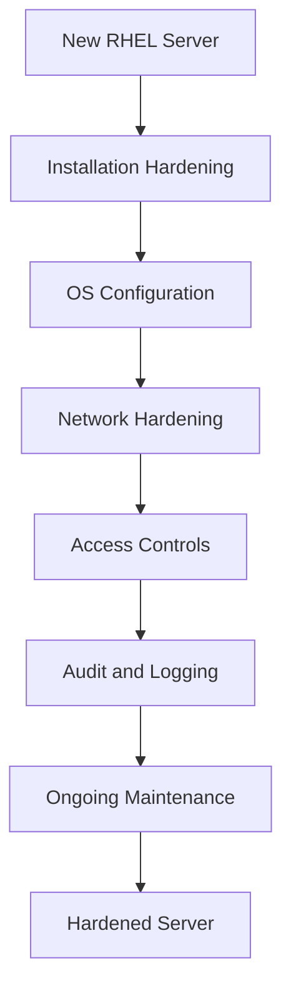

# How to Build a Security Hardening Checklist for RHEL Servers

Author: [nawazdhandala](https://www.github.com/nawazdhandala)

Tags: RHEL, Security Hardening, Checklist, Linux

Description: A comprehensive security hardening checklist for RHEL servers covering everything from initial installation to ongoing maintenance, with actionable steps you can follow in order.

---

Every time I build a new RHEL server, I run through the same hardening routine. After years of doing this, I have distilled it into a checklist that covers the essentials without being so long that you give up halfway through. This is not a theoretical exercise. These are the things that actually matter when an auditor shows up or when you are trying to keep attackers out.

## Why You Need a Checklist

Security hardening is not a one-time activity. It is a process that starts during installation and continues through the life of the server. Without a checklist, it is easy to forget a step, especially when you are building dozens of servers at a time. A good checklist gives you repeatable, auditable results.



## Phase 1: Installation Hardening

These items should be addressed during the OS installation itself.

### Partitioning

Separate partitions limit the blast radius of a full filesystem. At minimum, isolate these mount points:

```bash
# Verify your partition layout after installation
lsblk -f

# Confirm separate partitions exist for critical paths
df -h /tmp /var /var/log /var/log/audit /home
```

Your partition table should include separate entries for `/tmp`, `/var`, `/var/log`, `/var/log/audit`, and `/home`. Each one should have appropriate mount options.

### Mount options

Add restrictive mount options to non-root partitions:

```bash
# Check current mount options
findmnt -l

# Example /etc/fstab entries with hardened mount options
# /tmp should have nodev, nosuid, noexec
# /dev/mapper/rhel-tmp /tmp xfs defaults,nodev,nosuid,noexec 0 0
```

### Minimal installation

Always choose the "Minimal Install" option during setup. You can add packages later, but removing them after the fact is messy and easy to get wrong.

## Phase 2: OS Configuration

### Remove unnecessary packages

After the minimal install, audit what is still present:

```bash
# List all installed packages
dnf list installed | wc -l

# Remove packages you do not need (example: remove GUI-related leftovers)
dnf remove -y xorg-x11* gtk* 2>/dev/null

# Clean up orphaned dependencies
dnf autoremove -y
```

### Disable unused services

```bash
# List all enabled services
systemctl list-unit-files --state=enabled --type=service

# Disable services you do not need
systemctl disable --now cups.service
systemctl disable --now avahi-daemon.service
systemctl disable --now bluetooth.service
```

### Set the default target

If this is a server, there is no reason to run a graphical desktop:

```bash
# Set multi-user target (no GUI)
systemctl set-default multi-user.target
```

## Phase 3: User and Access Controls

### Password policies

Configure password aging and complexity:

```bash
# Set password aging defaults in /etc/login.defs
# These values apply to newly created accounts
grep -E "^PASS_MAX_DAYS|^PASS_MIN_DAYS|^PASS_MIN_LEN|^PASS_WARN_AGE" /etc/login.defs

# Recommended values
sed -i 's/^PASS_MAX_DAYS.*/PASS_MAX_DAYS   90/' /etc/login.defs
sed -i 's/^PASS_MIN_DAYS.*/PASS_MIN_DAYS   7/' /etc/login.defs
sed -i 's/^PASS_WARN_AGE.*/PASS_WARN_AGE   14/' /etc/login.defs
```

### Lock down root

```bash
# Disable direct root SSH login
sed -i 's/^#PermitRootLogin.*/PermitRootLogin no/' /etc/ssh/sshd_config
systemctl restart sshd

# Restrict su access to the wheel group
echo "auth required pam_wheel.so use_uid" >> /etc/pam.d/su
```

### Configure sudo

```bash
# Ensure sudo logs all commands
echo 'Defaults logfile="/var/log/sudo.log"' >> /etc/sudoers.d/logging
chmod 440 /etc/sudoers.d/logging
```

## Phase 4: Network Hardening

### Firewall

```bash
# Ensure firewalld is running
systemctl enable --now firewalld

# Check the default zone
firewall-cmd --get-default-zone

# List allowed services - remove anything unnecessary
firewall-cmd --list-all

# Remove unused services (example)
firewall-cmd --permanent --remove-service=cockpit
firewall-cmd --reload
```

### Kernel network parameters

Harden the kernel network stack via sysctl:

```bash
# Create a hardening sysctl configuration
cat > /etc/sysctl.d/99-hardening.conf << 'EOF'
# Disable IP forwarding
net.ipv4.ip_forward = 0

# Disable source routing
net.ipv4.conf.all.accept_source_route = 0
net.ipv4.conf.default.accept_source_route = 0

# Enable SYN cookies to prevent SYN flood attacks
net.ipv4.tcp_syncookies = 1

# Disable ICMP redirects
net.ipv4.conf.all.accept_redirects = 0
net.ipv4.conf.default.accept_redirects = 0
net.ipv4.conf.all.send_redirects = 0
net.ipv4.conf.default.send_redirects = 0

# Log suspicious packets
net.ipv4.conf.all.log_martians = 1
net.ipv4.conf.default.log_martians = 1

# Disable IPv6 if not needed
net.ipv6.conf.all.disable_ipv6 = 1
net.ipv6.conf.default.disable_ipv6 = 1
EOF

# Apply the settings
sysctl --system
```

## Phase 5: Audit and Logging

### Configure auditd

```bash
# Install and enable auditd
dnf install -y audit
systemctl enable --now auditd

# Add basic audit rules for critical files
cat >> /etc/audit/rules.d/hardening.rules << 'EOF'
-w /etc/passwd -p wa -k identity
-w /etc/group -p wa -k identity
-w /etc/shadow -p wa -k identity
-w /etc/sudoers -p wa -k actions
-w /etc/ssh/sshd_config -p wa -k sshd_config
EOF

# Load the rules
augenrules --load
```

### Configure rsyslog

```bash
# Ensure rsyslog is running
systemctl enable --now rsyslog

# Verify critical log files exist and are being written to
ls -la /var/log/messages /var/log/secure /var/log/audit/audit.log
```

## Phase 6: Ongoing Maintenance

### Automated security updates

```bash
# Install dnf-automatic for automated patching
dnf install -y dnf-automatic

# Configure for security-only updates
sed -i 's/^upgrade_type.*/upgrade_type = security/' /etc/dnf/automatic.conf
sed -i 's/^apply_updates.*/apply_updates = yes/' /etc/dnf/automatic.conf

# Enable the timer
systemctl enable --now dnf-automatic.timer
```

### Run compliance scans regularly

```bash
# Install OpenSCAP
dnf install -y openscap-scanner scap-security-guide

# Run a quick CIS benchmark scan
oscap xccdf eval \
  --profile xccdf_org.ssgproject.content_profile_cis \
  --results /tmp/cis-results.xml \
  --report /tmp/cis-report.html \
  /usr/share/xml/scap/ssg/content/ssg-rhel9-ds.xml
```

## The Complete Checklist

Here is the condensed checklist you can print or save:

| Category | Item | Status |
|----------|------|--------|
| Installation | Separate partitions for /tmp, /var, /var/log, /home | |
| Installation | Restrictive mount options (nodev, nosuid, noexec) | |
| Installation | Minimal install profile | |
| OS Config | Remove unnecessary packages | |
| OS Config | Disable unused services | |
| OS Config | Set multi-user target | |
| Access | Disable root SSH login | |
| Access | Configure password aging | |
| Access | Set up sudo logging | |
| Network | Enable and configure firewalld | |
| Network | Harden kernel network parameters | |
| Audit | Configure auditd with rules | |
| Audit | Enable rsyslog | |
| Maintenance | Enable automatic security updates | |
| Maintenance | Schedule regular compliance scans | |

## Automating the Checklist

For production environments, turn this checklist into an Ansible playbook or a Kickstart file so that every server gets the same treatment. Manual checklists are fine for a handful of servers, but if you are managing more than ten, automation is the only realistic path.

The key takeaway is this: a security hardening checklist is only useful if you actually follow it every time. Pin it to your build process, make it part of your CI/CD pipeline, and review it quarterly to keep up with new advisories and best practices.
