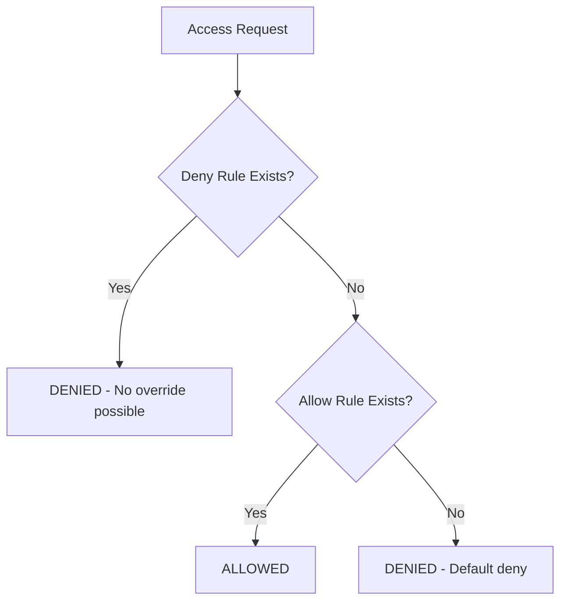

# How to Use SELinux Deny Rules Introduced in RHEL.4

Author: [nawazdhandala](https://www.github.com/nawazdhandala)

Tags: RHEL, SELinux, Deny Rules, Security, Linux

Description: Explore the new SELinux deny rules feature introduced in RHEL.4 that provides explicit denial capabilities, overriding any allow rules in the policy.

---

## What Changed in RHEL.4

RHEL.4 introduced a significant new capability to SELinux: explicit deny rules. Before this, SELinux worked on a "default deny, explicit allow" model. You could only add `allow` rules to grant access. There was no way to create a rule that explicitly denied access and could not be overridden by other allow rules.

With deny rules, you can now create ironclad restrictions that take precedence over everything else in the policy. Even if another module or boolean grants access, a deny rule blocks it.

## Why Deny Rules Matter



Before deny rules, if you wanted to prevent a specific access, you had to make sure no allow rule existed for it. But with complex policies, third-party modules, and booleans, an allow rule could slip in anywhere. Deny rules close that gap by providing an explicit, un-overridable block.

Use cases:
- Preventing specific processes from accessing sensitive files, no matter what
- Hardening a policy against future changes that might accidentally grant too much access
- Creating security guardrails that cannot be bypassed by enabling booleans

## Prerequisites

```bash
# Verify you are running RHEL.4 or later
cat /etc/redhat-release

# Check the SELinux policy version
sestatus | grep "Policy"

# Install policy development tools
sudo dnf install -y selinux-policy-devel policycoreutils-python-utils
```

## Creating a Deny Rule

Deny rules use the `neverallow` statement in the SELinux policy language. However, for runtime deny rules in RHEL.4+, you use the CIL (Common Intermediate Language) format with the `deny` keyword.

### Example: Deny httpd from Reading Shadow File

Create a CIL policy file called `deny_httpd_shadow.cil`:

```bash
(deny httpd_t shadow_t (file (read open getattr)))
```

Install the module:

```bash
# Install the deny rule
sudo semodule -i deny_httpd_shadow.cil
```

Now even if a custom module or boolean grants `httpd_t` access to `shadow_t`, this deny rule blocks it.

### Example: Deny Container Processes from Accessing Host Config

Create `deny_container_etc.cil`:

```bash
(deny container_t etc_t (file (write append)))
```

```bash
sudo semodule -i deny_container_etc.cil
```

Containers can never write to files labeled `etc_t`, regardless of any other rules.

## Writing Deny Rules in CIL Format

The CIL format for deny rules is:

```bash
(deny SOURCE_TYPE TARGET_TYPE (OBJECT_CLASS (PERMISSIONS)))
```

### Multiple Permissions

```bash
(deny httpd_t shadow_t (file (read write open getattr)))
```

### Multiple Object Classes

```bash
(deny httpd_t shadow_t (file (read open)))
(deny httpd_t shadow_t (dir (search)))
```

### Using Type Attributes

You can apply deny rules to groups of types using attributes:

```bash
(deny domain shadow_t (file (write append)))
```

This denies ALL process domains from writing to shadow files. Even the most privileged confined domain cannot override this.

## Practical Examples

### Prevent Any Process from Disabling SELinux

```bash
(deny domain security_t (security (setenforce)))
```

### Prevent Web Server from Executing Shell Commands

```bash
(deny httpd_t shell_exec_t (file (execute execute_no_trans)))
```

### Prevent Database from Accessing User Home Directories

```bash
(deny mysqld_t user_home_t (file (read write open)))
(deny mysqld_t user_home_dir_t (dir (search read)))
```

## Managing Deny Rule Modules

### List Installed Modules

```bash
# List all installed policy modules (including deny rule modules)
sudo semodule -l | grep deny
```

### Remove a Deny Rule

```bash
# Remove a deny rule module
sudo semodule -r deny_httpd_shadow
```

### Disable Without Removing

```bash
# Temporarily disable
sudo semodule -d deny_httpd_shadow

# Re-enable
sudo semodule -e deny_httpd_shadow
```

## Testing Deny Rules

### Verify the Rule Is Active

```bash
# Search for deny rules in the loaded policy
sudo sesearch --deny -s httpd_t -t shadow_t
```

### Test the Denial

```bash
# Attempt the denied action and check the audit log
sudo ausearch -m avc -ts recent | grep "denied"
```

Deny rule violations appear in the audit log just like regular AVC denials, but they cannot be resolved by adding allow rules.

## Interaction with Allow Rules

The key behavior to understand:

1. If a deny rule and an allow rule both apply, the **deny rule wins**
2. Deny rules cannot be overridden by booleans
3. Deny rules cannot be overridden by `audit2allow` generated modules
4. The only way to remove a deny rule's effect is to remove the deny rule module itself

This makes deny rules a powerful tool for security hardening, but also means you need to be careful. An overly broad deny rule could break services in ways that are hard to diagnose because the usual `audit2allow` fix will not work.

## Best Practices

**Start narrow:** Begin with specific source and target types. Avoid using broad attributes like `domain` until you are sure it will not break anything.

**Test in permissive first:** Before installing a deny rule, test with the system in permissive mode to understand the impact.

**Document your rules:** Each CIL file should have a comment explaining why the deny rule exists:

```bash
; Prevent web server from reading password hashes
; Required by security policy SEC-2024-001
(deny httpd_t shadow_t (file (read open getattr)))
```

**Version control:** Keep your deny rule CIL files in a git repository alongside your other configuration management code.

## Differences from neverallow

Traditional `neverallow` rules in SELinux are compile-time checks. They prevent policy authors from writing allow rules that violate the constraint, but they are only checked when the policy is compiled.

The new deny rules in RHEL.4 are runtime rules. They are evaluated during every access check and take precedence over allow rules that are already in the loaded policy. This is a much stronger guarantee.

## Troubleshooting

**Service breaks after installing deny rule:**

Check the audit log for the denied access:

```bash
sudo ausearch -m avc -ts recent
```

If the denial matches your deny rule and the service legitimately needs that access, you need to rethink your deny rule. Either narrow it or remove it.

**Cannot fix denial with audit2allow:**

This is expected behavior for deny rules. The deny rule takes precedence. If you need to allow the access, remove the deny rule module.

## Wrapping Up

Deny rules are a valuable addition to SELinux in RHEL.4. They give you explicit, un-overridable restrictions that strengthen your security posture. Use them for your most critical security boundaries, like preventing web servers from accessing password files or containers from modifying host configuration. Start with targeted, specific rules, test carefully, and keep them under version control. They are a powerful tool, and with power comes the need for discipline.
