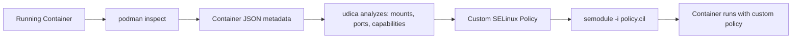

# How to Create SELinux Policies for Podman Containers Using udica on RHEL

Author: [nawazdhandala](https://www.github.com/nawazdhandala)

Tags: RHEL, SELinux, Podman, udica, Containers, Linux

Description: Use udica on RHEL to generate custom SELinux policies for Podman containers, providing fine-grained security beyond the default container policy.

---

## The Container SELinux Problem

By default, Podman containers on RHEL run with the `container_t` SELinux type. This generic policy works for most containers, but it is either too restrictive or too permissive depending on your needs. A container that needs to mount host volumes, access specific network ports, or interact with host devices might get blocked. On the flip side, `container_t` allows more than some containers actually need.

`udica` solves this by generating custom SELinux policies tailored to each container's specific requirements.

## What udica Does



`udica` inspects a running container's configuration (mounted volumes, exposed ports, Linux capabilities) and generates an SELinux policy that allows exactly what the container needs and nothing more.

## Prerequisites

```bash
# Install udica
sudo dnf install -y udica
```

## Step 1: Run Your Container

Start the container with its normal configuration:

```bash
# Example: run a web app container with a host volume mount
podman run -d --name mywebapp \
    -v /data/webapp:/var/www/html:Z \
    -p 8080:80 \
    docker.io/library/httpd:latest
```

The `:Z` flag tells Podman to relabel the volume for SELinux, but the container still runs with the generic `container_t` policy.

## Step 2: Inspect the Container

```bash
# Get the container's JSON metadata
podman inspect mywebapp > mywebapp.json
```

## Step 3: Generate the Custom Policy

```bash
# Generate a custom policy based on the container inspection
udica -j mywebapp.json mywebapp_policy
```

`udica` analyzes the JSON and outputs something like:

```
Policy mywebapp_policy created!

Please load these modules using:
# semodule -i mywebapp_policy.cil /usr/share/udica/templates/{base_container.cil,net_container.cil,home_container.cil}
```

## Step 4: Install the Policy

```bash
# Install the generated policy module
sudo semodule -i mywebapp_policy.cil /usr/share/udica/templates/base_container.cil /usr/share/udica/templates/net_container.cil
```

The exact templates listed depend on what your container needs. `udica` tells you which ones to include.

## Step 5: Run the Container with the Custom Policy

Stop the old container and restart with the custom policy:

```bash
# Stop and remove the old container
podman stop mywebapp
podman rm mywebapp

# Run with the custom SELinux policy
podman run -d --name mywebapp \
    --security-opt label=type:mywebapp_policy.process \
    -v /data/webapp:/var/www/html:Z \
    -p 8080:80 \
    docker.io/library/httpd:latest
```

The key option is `--security-opt label=type:mywebapp_policy.process` which tells Podman to use the custom SELinux type instead of the default `container_t`.

## Step 6: Verify the Policy

```bash
# Check the container's SELinux context
podman inspect mywebapp --format '{{ .ProcessLabel }}'

# It should show something like:
# system_u:system_r:mywebapp_policy.process:s0:c123,c456
```

Check for any remaining denials:

```bash
# Look for AVC denials from the container
sudo ausearch -m avc -ts recent | grep mywebapp_policy
```

## Practical Example: Database Container with Persistent Storage

```bash
# Run a MariaDB container with host storage
podman run -d --name mydb \
    -v /data/mysql:/var/lib/mysql:Z \
    -p 3306:3306 \
    -e MARIADB_ROOT_PASSWORD=secret \
    docker.io/library/mariadb:latest

# Inspect and generate policy
podman inspect mydb > mydb.json
udica -j mydb.json mydb_policy

# Install the policy
sudo semodule -i mydb_policy.cil /usr/share/udica/templates/base_container.cil /usr/share/udica/templates/net_container.cil

# Restart with custom policy
podman stop mydb && podman rm mydb
podman run -d --name mydb \
    --security-opt label=type:mydb_policy.process \
    -v /data/mysql:/var/lib/mysql:Z \
    -p 3306:3306 \
    -e MARIADB_ROOT_PASSWORD=secret \
    docker.io/library/mariadb:latest
```

## Understanding udica Templates

udica uses templates that grant specific capability sets:

| Template | Provides |
|---|---|
| base_container.cil | Basic container operations |
| net_container.cil | Network access (binding ports, connections) |
| home_container.cil | Access to home directories |
| virt_container.cil | KVM/QEMU virtualization access |
| x_container.cil | X11 display access |
| tty_container.cil | TTY/terminal access |
| log_container.cil | Access to /var/log |

## Handling Additional Denials

If your container still gets SELinux denials with the custom policy:

```bash
# Find the denials
sudo ausearch -m avc -ts recent | grep mywebapp_policy

# Generate additional rules with audit2allow
sudo ausearch -m avc -ts recent | audit2allow -M mywebapp_extra

# Install the extra module
sudo semodule -i mywebapp_extra.pp
```

## Updating the Policy

When your container's requirements change (new volumes, ports, etc.):

```bash
# Remove the old policy
sudo semodule -r mywebapp_policy

# Run the container with new config
podman run -d --name mywebapp_new \
    -v /data/webapp:/var/www/html:Z \
    -v /data/uploads:/var/www/uploads:Z \
    -p 8080:80 \
    -p 8443:443 \
    docker.io/library/httpd:latest

# Generate a new policy
podman inspect mywebapp_new > mywebapp_new.json
udica -j mywebapp_new.json mywebapp_policy

# Install the updated policy
sudo semodule -i mywebapp_policy.cil /usr/share/udica/templates/base_container.cil /usr/share/udica/templates/net_container.cil
```

## Using udica with Podman Compose

For multi-container applications:

```bash
# Start your compose stack
podman-compose up -d

# Generate policies for each container
for container in $(podman ps --format "{{.Names}}"); do
    podman inspect "$container" > "${container}.json"
    udica -j "${container}.json" "${container}_policy"
done
```

Then install each policy and restart containers with their custom labels.

## Removing Custom Policies

```bash
# List installed container policies
sudo semodule -l | grep _policy

# Remove a specific policy
sudo semodule -r mywebapp_policy
```

## Wrapping Up

`udica` bridges the gap between the generic `container_t` policy and a fully custom SELinux module. It automates the tedious process of analyzing container requirements and generating appropriate policies. For any production Podman deployment where security matters, generate custom policies with `udica` instead of relying on the default. The few extra minutes per container give you significantly better security isolation.
