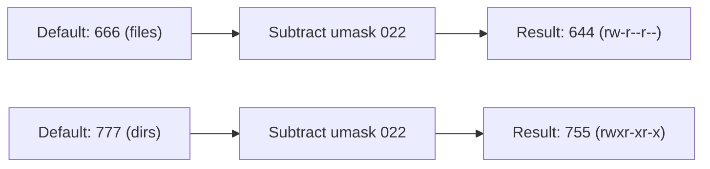

# How to Set Default Umask Values for New Files and Directories on RHEL

Author: [nawazdhandala](https://www.github.com/nawazdhandala)

Tags: RHEL, umask, File Permissions, Security, Linux

Description: A complete guide to understanding and configuring the default umask on RHEL, including system-wide settings, per-user overrides, and the pam_umask module.

---

## What umask Actually Does

The umask is a permission filter. When a process creates a new file or directory, the umask determines which permission bits get removed from the default. Files start with a potential `666` (rw-rw-rw-) and directories start with `777` (rwxrwxrwx). The umask subtracts from those defaults.

```bash
# Check your current umask
umask
```

With the RHEL default umask of `0022`:
- Files: `666 - 022 = 644` (rw-r--r--)
- Directories: `777 - 022 = 755` (rwxr-xr-x)

With a more restrictive umask of `0077`:
- Files: `666 - 077 = 600` (rw-------)
- Directories: `777 - 077 = 700` (rwx------)



Technically, the umask is a bitwise AND NOT operation, not arithmetic subtraction, but the result is the same for the common cases.

## Viewing the Umask

```bash
# Show umask in octal
umask

# Show umask in symbolic form
umask -S
```

The symbolic output is easier to read:

```bash
# umask -S with 0022
u=rwx,g=rx,o=rx

# umask -S with 0077
u=rwx,g=,o=
```

## Where the Umask Gets Set on RHEL

The umask value on RHEL comes from multiple places, applied in order. Later settings override earlier ones.

1. `/etc/login.defs` - Read by `pam_umask` during PAM authentication
2. `/etc/profile` and `/etc/profile.d/*.sh` - Executed during login shell startup
3. `/etc/bashrc` - Sourced by bash
4. `~/.bashrc` and `~/.bash_profile` - Per-user overrides

Let me walk through each one.

### /etc/login.defs

```bash
# Check the umask in login.defs
grep -i umask /etc/login.defs
```

```bash
UMASK           022
```

This is read by `pam_umask` during login. If `pam_umask` is configured in `/etc/pam.d/`, this value gets applied.

### /etc/profile

```bash
# Check how umask is set in /etc/profile
grep -A5 umask /etc/profile
```

On RHEL, `/etc/profile` typically contains logic like:

```bash
if [ $UID -gt 199 ] && [ "$(id -gn)" = "$(id -un)" ]; then
    umask 002
else
    umask 022
fi
```

This checks if the user has a UID above 199 and if their primary group name matches their username (the UPG scheme). If both conditions are true, it sets umask to `002`. Otherwise, it uses `022`.

This means regular users with UPG get a `002` umask by default, and root or system accounts get `022`.

### /etc/bashrc

```bash
# Check umask in bashrc
grep -A5 umask /etc/bashrc
```

The same logic often appears in `/etc/bashrc` to cover non-login interactive shells.

### Per-User Settings

Individual users can override the umask in their personal shell configuration:

```bash
# In ~/.bashrc or ~/.bash_profile
umask 077
```

## Changing the System-Wide Umask

### Method 1: Edit /etc/profile and /etc/bashrc

To change the umask for all users system-wide, modify both files:

```bash
# Edit /etc/profile
sudo vi /etc/profile
```

Find the umask block and change the values:

```bash
# Set restrictive umask for all users
if [ $UID -gt 199 ] && [ "$(id -gn)" = "$(id -un)" ]; then
    umask 027
else
    umask 022
fi
```

Do the same in `/etc/bashrc`:

```bash
# Edit /etc/bashrc
sudo vi /etc/bashrc
```

The `027` umask gives:
- Files: `640` (rw-r-----)
- Directories: `750` (rwxr-x---)

This is a good middle ground for servers where group access is needed but world access is not.

### Method 2: Use /etc/profile.d/ (Recommended)

A cleaner approach is to create a file in `/etc/profile.d/` instead of modifying the base config files directly:

```bash
# Create a custom umask script
sudo vi /etc/profile.d/custom-umask.sh
```

```bash
# Custom umask - more restrictive than default
# Applied to all users during login
umask 027
```

```bash
# Make it executable
sudo chmod 644 /etc/profile.d/custom-umask.sh
```

This file is sourced by `/etc/profile` during login. The advantage is that you are not modifying distribution-managed files, so your changes survive package updates.

### Method 3: Use pam_umask

The `pam_umask` module reads the umask from `/etc/login.defs` and applies it during PAM authentication. This is the most reliable method because it works for all login methods (console, SSH, graphical).

First, make sure `pam_umask` is enabled in PAM. Check the common PAM files:

```bash
# Check if pam_umask is configured
grep pam_umask /etc/pam.d/system-auth
grep pam_umask /etc/pam.d/password-auth
```

If it is not there, you can add it. But on RHEL, it is usually present. The PAM module reads the `UMASK` value from `/etc/login.defs`:

```bash
# Set the umask in login.defs
sudo vi /etc/login.defs
```

```bash
UMASK           027
```

The priority order when `pam_umask` is in use:
1. Per-user PAM config (if using `pam_umask` with `usergroups` option)
2. `/etc/login.defs` UMASK value
3. Shell profile files

## Setting Per-User Umask

### Through Shell Configuration

The simplest per-user method:

```bash
# Add to the user's ~/.bashrc
echo "umask 077" >> /home/jsmith/.bashrc
```

### Through pam_umask with /etc/login.defs

You can set per-user umask values using the user's entry in `/etc/shadow` or through PAM configuration, but the shell method is more practical and easier to manage.

## Common Umask Values Reference

| Umask | File Perms | Dir Perms | Use Case |
|-------|-----------|-----------|----------|
| 022 | 644 (rw-r--r--) | 755 (rwxr-xr-x) | Traditional default, world-readable |
| 027 | 640 (rw-r-----) | 750 (rwxr-x---) | Good for servers, group can read |
| 077 | 600 (rw-------) | 700 (rwx------) | Most restrictive, owner-only |
| 002 | 664 (rw-rw-r--) | 775 (rwxrwxr-x) | UPG default, group-writable |
| 007 | 660 (rw-rw----) | 770 (rwxrwx---) | Collaborative, no world access |

## Testing Umask Changes

After making changes, test them properly:

```bash
# Start a new login shell (sources /etc/profile)
su - $(whoami)

# Verify the umask
umask

# Create test files and check permissions
touch /tmp/testfile
mkdir /tmp/testdir
ls -l /tmp/testfile
ls -ld /tmp/testdir

# Clean up
rm /tmp/testfile
rmdir /tmp/testdir
```

For SSH-based testing:

```bash
# SSH to localhost to test the full login chain
ssh localhost "umask; touch /tmp/sshtest && ls -l /tmp/sshtest && rm /tmp/sshtest"
```

## Umask and systemd Services

Services managed by systemd have their own umask setting. The system-wide shell umask does not affect them.

```bash
# Check the umask for a service
systemctl show httpd.service -p UMask
```

The default for systemd services is `0022`. You can override it in the unit file:

```ini
# Set a custom umask for a service
[Service]
UMask=0027
```

This is important for services that create files users need to access. A web server creating files with umask `0077` would produce files that only root can read.

## Umask Gotchas

### Umask Does Not Affect Existing Files

Changing the umask only affects newly created files. Existing files keep their current permissions. Use `chmod` to fix existing files:

```bash
# Fix permissions on existing files in a directory
find /srv/data -type f -exec chmod 640 {} \;
find /srv/data -type d -exec chmod 750 {} \;
```

### Umask and cp vs mv

When you copy a file with `cp`, the new file is created with the umask applied. When you move a file with `mv`, the file keeps its original permissions (no new file is created). This surprises people.

```bash
# cp applies umask to the new file
cp original.txt copy.txt  # copy.txt gets umask-filtered permissions

# mv preserves original permissions
mv original.txt moved.txt  # moved.txt keeps original permissions
```

### Umask and Applications

Some applications set their own umask internally, overriding the system default. If you see files with unexpected permissions, check if the application is setting umask in its own configuration.

## Wrapping Up

The umask is a simple concept that is easy to get wrong because it is set in multiple places. On RHEL, the most reliable approach is to use `/etc/profile.d/` for shell-based sessions and ensure `pam_umask` is reading from `/etc/login.defs` for non-shell logins. For most servers, a umask of `027` strikes the right balance between security and usability. Remember that systemd services have their own umask setting, and changing the system umask does not affect existing files.
