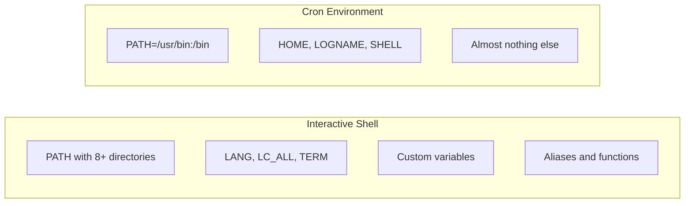

# How to Set Environment Variables in Cron Jobs on RHEL 9

Author: [nawazdhandala](https://www.github.com/nawazdhandala)

Tags: RHEL, cron, Environment Variables, Linux, Automation

Description: A practical guide to managing environment variables in cron jobs on RHEL 9, covering PATH, SHELL, HOME, profile sourcing, and wrapper script patterns.

---

## The Environment Gap

One of the most common reasons cron jobs fail is the environment gap. When you log into a RHEL 9 system, your shell loads a rich set of environment variables from `/etc/profile`, `~/.bash_profile`, `~/.bashrc`, and other files. You get a fully configured PATH, custom variables, aliases, and functions.

Cron does not do any of that.

When cron runs your job, it starts with a bare-bones environment. Only a handful of variables are set, and PATH is minimal. Commands that work perfectly in your terminal suddenly fail because cron cannot find them. Let me show you exactly what cron's environment looks like and how to fix it.

## What Cron's Default Environment Looks Like

The easiest way to see cron's environment is to capture it.

```bash
# Add this to your crontab temporarily to dump the cron environment
# Remove it after checking
* * * * * env > /tmp/cron-env.txt 2>&1
```

Wait one minute, then check the output:

```bash
# See what cron actually provides
cat /tmp/cron-env.txt
```

You will see something like this:

```
HOME=/home/youruser
LOGNAME=youruser
PATH=/usr/bin:/bin
SHELL=/bin/sh
```

Compare that to your interactive session:

```bash
# Compare with your login environment
env | wc -l
# Probably 40+ variables vs cron's 4-5
```



## Method 1: Set Variables Directly in the Crontab

The simplest approach is to define variables at the top of your crontab. These apply to all jobs that follow.

```bash
# Edit your crontab
crontab -e
```

Add variables before your job entries:

```bash
# Set environment variables for all cron jobs below
SHELL=/bin/bash
PATH=/usr/local/sbin:/usr/local/bin:/usr/sbin:/usr/bin:/sbin:/bin
HOME=/home/admin
MAILTO=admin@example.com

# Custom application variables
APP_ENV=production
DB_HOST=db.example.com

# Now your jobs can use the full PATH and custom variables
30 2 * * * /usr/local/bin/backup.sh
*/5 * * * * /opt/myapp/bin/health-check
```

Important limitations of crontab variables:

- You cannot use variable expansion. `PATH=$HOME/bin:$PATH` will not work.
- You cannot use command substitution. `TODAY=$(date +%F)` will not work.
- Each variable must be on its own line in the format `NAME=value`.
- Quotes around values are optional and treated as literal characters.

## Method 2: Source Your Profile in the Job

If your script depends on the full login environment, source the profile files explicitly.

```bash
# Source bash_profile before running the command
30 2 * * * source /home/admin/.bash_profile && /usr/local/bin/backup.sh

# Or use the dot notation
30 2 * * * . /etc/profile && /usr/local/bin/deploy.sh
```

You can also source profiles inside your script, which is cleaner.

```bash
#!/bin/bash
# backup.sh - sources profile for full environment

# Load the system-wide profile
source /etc/profile

# Load user-specific settings
source "$HOME/.bash_profile" 2>/dev/null

# Now all your environment variables are available
echo "Running backup with PATH: $PATH"
/usr/local/bin/custom-backup-tool --config /etc/backup.conf
```

Be careful with this approach though. If any of those profile files produce output or require a terminal, your cron job might behave unexpectedly.

## Method 3: Use a Wrapper Script

This is my preferred approach for production systems. Create a wrapper script that sets up the environment explicitly, then calls the actual job. It is clean, testable, and self-documenting.

```bash
#!/bin/bash
# /usr/local/bin/cron-wrapper-backup.sh
# Wrapper script that sets up the environment for the backup job

# Define the environment explicitly
export PATH="/usr/local/sbin:/usr/local/bin:/usr/sbin:/usr/bin:/sbin:/bin"
export HOME="/home/admin"
export APP_ENV="production"
export DB_HOST="db.internal.example.com"
export DB_PORT="5432"
export BACKUP_DIR="/mnt/backup"
export LANG="en_US.UTF-8"

# Log start time
echo "$(date): Starting backup job"

# Run the actual backup script
/opt/backup/run-backup.sh

# Capture exit code
EXIT_CODE=$?

echo "$(date): Backup job finished with exit code $EXIT_CODE"
exit $EXIT_CODE
```

Your crontab entry stays simple:

```bash
# Clean crontab entry using wrapper script
30 2 * * * /usr/local/bin/cron-wrapper-backup.sh >> /var/log/backup.log 2>&1
```

## Method 4: Use an Environment File

For applications that use `.env` files (which is common these days), you can load them in your cron job.

```bash
#!/bin/bash
# Load environment from a .env file

# Read key=value pairs from the env file, skipping comments and empty lines
if [ -f /opt/myapp/.env ]; then
    set -a
    source /opt/myapp/.env
    set +a
fi

# Run the application task
/opt/myapp/bin/run-task
```

The `set -a` command tells bash to automatically export all variables that get set, and `set +a` turns that off. This way, every variable defined in the `.env` file becomes an environment variable.

## The SHELL Variable

By default, cron uses `/bin/sh` to execute commands. On RHEL 9, `/bin/sh` is actually a symlink to bash, but it runs in POSIX mode, which disables some bash-specific features. Set SHELL explicitly if you need bash features.

```bash
# Set bash as the shell for your cron jobs
SHELL=/bin/bash

# Now you can use bash-specific syntax
30 2 * * * [[ -f /tmp/flag ]] && /usr/local/bin/process.sh
```

## The HOME Variable

Cron sets HOME to the user's home directory from `/etc/passwd`. If your script uses relative paths or tilde expansion, be aware that the working directory for cron jobs is the user's home directory.

```bash
# These are equivalent in cron
30 2 * * * cd /opt/myapp && ./run.sh
30 2 * * * /opt/myapp/run.sh

# The working directory is HOME by default, not the script's location
```

If your script expects to be run from a specific directory, always `cd` to it first.

```bash
#!/bin/bash
# Always cd to the application directory first
cd /opt/myapp || exit 1

# Now relative paths work correctly
./bin/process --config ./config/prod.yml
```

## Debugging Environment Issues

When a cron job fails and you suspect an environment issue, here is a systematic way to debug it.

```bash
# Step 1: Capture the actual cron environment for your job
# Add to crontab temporarily:
* * * * * env > /tmp/cron-env-debug.txt 2>&1

# Step 2: Try running your script with the same minimal environment
env -i HOME=$HOME LOGNAME=$(whoami) PATH=/usr/bin:/bin SHELL=/bin/sh /usr/local/bin/your-script.sh

# Step 3: If step 2 fails, you have found the gap
# Add the missing variables one at a time until it works
env -i HOME=$HOME LOGNAME=$(whoami) PATH=/usr/local/bin:/usr/bin:/bin SHELL=/bin/sh /usr/local/bin/your-script.sh
```

## Common Pitfalls

**Python virtual environments:** If your cron job runs a Python script in a virtualenv, you need to activate it or use the full path to the virtualenv's Python.

```bash
# Option 1: Use the full path to the virtualenv python
30 2 * * * /opt/myapp/venv/bin/python /opt/myapp/process.py

# Option 2: Activate the virtualenv in the command
30 2 * * * source /opt/myapp/venv/bin/activate && python /opt/myapp/process.py
```

**Java applications:** Java needs JAVA_HOME and the java binary in PATH.

```bash
# Set Java environment for cron
JAVA_HOME=/usr/lib/jvm/java-17-openjdk
PATH=/usr/lib/jvm/java-17-openjdk/bin:/usr/local/bin:/usr/bin:/bin

0 3 * * * java -jar /opt/myapp/app.jar
```

**Ruby with rbenv or rvm:** These tools modify your shell environment heavily. Use full paths.

```bash
# Use the full path to the specific ruby version
30 2 * * * /home/deploy/.rbenv/versions/3.2.0/bin/ruby /opt/myapp/task.rb
```

## Environment Variable Reference for Crontab

Here is a quick reference for the special variables you can set in a crontab:

| Variable | Purpose | Default |
|----------|---------|---------|
| SHELL | Shell used to run commands | /bin/sh |
| PATH | Command search path | /usr/bin:/bin |
| HOME | Home directory | From /etc/passwd |
| MAILTO | Where to send output email | Crontab owner |
| LOGNAME | Username | Crontab owner |

## Summary

The environment gap between your interactive shell and cron's minimal environment is the root cause of most cron failures. Set PATH and other variables directly in your crontab for simple cases, use wrapper scripts for complex setups, and always test your scripts with a minimal environment before deploying them as cron jobs. Once you build the habit of handling the environment explicitly, cron jobs become much more reliable.
