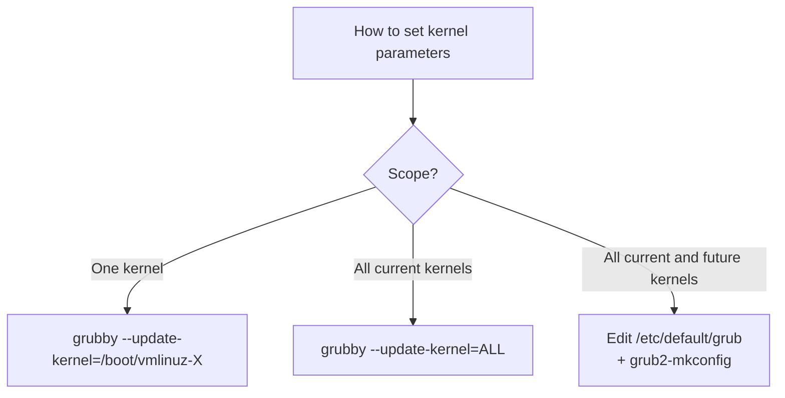

# How to Set Kernel Command-Line Parameters on RHEL

Author: [nawazdhandala](https://www.github.com/nawazdhandala)

Tags: RHEL, Kernel, Command-Line, GRUB2, Linux

Description: Learn how to set, modify, and manage kernel command-line parameters on RHEL using grubby and GRUB2, with practical examples for common tuning and troubleshooting scenarios.

---

## What Are Kernel Command-Line Parameters?

Kernel command-line parameters are options passed to the Linux kernel at boot time. They control how the kernel initializes hardware, manages memory, configures networking, and handles various subsystems. Some parameters are critical for the system to boot, while others fine-tune performance or enable debugging.

On RHEL, you can view the parameters that were passed to the currently running kernel:

```bash
# Show the current kernel command line
cat /proc/cmdline
```

A typical output might look like:

```
BOOT_IMAGE=(hd0,msdos1)/vmlinuz-5.14.0-362.el9.x86_64 root=/dev/mapper/rhel-root ro crashkernel=1G-4G:192M,4G-64G:256M,64G-:512M resume=/dev/mapper/rhel-swap rd.lvm.lv=rhel/root rd.lvm.lv=rhel/swap
```

## Adding Parameters with grubby

The `grubby` command is the standard tool for managing kernel boot parameters on RHEL.

```bash
# Add a parameter to all installed kernels
sudo grubby --update-kernel=ALL --args="parameter=value"

# Add a parameter to only the default kernel
sudo grubby --update-kernel=DEFAULT --args="parameter=value"

# Add a parameter to a specific kernel
sudo grubby --update-kernel=/boot/vmlinuz-5.14.0-362.el9.x86_64 --args="parameter=value"
```

## Removing Parameters

```bash
# Remove a parameter from all kernels
sudo grubby --update-kernel=ALL --remove-args="parameter"

# Remove a parameter with a specific value
sudo grubby --update-kernel=ALL --remove-args="parameter=value"

# Remove the quiet parameter to see verbose boot messages
sudo grubby --update-kernel=ALL --remove-args="quiet"
```

## Common Kernel Parameters

### System and Boot Parameters

```bash
# Enable verbose boot output
sudo grubby --update-kernel=ALL --remove-args="quiet rhgb"

# Set the root filesystem
# root=/dev/mapper/rhel-root (usually set during installation)

# Set the init system (default is systemd)
# init=/usr/lib/systemd/systemd
```

### Memory Parameters

```bash
# Reserve memory for kdump crash kernel
sudo grubby --update-kernel=ALL --args="crashkernel=256M"

# Allocate huge pages at boot
sudo grubby --update-kernel=ALL --args="hugepages=1024 hugepagesz=2M"

# Disable transparent huge pages
sudo grubby --update-kernel=ALL --args="transparent_hugepage=never"
```

### Networking Parameters

```bash
# Disable predictable network interface names
sudo grubby --update-kernel=ALL --args="net.ifnames=0 biosdevname=0"

# Disable IPv6 at the kernel level
sudo grubby --update-kernel=ALL --args="ipv6.disable=1"
```

### Performance Parameters

```bash
# Enable IOMMU for device passthrough
sudo grubby --update-kernel=ALL --args="intel_iommu=on iommu=pt"

# Set processor idle state
sudo grubby --update-kernel=ALL --args="processor.max_cstate=1"

# Disable CPU frequency scaling for consistent performance
sudo grubby --update-kernel=ALL --args="intel_pstate=disable"

# Isolate CPUs from the scheduler for real-time workloads
sudo grubby --update-kernel=ALL --args="isolcpus=2-7"
```

### Security Parameters

```bash
# Disable kernel module loading after boot (security hardening)
sudo grubby --update-kernel=ALL --args="modules_disabled=1"

# Set SELinux mode from the command line
sudo grubby --update-kernel=ALL --args="enforcing=1"

# Disable SELinux temporarily for troubleshooting
sudo grubby --update-kernel=ALL --args="selinux=0"
```

### Debugging Parameters

```bash
# Enable serial console for remote debugging
sudo grubby --update-kernel=ALL --args="console=ttyS0,115200n8 console=tty0"

# Increase kernel log level for more verbose messages
sudo grubby --update-kernel=ALL --args="loglevel=7"

# Enable early printk for debugging boot issues
sudo grubby --update-kernel=ALL --args="earlyprintk=ttyS0,115200"
```

## Using /etc/default/grub for Global Settings

For parameters that should apply to every kernel, including future updates, set them in `/etc/default/grub`.

```bash
# Edit the defaults file
sudo vi /etc/default/grub

# Modify the GRUB_CMDLINE_LINUX line
GRUB_CMDLINE_LINUX="crashkernel=256M resume=/dev/mapper/rhel-swap rd.lvm.lv=rhel/root rd.lvm.lv=rhel/swap transparent_hugepage=never"

# Regenerate GRUB configuration
# For BIOS:
sudo grub2-mkconfig -o /boot/grub2/grub.cfg
# For UEFI:
sudo grub2-mkconfig -o /boot/efi/EFI/redhat/grub.cfg
```



## Temporary One-Time Parameters

To test a parameter without making it permanent, you can edit the kernel command line at the GRUB menu during boot:

1. Reboot the system
2. When the GRUB menu appears, press `e` to edit
3. Find the line starting with `linux` or `linuxefi`
4. Add your parameter at the end of that line
5. Press `Ctrl+X` or `F10` to boot with the modified parameters

This change lasts only for that single boot.

## Verifying Parameters

```bash
# Check the active kernel command line
cat /proc/cmdline

# Check what grubby has set for the default kernel
sudo grubby --info=DEFAULT

# Check a specific parameter
cat /proc/cmdline | tr ' ' '\n' | grep hugepages

# Verify through the BLS entry files
cat /boot/loader/entries/*.conf
```

## Wrapping Up

Kernel command-line parameters on RHEL are managed through `grubby` for targeted changes and `/etc/default/grub` for global defaults. The key is knowing where each parameter should go: use `grubby --update-kernel=ALL` for changes that need to apply now, and edit `/etc/default/grub` with `grub2-mkconfig` for changes that must persist across future kernel installations. Always verify with `cat /proc/cmdline` after rebooting, and test unfamiliar parameters with a one-time GRUB menu edit before making them permanent.
