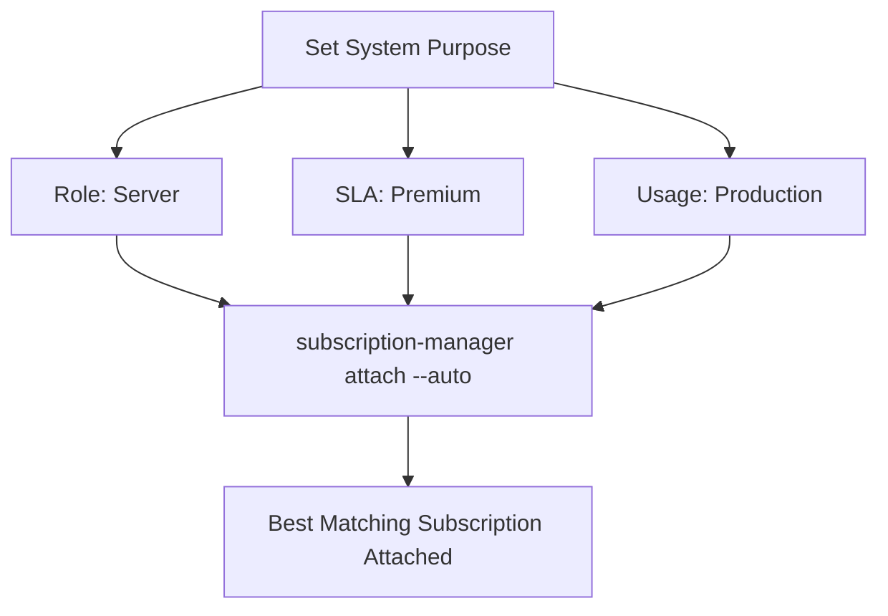

# How to Set System Purpose Attributes (Role, SLA, Usage) on RHEL

Author: [nawazdhandala](https://www.github.com/nawazdhandala)

Tags: RHEL, System Purpose, SLA, Red Hat, Linux

Description: Learn how to configure system purpose attributes on RHEL including role, SLA, and usage, helping Red Hat auto-attach the correct subscriptions and track system compliance.

---

System purpose attributes are metadata you set on each RHEL system to describe what the system does and what level of support it needs. These attributes help `subscription-manager` choose the right subscription during auto-attach and help your organization track subscription usage by role, service level, and usage type. Here is how to configure them.

## What Are System Purpose Attributes?

RHEL supports three system purpose attributes:

- **Role**: What the system does (e.g., Red Hat Enterprise Linux Server, Red Hat Enterprise Linux Workstation, Red Hat Enterprise Linux Compute Node)
- **Service Level Agreement (SLA)**: The support level required (e.g., Premium, Standard, Self-Support)
- **Usage**: How the system is being used (e.g., Production, Development/Test, Disaster Recovery)

These attributes do not restrict what the system can do. They are informational and influence subscription auto-attach behavior.

## Why Set System Purpose?

Without system purpose attributes, `subscription-manager attach --auto` picks any matching subscription. With attributes set, it prioritizes subscriptions that match the system's declared purpose. For example, a production server with Premium SLA will preferentially get a Premium subscription attached.



## Setting System Purpose with syspurpose

RHEL includes the `syspurpose` tool as part of `subscription-manager`. Set attributes individually:

```bash
# Set the system role
sudo subscription-manager syspurpose role --set="Red Hat Enterprise Linux Server"

# Set the service level agreement
sudo subscription-manager syspurpose service-level --set="Premium"

# Set the usage type
sudo subscription-manager syspurpose usage --set="Production"
```

## Viewing Current System Purpose

Check what is currently set:

```bash
# Show all system purpose attributes
sudo subscription-manager syspurpose --show
```

This displays the role, SLA, and usage values. If nothing is set, the output will show empty values.

You can also check individual attributes:

```bash
# Show just the role
sudo subscription-manager syspurpose role --show

# Show just the SLA
sudo subscription-manager syspurpose service-level --show

# Show just the usage
sudo subscription-manager syspurpose usage --show
```

## Available Values for Each Attribute

To see what values are valid for each attribute:

```bash
# List valid roles
sudo subscription-manager syspurpose role --list

# List valid service levels
sudo subscription-manager syspurpose service-level --list

# List valid usage types
sudo subscription-manager syspurpose usage --list
```

Common values include:

| Attribute | Common Values |
|-----------|---------------|
| Role | Red Hat Enterprise Linux Server, Red Hat Enterprise Linux Workstation, Red Hat Enterprise Linux Compute Node |
| SLA | Premium, Standard, Self-Support |
| Usage | Production, Development/Test, Disaster Recovery |

## Setting System Purpose During Installation

You can set system purpose attributes during RHEL installation via Kickstart:

```bash
# Kickstart system purpose configuration
syspurpose --role="Red Hat Enterprise Linux Server" --sla="Premium" --usage="Production"
```

This sets the attributes before the system is even registered, so the first auto-attach picks the right subscription.

## Setting System Purpose During Registration

You can also set these values as part of the registration command:

```bash
# Register and set system purpose in one command
sudo subscription-manager register \
    --username=your_username \
    --password=your_password \
    --service-level=Premium \
    --usage=Production
```

For activation key registration, configure the purpose attributes on the activation key in the Customer Portal or Satellite, and they will be applied automatically during registration.

## Setting Addons

Beyond role, SLA, and usage, you can set addon attributes for systems that need specific product content:

```bash
# Set an addon
sudo subscription-manager syspurpose addons --set="RHEL EUS"

# Add multiple addons
sudo subscription-manager syspurpose addons --set="RHEL EUS" --set="Smart Management"
```

To list addons:

```bash
# Show current addons
sudo subscription-manager syspurpose addons --show
```

## Removing System Purpose Attributes

To clear a specific attribute:

```bash
# Remove the role setting
sudo subscription-manager syspurpose role --unset

# Remove the SLA setting
sudo subscription-manager syspurpose service-level --unset

# Remove the usage setting
sudo subscription-manager syspurpose usage --unset
```

## How System Purpose Affects Auto-Attach

When you run `subscription-manager attach --auto`, the auto-attach logic considers:

1. The system's architecture
2. Installed products
3. System purpose attributes (role, SLA, usage)

It then selects the subscription that best matches all of these criteria. Without system purpose set, the choice is based solely on architecture and installed products, which may result in a less optimal subscription being selected.

## System Purpose with Simple Content Access

If your organization uses SCA, system purpose attributes are still useful for reporting and compliance tracking, even though explicit subscription attachment is not required. Setting purpose attributes helps you track:

- How many production vs. development systems you have
- Which systems require Premium support
- Subscription allocation across different roles

## Managing System Purpose with Ansible

For consistent configuration across your fleet:

```yaml
# Ansible playbook to set system purpose
- name: Configure system purpose on RHEL systems
  hosts: production_servers
  become: true
  tasks:
    - name: Set system role
      command: subscription-manager syspurpose role --set="Red Hat Enterprise Linux Server"

    - name: Set SLA
      command: subscription-manager syspurpose service-level --set="Premium"

    - name: Set usage
      command: subscription-manager syspurpose usage --set="Production"
```

Or use the `redhat_subscription` module with purpose attributes:

```yaml
# Set purpose during registration with Ansible
- name: Register with system purpose
  community.general.redhat_subscription:
    activationkey: rhel9-production
    org_id: my-org
    syspurpose:
      role: "Red Hat Enterprise Linux Server"
      service_level_agreement: "Premium"
      usage: "Production"
    state: present
```

## Viewing System Purpose in the Customer Portal

After setting system purpose, the attributes are visible in the Red Hat Customer Portal:

1. Log in to access.redhat.com
2. Navigate to Subscriptions, then Systems
3. Find your system
4. View the system details to see the purpose attributes

This helps operations teams and management understand how subscriptions are being used across the organization.

## Where System Purpose Data Is Stored

Locally, system purpose data is stored in `/etc/rhsm/syspurpose/syspurpose.json`:

```bash
# View the local system purpose file
cat /etc/rhsm/syspurpose/syspurpose.json
```

This is a simple JSON file. While you could edit it directly, using the `subscription-manager syspurpose` commands is the supported approach.

## Summary

System purpose attributes are a small configuration step that pays off in better subscription matching and clearer reporting. Set the role, SLA, and usage on every system, whether through Kickstart, registration commands, or post-install configuration. Even with SCA enabled, these attributes help your organization understand its subscription landscape and ensure that systems get the right level of support.
