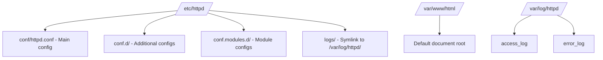

# How to Set Up Apache HTTP Server on RHEL 9

Author: [nawazdhandala](https://www.github.com/nawazdhandala)

Tags: RHEL, Apache, httpd, Web Server, Linux

Description: A complete guide to installing, configuring, and running Apache HTTP Server on RHEL 9, from initial setup to serving your first website.

---

Apache HTTP Server (httpd) remains one of the most widely used web servers in the world. On RHEL 9, Apache is available directly from the default repositories and integrates well with SELinux and firewalld. This guide covers everything from installation to serving your first site.

## Prerequisites

- A RHEL 9 system with root or sudo access
- A registered domain name (optional, but helpful for testing)
- Network access to install packages

## Step 1: Install Apache

```bash
# Install the Apache HTTP Server package
sudo dnf install -y httpd

# Verify the installed version
httpd -v
```

## Step 2: Start and Enable Apache

```bash
# Start the Apache service
sudo systemctl start httpd

# Enable it to start on boot
sudo systemctl enable httpd

# Check the service status
sudo systemctl status httpd
```

## Step 3: Open Firewall Ports

```bash
# Allow HTTP traffic through the firewall
sudo firewall-cmd --permanent --add-service=http

# Allow HTTPS traffic (for later SSL setup)
sudo firewall-cmd --permanent --add-service=https

# Reload the firewall to apply changes
sudo firewall-cmd --reload

# Verify the services are allowed
sudo firewall-cmd --list-services
```

## Step 4: Understand the Directory Layout

Apache on RHEL 9 follows a specific directory structure:



Key files and directories:

- `/etc/httpd/conf/httpd.conf` - The main configuration file
- `/etc/httpd/conf.d/` - Drop-in configuration files (files ending in .conf are auto-loaded)
- `/var/www/html/` - The default document root
- `/var/log/httpd/` - Log files

## Step 5: Create Your First Web Page

```bash
# Create a simple index page
cat <<'EOF' | sudo tee /var/www/html/index.html
<!DOCTYPE html>
<html lang="en">
<head>
    <meta charset="UTF-8">
    <title>Welcome to RHEL 9</title>
</head>
<body>
    <h1>Apache is running on RHEL 9</h1>
    <p>If you see this page, your web server is working correctly.</p>
</body>
</html>
EOF

# Set correct ownership
sudo chown apache:apache /var/www/html/index.html

# Set correct permissions
sudo chmod 644 /var/www/html/index.html
```

Test by visiting `http://your-server-ip` in a browser.

## Step 6: Configure Basic Settings

Edit the main configuration file to adjust common settings:

```bash
# Back up the original configuration
sudo cp /etc/httpd/conf/httpd.conf /etc/httpd/conf/httpd.conf.bak

# Edit the configuration
sudo vi /etc/httpd/conf/httpd.conf
```

Key settings to review:

```apache
# Set the server administrator email
ServerAdmin admin@example.com

# Set the server name (replace with your actual domain or IP)
ServerName www.example.com:80

# Set the document root
DocumentRoot "/var/www/html"

# Configure the document root directory options
<Directory "/var/www/html">
    # Allow .htaccess overrides
    AllowOverride All

    # Only allow access controls
    Require all granted
</Directory>

# Hide the Apache version in response headers
ServerTokens Prod
ServerSignature Off
```

## Step 7: Test and Reload Configuration

```bash
# Test the configuration for syntax errors
sudo apachectl configtest

# If the test passes, reload Apache to apply changes
sudo systemctl reload httpd
```

## Step 8: Configure SELinux for Apache

RHEL 9 runs SELinux in enforcing mode by default. Apache has specific SELinux contexts and booleans.

```bash
# Check the SELinux context for web content
ls -lZ /var/www/html/

# If you serve content from a non-default directory, set the correct context
# Example: serving from /srv/www
sudo semanage fcontext -a -t httpd_sys_content_t "/srv/www(/.*)?"
sudo restorecon -Rv /srv/www

# View Apache-related SELinux booleans
getsebool -a | grep httpd

# Allow Apache to make network connections (for reverse proxy, etc.)
sudo setsebool -P httpd_can_network_connect on

# Allow Apache to serve user home directories
sudo setsebool -P httpd_enable_homedirs on
```

## Step 9: Enable and View Logs

```bash
# View the access log in real time
sudo tail -f /var/log/httpd/access_log

# View the error log in real time
sudo tail -f /var/log/httpd/error_log

# Configure custom log format in httpd.conf
# The combined format includes referer and user agent
LogFormat "%h %l %u %t \"%r\" %>s %b \"%{Referer}i\" \"%{User-Agent}i\"" combined
CustomLog "logs/access_log" combined
```

## Step 10: Set Up Log Rotation

Apache logs are rotated automatically by logrotate on RHEL 9:

```bash
# View the logrotate configuration for httpd
cat /etc/logrotate.d/httpd
```

The default configuration rotates logs weekly and keeps 4 weeks of history.

## Troubleshooting

```bash
# Check if Apache is listening on the expected port
sudo ss -tlnp | grep httpd

# Test the configuration syntax
sudo apachectl configtest

# Check for SELinux denials related to httpd
sudo ausearch -m avc -ts recent | grep httpd

# Check if the firewall allows HTTP traffic
sudo firewall-cmd --list-all

# Restart Apache if a reload does not fix the issue
sudo systemctl restart httpd
```

## Summary

You now have Apache HTTP Server installed and running on RHEL 9. The server is configured with proper firewall rules, SELinux contexts, and a basic web page. From here, you can set up virtual hosts, enable SSL, or configure Apache as a reverse proxy for your applications.
