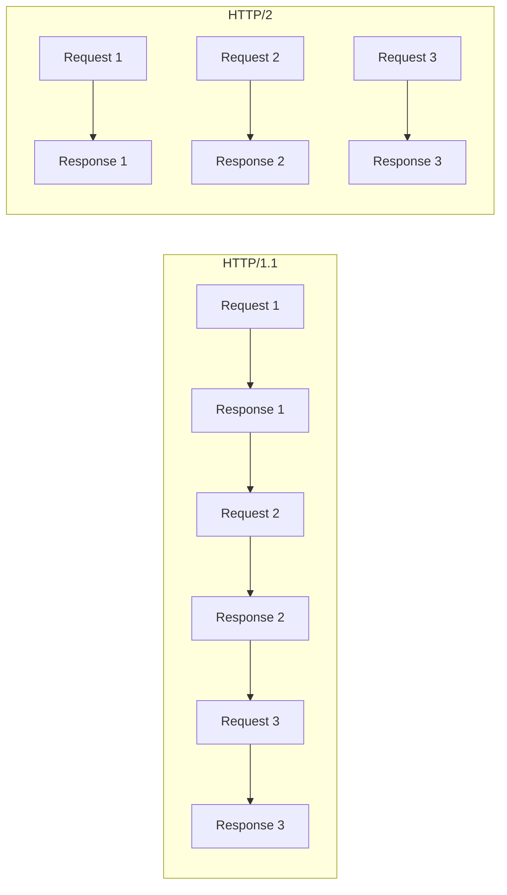

# How to Set Up Apache with HTTP/2 on RHEL 9

Author: [nawazdhandala](https://www.github.com/nawazdhandala)

Tags: RHEL, Apache, HTTP/2, Performance, Linux

Description: Learn how to enable and configure HTTP/2 protocol support in Apache on RHEL 9 for faster page loads through multiplexing and header compression.

---

HTTP/2 brings significant performance improvements over HTTP/1.1, including multiplexed streams, header compression, and server push. Apache on RHEL 9 supports HTTP/2 through the mod_http2 module. This guide shows you how to enable and configure it.

## Prerequisites

- A RHEL 9 system with Apache installed
- SSL/TLS configured (HTTP/2 in browsers requires HTTPS)
- The event or worker MPM (HTTP/2 does not work well with prefork)
- Root or sudo access

## Why HTTP/2 Matters



HTTP/1.1 processes requests sequentially on each connection. HTTP/2 multiplexes multiple requests over a single connection, dramatically reducing page load times.

## Step 1: Install and Enable mod_http2

```bash
# Install mod_http2 (usually included with httpd)
sudo dnf install -y mod_http2

# Verify the module is available
httpd -M | grep http2
```

## Step 2: Verify the MPM

HTTP/2 works best with the event MPM. Check your current MPM:

```bash
# Check which MPM is active
httpd -V | grep MPM

# If using prefork, switch to event
sudo vi /etc/httpd/conf.modules.d/00-mpm.conf
```

Make sure the event MPM is loaded:

```apache
# Enable event MPM (comment out prefork)
# LoadModule mpm_prefork_module modules/mod_mpm_prefork.so
LoadModule mpm_event_module modules/mod_mpm_event.so
```

## Step 3: Enable HTTP/2 in Apache

```bash
# Create HTTP/2 configuration
cat <<'EOF' | sudo tee /etc/httpd/conf.d/http2.conf
# Enable HTTP/2 protocol
# h2 = HTTP/2 over TLS
# h2c = HTTP/2 cleartext (not used by browsers)
Protocols h2 h2c http/1.1
EOF
```

## Step 4: Configure Your SSL Virtual Host

Add HTTP/2 support to your HTTPS virtual host:

```apache
<VirtualHost *:443>
    ServerName www.example.com
    DocumentRoot /var/www/html

    # Enable HTTP/2 for this virtual host
    Protocols h2 http/1.1

    # SSL configuration
    SSLEngine on
    SSLCertificateFile /etc/letsencrypt/live/example.com/fullchain.pem
    SSLCertificateKeyFile /etc/letsencrypt/live/example.com/privkey.pem

    # Use only TLS 1.2 and 1.3 (required for HTTP/2)
    SSLProtocol all -SSLv3 -TLSv1 -TLSv1.1

    # HTTP/2 compatible cipher suites
    SSLCipherSuite ECDHE-ECDSA-AES128-GCM-SHA256:ECDHE-RSA-AES128-GCM-SHA256:ECDHE-ECDSA-AES256-GCM-SHA384:ECDHE-RSA-AES256-GCM-SHA384

    <Directory /var/www/html>
        Require all granted
    </Directory>

    ErrorLog logs/ssl-error.log
    CustomLog logs/ssl-access.log combined
</VirtualHost>
```

## Step 5: Tune HTTP/2 Settings

```apache
# /etc/httpd/conf.d/http2.conf

# Enable HTTP/2
Protocols h2 h2c http/1.1

# Maximum number of concurrent streams per connection
# Default is 100, which is fine for most sites
H2MaxSessionStreams 100

# Window size for flow control (bytes)
# Larger values can improve throughput for large files
H2WindowSize 65535

# Minimum number of workers for HTTP/2 processing
H2MinWorkers 1

# Maximum number of workers for HTTP/2 processing
H2MaxWorkers 25

# Direct HTTP/2 mode (improves performance, avoids internal redirect)
H2Direct On

# Enable server push
H2Push On

# Push CSS and JS resources when HTML is requested
<Location "/">
    H2PushResource /css/style.css
    H2PushResource /js/app.js
</Location>
```

## Step 6: Test and Apply

```bash
# Test configuration
sudo apachectl configtest

# Restart Apache (restart is needed for MPM changes)
sudo systemctl restart httpd

# Test HTTP/2 support with curl
curl -vso /dev/null --http2 https://www.example.com/ 2>&1 | grep "< HTTP/"

# You should see: < HTTP/2 200

# Alternative test using nghttp2 client
sudo dnf install -y nghttp2
nghttp -nv https://www.example.com/
```

## Step 7: Verify HTTP/2 in Browser

Open your browser's developer tools (F12), go to the Network tab, and look for the Protocol column. It should show "h2" for requests to your server.

You can also use online tools like https://tools.keycdn.com/http2-test to verify.

## Step 8: Log HTTP/2 Protocol Usage

```apache
# Add the HTTP/2 protocol to your access log format
LogFormat "%h %l %u %t \"%r\" %>s %b \"%{Referer}i\" \"%{User-Agent}i\" %{H2_STREAM_TAG}e" h2_combined

CustomLog logs/ssl-access.log h2_combined
```

## Troubleshooting

```bash
# Check if mod_http2 is loaded
httpd -M | grep http2

# Verify the event MPM is active (prefork causes issues with HTTP/2)
httpd -V | grep MPM

# Check for HTTP/2 related errors
sudo grep -i "http2\|h2" /var/log/httpd/error_log

# Verify TLS version (HTTP/2 requires TLS 1.2+)
openssl s_client -connect www.example.com:443 -alpn h2 < /dev/null 2>/dev/null | grep "ALPN"

# If ALPN shows h2, the server is correctly advertising HTTP/2 support

# Check if the server is actually using HTTP/2
curl -v --http2 https://www.example.com/ 2>&1 | grep "using HTTP/2"
```

## Summary

HTTP/2 on Apache with RHEL 9 brings multiplexed connections, header compression, and optional server push to your web server. The main requirements are using the event MPM, having TLS configured, and loading mod_http2. With these in place, browsers automatically negotiate HTTP/2 and your users get faster page loads.
