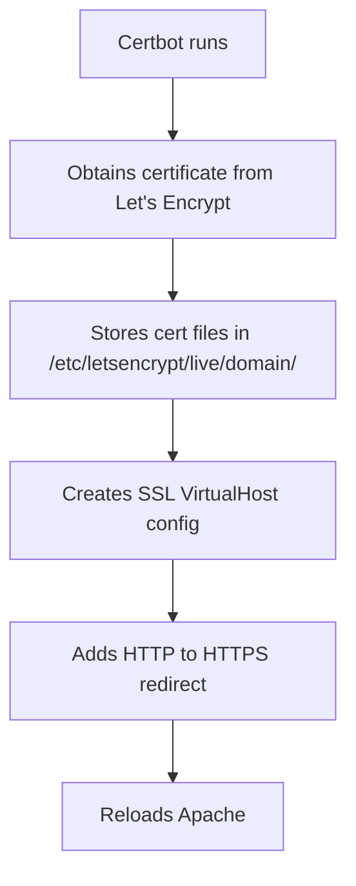

# How to Set Up Apache with mod_ssl and Let's Encrypt on RHEL

Author: [nawazdhandala](https://www.github.com/nawazdhandala)

Tags: RHEL, Apache, SSL, TLS, Let's Encrypt, Certbot, Linux

Description: A practical guide to securing Apache with free SSL/TLS certificates from Let's Encrypt using Certbot on RHEL, including automatic renewal configuration.

---

HTTPS is no longer optional. Browsers flag unencrypted sites as insecure, and search engines penalize them in rankings. Let's Encrypt provides free, automated SSL/TLS certificates, and Certbot makes it simple to install and renew them on Apache. This guide walks you through the entire process on RHEL.

## Prerequisites

- A RHEL system with Apache installed and running
- A registered domain name pointing to your server's public IP
- Port 80 and 443 open in the firewall
- Root or sudo access

## Step 1: Install mod_ssl and Certbot

```bash
# Install the Apache SSL module
sudo dnf install -y mod_ssl

# Enable the EPEL repository (Certbot lives here)
sudo dnf install -y epel-release

# Install Certbot and the Apache plugin
sudo dnf install -y certbot python3-certbot-apache

# Verify mod_ssl is loaded
httpd -M | grep ssl
```

## Step 2: Open Firewall Ports

```bash
# Allow HTTPS traffic
sudo firewall-cmd --permanent --add-service=https

# Ensure HTTP is also allowed (needed for certificate validation)
sudo firewall-cmd --permanent --add-service=http

# Reload the firewall
sudo firewall-cmd --reload
```

## Step 3: Obtain a Certificate with Certbot

```bash
# Run Certbot with the Apache plugin
# It will automatically configure Apache for you
sudo certbot --apache -d example.com -d www.example.com

# Certbot will prompt you for:
# 1. Your email address (for renewal notifications)
# 2. Agreement to the terms of service
# 3. Whether to redirect HTTP to HTTPS (recommended)
```

For non-interactive use (scripting or automation):

```bash
# Non-interactive certificate request
sudo certbot --apache \
    --non-interactive \
    --agree-tos \
    --email admin@example.com \
    --redirect \
    -d example.com \
    -d www.example.com
```

## Step 4: Understand What Certbot Configured

Certbot creates and modifies configuration files automatically. Here is what happens:



The certificate files are stored in `/etc/letsencrypt/live/example.com/`:

```bash
# View the certificate files
sudo ls -la /etc/letsencrypt/live/example.com/

# fullchain.pem  - Your certificate plus intermediate certificates
# privkey.pem    - Your private key
# cert.pem       - Your certificate only
# chain.pem      - Intermediate certificates only
```

Certbot creates a file like `/etc/httpd/conf.d/example.com-le-ssl.conf`:

```apache
<VirtualHost *:443>
    ServerName example.com
    ServerAlias www.example.com
    DocumentRoot /var/www/html

    # SSL configuration added by Certbot
    SSLEngine on
    SSLCertificateFile /etc/letsencrypt/live/example.com/fullchain.pem
    SSLCertificateKeyFile /etc/letsencrypt/live/example.com/privkey.pem

    # Include recommended SSL settings
    Include /etc/letsencrypt/options-ssl-apache.conf
</VirtualHost>
```

## Step 5: Verify SSL Is Working

```bash
# Test the SSL configuration
sudo apachectl configtest

# Check the certificate details from the command line
openssl s_client -connect example.com:443 -servername example.com < /dev/null 2>/dev/null | openssl x509 -noout -dates -subject

# Test with curl
curl -vI https://example.com 2>&1 | grep -E "subject|expire|issuer"
```

## Step 6: Set Up Automatic Renewal

Let's Encrypt certificates expire after 90 days. Certbot installs a systemd timer for automatic renewal.

```bash
# Check if the renewal timer is active
sudo systemctl status certbot-renew.timer

# If not active, enable it
sudo systemctl enable --now certbot-renew.timer

# Test the renewal process without actually renewing
sudo certbot renew --dry-run

# List all managed certificates and their expiry dates
sudo certbot certificates
```

The timer runs twice daily and only renews certificates that are within 30 days of expiry.

## Step 7: Harden SSL Configuration

The default Certbot configuration is good, but you can tighten it further.

```bash
# Create a custom SSL hardening config
cat <<'EOF' | sudo tee /etc/httpd/conf.d/ssl-hardening.conf
# Disable older TLS versions - only allow TLS 1.2 and 1.3
SSLProtocol all -SSLv3 -TLSv1 -TLSv1.1

# Use strong cipher suites
SSLCipherSuite ECDHE-ECDSA-AES128-GCM-SHA256:ECDHE-RSA-AES128-GCM-SHA256:ECDHE-ECDSA-AES256-GCM-SHA384:ECDHE-RSA-AES256-GCM-SHA384

# Let the server choose the cipher order
SSLHonorCipherOrder on

# Enable HSTS (HTTP Strict Transport Security)
# This tells browsers to always use HTTPS for this domain
Header always set Strict-Transport-Security "max-age=31536000; includeSubDomains"

# Enable OCSP stapling for faster certificate validation
SSLUseStapling on
SSLStaplingCache "shmcb:logs/ssl_stapling(128000)"
EOF

# Test and reload
sudo apachectl configtest && sudo systemctl reload httpd
```

## Step 8: Configure HTTP to HTTPS Redirect

If Certbot did not set this up automatically:

```bash
cat <<'EOF' | sudo tee /etc/httpd/conf.d/http-redirect.conf
# Redirect all HTTP traffic to HTTPS
<VirtualHost *:80>
    ServerName example.com
    ServerAlias www.example.com

    # Permanent redirect to HTTPS
    Redirect permanent / https://example.com/
</VirtualHost>
EOF
```

## Troubleshooting

```bash
# Check if Apache is listening on port 443
sudo ss -tlnp | grep :443

# View SSL-related error messages
sudo tail -f /var/log/httpd/error_log

# Test certificate renewal
sudo certbot renew --dry-run

# If Certbot fails, check that port 80 is accessible from the internet
# Let's Encrypt needs to reach your server on port 80 for validation

# Verify SELinux is not blocking access to certificate files
sudo ausearch -m avc -ts recent | grep certbot

# Check certificate expiration
echo | openssl s_client -connect example.com:443 2>/dev/null | openssl x509 -noout -enddate
```

## Summary

Your Apache server on RHEL is now secured with a free SSL/TLS certificate from Let's Encrypt. Certbot handles both the initial setup and ongoing renewals. With the additional hardening steps, your server only accepts modern TLS connections and includes security headers like HSTS. The automatic renewal timer makes sure your certificates never expire unexpectedly.
