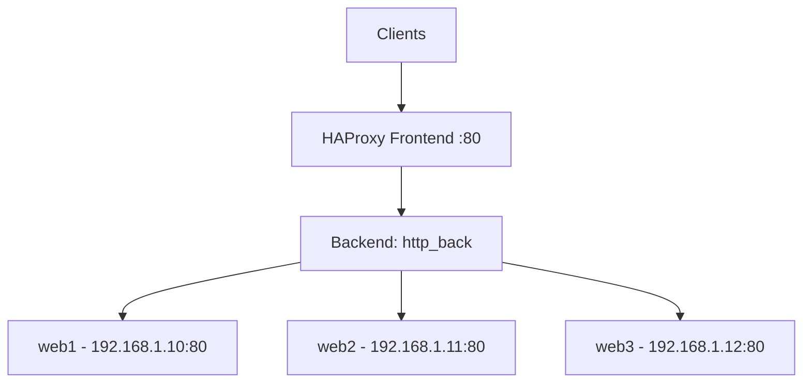

# How to Set Up HAProxy for HTTP Load Balancing on RHEL

Author: [nawazdhandala](https://www.github.com/nawazdhandala)

Tags: RHEL, HAProxy, Load Balancing, HTTP, Linux

Description: Configure HAProxy as an HTTP load balancer on RHEL with multiple backend servers, health checks, and session persistence.

---

HAProxy is a high-performance load balancer widely used in production environments. On RHEL, it provides reliable HTTP load balancing with advanced health checking, session persistence, and detailed statistics. This guide covers setting up HAProxy for HTTP workloads.

## Prerequisites

- A RHEL system with HAProxy installed
- Two or more backend web servers
- Root or sudo access

## Step 1: Install HAProxy

```bash
# Install HAProxy from the default repositories
sudo dnf install -y haproxy

# Enable and start the service
sudo systemctl enable --now haproxy

# Check the version
haproxy -v
```

## Step 2: Configure HAProxy for HTTP Load Balancing

```bash
# Back up the default configuration
sudo cp /etc/haproxy/haproxy.cfg /etc/haproxy/haproxy.cfg.bak
```

```haproxy
# /etc/haproxy/haproxy.cfg

global
    # Run as the haproxy user
    user        haproxy
    group       haproxy

    # Maximum connections
    maxconn     4096

    # Logging
    log         /dev/log local0
    log         /dev/log local1 notice

    # Chroot for security
    chroot      /var/lib/haproxy

    # Stats socket for runtime management
    stats socket /var/lib/haproxy/stats mode 660 level admin

    # Use system SSL settings
    ssl-default-bind-ciphers ECDHE-ECDSA-AES128-GCM-SHA256:ECDHE-RSA-AES128-GCM-SHA256
    ssl-default-bind-options ssl-min-ver TLSv1.2

defaults
    # Default to HTTP mode
    mode        http
    log         global

    # Log HTTP request details
    option      httplog

    # Close connections after each request
    option      http-server-close

    # Forward client IP via X-Forwarded-For header
    option      forwardfor

    # Timeouts
    timeout connect     5s
    timeout client      30s
    timeout server      30s

    # Retry failed connections on the next server
    retries     3

frontend http_front
    # Listen on port 80
    bind *:80

    # Default backend
    default_backend http_back

backend http_back
    # Use round-robin load balancing
    balance roundrobin

    # Health check: send HTTP request to /health
    option httpchk GET /health

    # Backend servers
    server web1 192.168.1.10:80 check inter 5s fall 3 rise 2
    server web2 192.168.1.11:80 check inter 5s fall 3 rise 2
    server web3 192.168.1.12:80 check inter 5s fall 3 rise 2
```



## Step 3: Load Balancing Algorithms

```haproxy
backend http_back
    # Round-robin (default) - equal distribution
    balance roundrobin

    # Least connections - send to least busy server
    # balance leastconn

    # Source IP hash - same client always hits same server
    # balance source

    # URI hash - same URL always hits same server (good for caching)
    # balance uri

    server web1 192.168.1.10:80 check
    server web2 192.168.1.11:80 check
```

## Step 4: Weighted Servers

```haproxy
backend http_back
    balance roundrobin

    # web1 gets 3x the traffic of web3
    server web1 192.168.1.10:80 weight 3 check
    server web2 192.168.1.11:80 weight 2 check
    server web3 192.168.1.12:80 weight 1 check
```

## Step 5: Session Persistence with Cookies

```haproxy
backend http_back
    balance roundrobin

    # Insert a cookie to maintain session persistence
    cookie SERVERID insert indirect nocache

    # Each server gets a unique cookie value
    server web1 192.168.1.10:80 cookie s1 check
    server web2 192.168.1.11:80 cookie s2 check
    server web3 192.168.1.12:80 cookie s3 check
```

## Step 6: Content-Based Routing

```haproxy
frontend http_front
    bind *:80

    # Route API traffic to the API backend
    acl is_api path_beg /api/

    # Route static content to a different backend
    acl is_static path_end .css .js .jpg .png .gif

    use_backend api_back if is_api
    use_backend static_back if is_static
    default_backend web_back

backend api_back
    balance leastconn
    server api1 192.168.1.20:3000 check
    server api2 192.168.1.21:3000 check

backend static_back
    balance roundrobin
    server static1 192.168.1.30:80 check

backend web_back
    balance roundrobin
    server web1 192.168.1.10:80 check
    server web2 192.168.1.11:80 check
```

## Step 7: Open Firewall and Start

```bash
# Open port 80 in the firewall
sudo firewall-cmd --permanent --add-service=http
sudo firewall-cmd --reload

# Configure SELinux to allow HAProxy to bind to ports
sudo setsebool -P haproxy_connect_any on

# Test the configuration
haproxy -c -f /etc/haproxy/haproxy.cfg

# Restart HAProxy
sudo systemctl restart haproxy

# Check status
sudo systemctl status haproxy
```

## Step 8: Test Load Balancing

```bash
# Make multiple requests and check which server responds
for i in $(seq 1 10); do
    curl -s http://localhost/ | grep "Server:"
done

# Check HAProxy logs
sudo journalctl -u haproxy -f
```

## Troubleshooting

```bash
# Validate configuration
haproxy -c -f /etc/haproxy/haproxy.cfg

# Check if HAProxy is listening
sudo ss -tlnp | grep haproxy

# Check backend health
echo "show servers state" | sudo socat stdio /var/lib/haproxy/stats

# Check SELinux
sudo ausearch -m avc -ts recent | grep haproxy
```

## Summary

HAProxy on RHEL provides robust HTTP load balancing with flexible algorithms, health checks, and session persistence. The ACL system allows content-based routing to direct different types of traffic to specialized backend pools. With its efficient event-driven architecture, HAProxy can handle thousands of concurrent connections with minimal resource usage.
