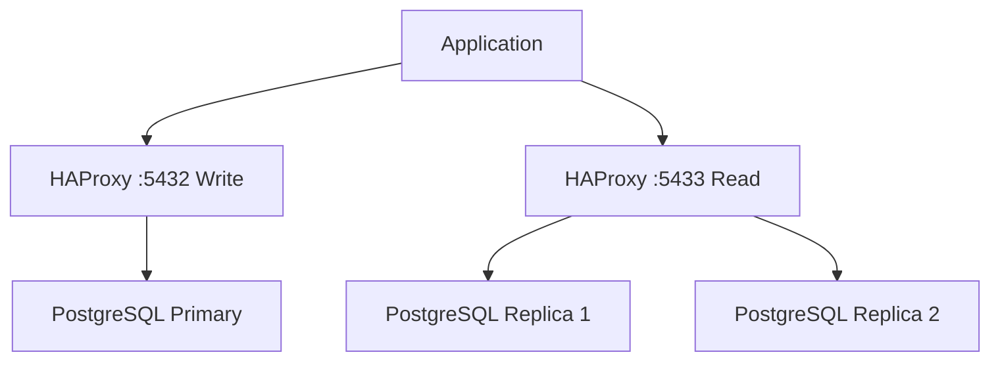

# How to Set Up HAProxy for PostgreSQL Connection Routing on RHEL

Author: [nawazdhandala](https://www.github.com/nawazdhandala)

Tags: RHEL, HAProxy, PostgreSQL, Load Balancing, Linux

Description: Configure HAProxy to route PostgreSQL connections on RHEL with primary/replica splitting, health checks, and connection pooling.

---

HAProxy can route PostgreSQL connections to separate primary and replica servers, providing read/write splitting and high availability. This guide covers setting up HAProxy for PostgreSQL on RHEL.

## Prerequisites

- A RHEL system with HAProxy installed
- A PostgreSQL primary and one or more replicas
- Root or sudo access

## Architecture



## Step 1: Create a Health Check User

On the PostgreSQL primary:

```sql
-- Create a user for health checks
CREATE USER haproxy_check WITH LOGIN;

-- Grant connect permission
GRANT CONNECT ON DATABASE postgres TO haproxy_check;
```

Update `pg_hba.conf` on all PostgreSQL servers:

```bash
# Allow health check connections from HAProxy
host    postgres    haproxy_check    192.168.1.0/24    trust
```

```bash
# Reload PostgreSQL
sudo systemctl reload postgresql
```

## Step 2: Configure HAProxy

```haproxy
# /etc/haproxy/haproxy.cfg

global
    user        haproxy
    group       haproxy
    maxconn     4096
    log         /dev/log local0
    stats socket /var/lib/haproxy/stats mode 660 level admin

defaults
    log         global
    retries     3
    timeout connect     5s
    timeout client      60s
    timeout server      60s

# Stats page
listen stats
    bind *:8404
    mode http
    stats enable
    stats uri /stats
    stats auth admin:SecurePass123

# Write traffic to PostgreSQL primary
listen pgsql_write
    bind *:5432
    mode tcp
    option tcplog

    # PostgreSQL health check
    option pgsql-check user haproxy_check

    # Primary server
    server pg-primary 192.168.1.10:5432 check inter 5s fall 3 rise 2

    # Standby for automatic failover (optional)
    server pg-standby 192.168.1.11:5432 check backup

# Read traffic distributed across replicas
listen pgsql_read
    bind *:5433
    mode tcp
    option tcplog
    balance leastconn

    # PostgreSQL health check
    option pgsql-check user haproxy_check

    # Read replicas
    server pg-replica1 192.168.1.11:5432 check inter 5s fall 3 rise 2
    server pg-replica2 192.168.1.12:5432 check inter 5s fall 3 rise 2

    # Primary as fallback for reads
    server pg-primary 192.168.1.10:5432 check backup
```

## Step 3: Configure Firewall and SELinux

```bash
# Open PostgreSQL ports
sudo firewall-cmd --permanent --add-port=5432/tcp
sudo firewall-cmd --permanent --add-port=5433/tcp
sudo firewall-cmd --permanent --add-port=8404/tcp
sudo firewall-cmd --reload

# Allow HAProxy to connect to any port
sudo setsebool -P haproxy_connect_any on
```

## Step 4: Test the Setup

```bash
# Validate HAProxy configuration
haproxy -c -f /etc/haproxy/haproxy.cfg

# Restart HAProxy
sudo systemctl restart haproxy

# Test write connection (primary)
psql -h 127.0.0.1 -p 5432 -U appuser -d mydb -c "SELECT inet_server_addr();"

# Test read connection (replica)
psql -h 127.0.0.1 -p 5433 -U appuser -d mydb -c "SELECT inet_server_addr();"

# Verify load balancing across replicas
for i in $(seq 1 10); do
    psql -h 127.0.0.1 -p 5433 -U appuser -d mydb -t -c "SELECT inet_server_addr();" 2>/dev/null
done
```

## Step 5: Connection Timeouts for Long Queries

```haproxy
listen pgsql_write
    bind *:5432
    mode tcp

    # Longer timeout for write operations (DDL, bulk inserts)
    timeout client  300s
    timeout server  300s

    option pgsql-check user haproxy_check
    server pg-primary 192.168.1.10:5432 check

listen pgsql_read
    bind *:5433
    mode tcp

    # Moderate timeout for read queries
    timeout client  60s
    timeout server  60s

    option pgsql-check user haproxy_check
    server pg-replica1 192.168.1.11:5432 check
    server pg-replica2 192.168.1.12:5432 check
```

## Step 6: Monitor Connections

```bash
# Check server health
echo "show servers state" | sudo socat stdio /var/lib/haproxy/stats

# View current connections per server
echo "show stat" | sudo socat stdio /var/lib/haproxy/stats | grep pgsql

# Check the stats dashboard
curl -u admin:SecurePass123 http://localhost:8404/stats
```

## Troubleshooting

```bash
# Verify HAProxy is listening
sudo ss -tlnp | grep -E "5432|5433"

# Test direct connection to PostgreSQL (bypass HAProxy)
psql -h 192.168.1.10 -p 5432 -U haproxy_check -d postgres -c "SELECT 1;"

# Check HAProxy logs
sudo journalctl -u haproxy | grep -i "pgsql\|down\|check"

# Verify SELinux
sudo ausearch -m avc -ts recent | grep haproxy
```

## Summary

HAProxy on RHEL provides PostgreSQL connection routing with read/write splitting, health checks, and failover support. Direct writes to the primary on one port and reads to replicas on another. The built-in PostgreSQL health check verifies database connectivity, and connection-based load balancing ensures even distribution of database queries.
