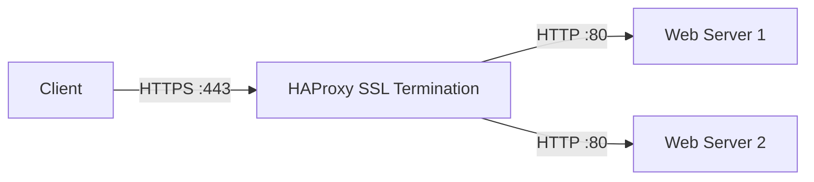

# How to Set Up HAProxy with SSL Termination on RHEL

Author: [nawazdhandala](https://www.github.com/nawazdhandala)

Tags: RHEL, HAProxy, SSL, TLS, Load Balancing, Linux

Description: Configure HAProxy to handle SSL/TLS termination on RHEL, offloading encryption from backend servers and managing certificates centrally.

---

SSL termination at the load balancer offloads encryption work from your backend servers and centralizes certificate management. HAProxy on RHEL handles SSL termination efficiently with support for modern TLS protocols. This guide covers the setup.

## Prerequisites

- A RHEL system with HAProxy installed
- An SSL certificate and private key (from Let's Encrypt or another CA)
- Root or sudo access

## Step 1: Prepare the SSL Certificate

HAProxy needs the certificate and key in a single PEM file:

```bash
# If using Let's Encrypt, combine the files
sudo cat /etc/letsencrypt/live/example.com/fullchain.pem     /etc/letsencrypt/live/example.com/privkey.pem     | sudo tee /etc/haproxy/certs/example.com.pem

# Set secure permissions
sudo chmod 600 /etc/haproxy/certs/example.com.pem
sudo chown haproxy:haproxy /etc/haproxy/certs/example.com.pem

# Create the certs directory if it does not exist
sudo mkdir -p /etc/haproxy/certs
```

## Step 2: Configure SSL Termination

```haproxy
# /etc/haproxy/haproxy.cfg

global
    user        haproxy
    group       haproxy
    maxconn     4096
    log         /dev/log local0

    # SSL/TLS global settings
    ssl-default-bind-ciphers ECDHE-ECDSA-AES128-GCM-SHA256:ECDHE-RSA-AES128-GCM-SHA256:ECDHE-ECDSA-AES256-GCM-SHA384:ECDHE-RSA-AES256-GCM-SHA384
    ssl-default-bind-ciphersuites TLS_AES_128_GCM_SHA256:TLS_AES_256_GCM_SHA384:TLS_CHACHA20_POLY1305_SHA256
    ssl-default-bind-options ssl-min-ver TLSv1.2

    # Tune SSL for performance
    tune.ssl.default-dh-param 2048

    stats socket /var/lib/haproxy/stats mode 660 level admin

defaults
    mode        http
    log         global
    option      httplog
    option      http-server-close
    option      forwardfor
    timeout connect 5s
    timeout client  30s
    timeout server  30s

# HTTPS frontend with SSL termination
frontend https_front
    # Bind to port 443 with SSL
    bind *:443 ssl crt /etc/haproxy/certs/example.com.pem alpn h2,http/1.1

    # Add security headers
    http-response set-header Strict-Transport-Security "max-age=31536000; includeSubDomains"

    # Pass the protocol info to the backend
    http-request set-header X-Forwarded-Proto https

    default_backend web_servers

# HTTP frontend - redirect to HTTPS
frontend http_front
    bind *:80

    # Redirect all HTTP traffic to HTTPS
    http-request redirect scheme https unless { ssl_fc }

backend web_servers
    balance roundrobin
    option httpchk GET /health

    # Backend servers receive unencrypted traffic
    server web1 192.168.1.10:80 check
    server web2 192.168.1.11:80 check
```



## Step 3: Multiple Certificates (SNI)

Serve different certificates based on the requested domain:

```haproxy
frontend https_front
    # Load all certificates from a directory
    bind *:443 ssl crt /etc/haproxy/certs/ alpn h2,http/1.1

    # Route based on SNI
    use_backend app1_servers if { ssl_fc_sni app1.example.com }
    use_backend app2_servers if { ssl_fc_sni app2.example.com }
    default_backend default_servers
```

```bash
# Place each domain's PEM file in the certs directory
# HAProxy auto-matches based on SNI
ls /etc/haproxy/certs/
# app1.example.com.pem
# app2.example.com.pem
```

## Step 4: Enable OCSP Stapling

```bash
# Download the OCSP response for your certificate
openssl ocsp -issuer /etc/letsencrypt/live/example.com/chain.pem     -cert /etc/letsencrypt/live/example.com/cert.pem     -url http://r3.o.lencr.org     -noverify     -respout /etc/haproxy/certs/example.com.ocsp
```

```haproxy
frontend https_front
    bind *:443 ssl crt /etc/haproxy/certs/example.com.pem alpn h2,http/1.1
```

## Step 5: Open Firewall Ports

```bash
# Allow HTTPS traffic
sudo firewall-cmd --permanent --add-service=https
sudo firewall-cmd --permanent --add-service=http
sudo firewall-cmd --reload

# Allow HAProxy to bind to privileged ports
sudo setsebool -P haproxy_connect_any on
```

## Step 6: Test and Apply

```bash
# Validate the configuration
haproxy -c -f /etc/haproxy/haproxy.cfg

# Restart HAProxy
sudo systemctl restart haproxy

# Test HTTPS
curl -vI https://example.com 2>&1 | grep -E "HTTP/|subject|issuer"

# Test HTTP redirect
curl -I http://example.com

# Check TLS version
openssl s_client -connect example.com:443 < /dev/null 2>/dev/null | grep "Protocol"
```

## Step 7: Automatic Certificate Renewal

Create a renewal hook for Certbot:

```bash
# /etc/letsencrypt/renewal-hooks/deploy/haproxy.sh
#!/bin/bash
# Combine cert and key for HAProxy after renewal
cat /etc/letsencrypt/live/example.com/fullchain.pem     /etc/letsencrypt/live/example.com/privkey.pem     > /etc/haproxy/certs/example.com.pem

# Reload HAProxy
systemctl reload haproxy
```

```bash
sudo chmod +x /etc/letsencrypt/renewal-hooks/deploy/haproxy.sh
```

## Troubleshooting

```bash
# Check if HAProxy is listening on 443
sudo ss -tlnp | grep 443

# Test SSL certificate
openssl s_client -connect example.com:443 -servername example.com < /dev/null

# Check HAProxy error log
sudo journalctl -u haproxy -f

# Verify certificate file format
openssl x509 -in /etc/haproxy/certs/example.com.pem -noout -text | head -20
```

## Summary

HAProxy SSL termination on RHEL centralizes certificate management and offloads encryption from your backend servers. With SNI support, you can serve multiple domains with different certificates on a single IP. The automatic redirect from HTTP to HTTPS ensures all traffic is encrypted, and the HSTS header tells browsers to always use HTTPS for your domain.
