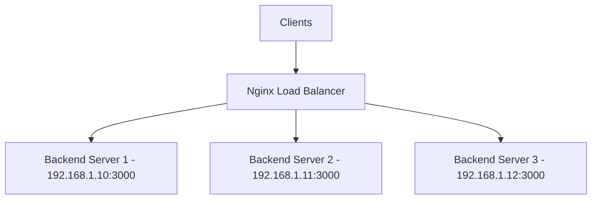

# How to Set Up Nginx Load Balancing on RHEL

Author: [nawazdhandala](https://www.github.com/nawazdhandala)

Tags: RHEL, NGINX, Load Balancing, High Availability, Linux

Description: Learn how to configure Nginx as a load balancer on RHEL with round-robin, least connections, and IP hash algorithms plus health checks.

---

Nginx provides efficient layer 7 load balancing with multiple distribution algorithms, health checks, and session persistence. This guide covers configuring Nginx as a load balancer on RHEL for both HTTP and HTTPS traffic.

## Prerequisites

- A RHEL system with Nginx installed
- Two or more backend servers running your application
- Root or sudo access

## Load Balancing Architecture



## Step 1: Round-Robin Load Balancing

The default algorithm distributes requests evenly across all servers:

```nginx
# /etc/nginx/conf.d/loadbalancer.conf

# Define the upstream group
upstream backend_servers {
    server 192.168.1.10:3000;
    server 192.168.1.11:3000;
    server 192.168.1.12:3000;
}

server {
    listen 80;
    server_name app.example.com;

    location / {
        proxy_pass http://backend_servers;
        proxy_set_header Host $host;
        proxy_set_header X-Real-IP $remote_addr;
        proxy_set_header X-Forwarded-For $proxy_add_x_forwarded_for;
        proxy_set_header X-Forwarded-Proto $scheme;
    }
}
```

## Step 2: Least Connections Algorithm

Sends new requests to the server with the fewest active connections:

```nginx
upstream backend_servers {
    # Direct traffic to the least busy server
    least_conn;

    server 192.168.1.10:3000;
    server 192.168.1.11:3000;
    server 192.168.1.12:3000;
}
```

## Step 3: IP Hash for Session Persistence

Routes clients to the same backend based on their IP address:

```nginx
upstream backend_servers {
    # Same client IP always goes to the same backend
    ip_hash;

    server 192.168.1.10:3000;
    server 192.168.1.11:3000;
    server 192.168.1.12:3000;
}
```

## Step 4: Weighted Load Balancing

Assign different capacities to servers:

```nginx
upstream backend_servers {
    # Server 1 gets 5x the traffic of server 3
    server 192.168.1.10:3000 weight=5;
    server 192.168.1.11:3000 weight=3;
    server 192.168.1.12:3000 weight=1;
}
```

## Step 5: Configure Health Checks

```nginx
upstream backend_servers {
    server 192.168.1.10:3000 max_fails=3 fail_timeout=30s;
    server 192.168.1.11:3000 max_fails=3 fail_timeout=30s;
    server 192.168.1.12:3000 max_fails=3 fail_timeout=30s;

    # Backup server only used when all primary servers are down
    server 192.168.1.20:3000 backup;
}
```

Parameters explained:
- `max_fails=3` - Mark the server as down after 3 consecutive failures
- `fail_timeout=30s` - Wait 30 seconds before trying the failed server again

## Step 6: Keepalive Connections to Upstream

```nginx
upstream backend_servers {
    server 192.168.1.10:3000;
    server 192.168.1.11:3000;

    # Maintain up to 32 idle connections to each backend
    keepalive 32;
}

server {
    listen 80;
    server_name app.example.com;

    location / {
        proxy_pass http://backend_servers;

        # Required for keepalive to work with upstream
        proxy_http_version 1.1;
        proxy_set_header Connection "";

        proxy_set_header Host $host;
        proxy_set_header X-Real-IP $remote_addr;
    }
}
```

## Step 7: HTTPS Load Balancing

```nginx
upstream backend_servers {
    server 192.168.1.10:3000;
    server 192.168.1.11:3000;
}

# Redirect HTTP to HTTPS
server {
    listen 80;
    server_name app.example.com;
    return 301 https://$server_name$request_uri;
}

# HTTPS server with SSL termination
server {
    listen 443 ssl;
    server_name app.example.com;

    ssl_certificate /etc/letsencrypt/live/app.example.com/fullchain.pem;
    ssl_certificate_key /etc/letsencrypt/live/app.example.com/privkey.pem;

    location / {
        proxy_pass http://backend_servers;
        proxy_set_header Host $host;
        proxy_set_header X-Real-IP $remote_addr;
        proxy_set_header X-Forwarded-For $proxy_add_x_forwarded_for;
        proxy_set_header X-Forwarded-Proto https;
    }
}
```

## Step 8: Configure SELinux and Test

```bash
# Allow Nginx to connect to backend servers
sudo setsebool -P httpd_can_network_connect on

# Test configuration
sudo nginx -t

# Reload Nginx
sudo systemctl reload nginx

# Test load balancing by making multiple requests
for i in $(seq 1 10); do
    curl -s http://app.example.com/ | grep "Server:"
done
```

## Troubleshooting

```bash
# Check if backends are reachable
curl http://192.168.1.10:3000/
curl http://192.168.1.11:3000/

# Check Nginx error log for upstream errors
sudo tail -f /var/log/nginx/error.log

# Look for "upstream timed out" or "connection refused" messages

# Check SELinux
sudo ausearch -m avc -ts recent | grep nginx
```

## Summary

Nginx load balancing on RHEL distributes traffic efficiently across your backend servers. Choose round-robin for even distribution, least_conn for variable request processing times, or ip_hash when you need session persistence. Health checks automatically remove failing backends and re-add them when they recover.
