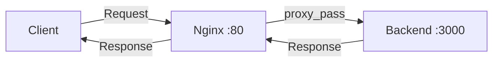

# How to Set Up Nginx Reverse Proxy on RHEL

Author: [nawazdhandala](https://www.github.com/nawazdhandala)

Tags: RHEL, NGINX, Reverse Proxy, Web Server, Linux

Description: A step-by-step guide to configuring Nginx as a reverse proxy on RHEL, including upstream configuration, WebSocket support, and caching.

---

Nginx excels as a reverse proxy thanks to its event-driven architecture and low memory footprint. It can sit in front of application servers, handle SSL termination, serve static files, and balance load across backends. This guide covers setting up Nginx as a reverse proxy on RHEL.

## Prerequisites

- A RHEL system with Nginx installed
- A backend application running on a local or remote port
- Root or sudo access

## Step 1: Install Nginx

```bash
# Install Nginx from the default repositories
sudo dnf install -y nginx

# Start and enable Nginx
sudo systemctl enable --now nginx

# Open firewall ports
sudo firewall-cmd --permanent --add-service=http
sudo firewall-cmd --permanent --add-service=https
sudo firewall-cmd --reload
```

## Step 2: Basic Reverse Proxy Configuration

```nginx
# /etc/nginx/conf.d/app.conf

server {
    listen 80;
    server_name app.example.com;

    # Proxy all requests to the backend application
    location / {
        # Backend application address
        proxy_pass http://127.0.0.1:3000;

        # Pass the original host header to the backend
        proxy_set_header Host $host;

        # Pass the real client IP address
        proxy_set_header X-Real-IP $remote_addr;

        # Pass the full chain of proxy addresses
        proxy_set_header X-Forwarded-For $proxy_add_x_forwarded_for;

        # Tell the backend whether the original request was HTTP or HTTPS
        proxy_set_header X-Forwarded-Proto $scheme;
    }
}
```



## Step 3: Upstream Configuration for Multiple Backends

```nginx
# /etc/nginx/conf.d/app.conf

# Define an upstream group of backend servers
upstream app_backend {
    # Round-robin by default
    server 192.168.1.10:3000;
    server 192.168.1.11:3000;
    server 192.168.1.12:3000 backup;

    # Keep connections alive to reduce overhead
    keepalive 32;
}

server {
    listen 80;
    server_name app.example.com;

    location / {
        proxy_pass http://app_backend;
        proxy_set_header Host $host;
        proxy_set_header X-Real-IP $remote_addr;
        proxy_set_header X-Forwarded-For $proxy_add_x_forwarded_for;
        proxy_set_header X-Forwarded-Proto $scheme;

        # Required for keepalive connections to upstream
        proxy_http_version 1.1;
        proxy_set_header Connection "";
    }
}
```

## Step 4: Proxy Specific Paths to Different Backends

```nginx
server {
    listen 80;
    server_name www.example.com;
    root /var/www/html;

    # Serve static files directly from Nginx
    location /static/ {
        alias /var/www/html/static/;
        expires 30d;
    }

    # Proxy API requests to the API server
    location /api/ {
        proxy_pass http://127.0.0.1:3000;
        proxy_set_header Host $host;
        proxy_set_header X-Real-IP $remote_addr;
    }

    # Proxy admin panel to a separate backend
    location /admin/ {
        proxy_pass http://127.0.0.1:8080;
        proxy_set_header Host $host;
        proxy_set_header X-Real-IP $remote_addr;
    }

    # Everything else goes to the main app
    location / {
        proxy_pass http://127.0.0.1:5000;
        proxy_set_header Host $host;
        proxy_set_header X-Real-IP $remote_addr;
    }
}
```

## Step 5: WebSocket Proxy Support

```nginx
server {
    listen 80;
    server_name ws.example.com;

    location / {
        proxy_pass http://127.0.0.1:3000;
        proxy_set_header Host $host;
        proxy_set_header X-Real-IP $remote_addr;
        proxy_set_header X-Forwarded-For $proxy_add_x_forwarded_for;

        # WebSocket support - upgrade the connection
        proxy_http_version 1.1;
        proxy_set_header Upgrade $http_upgrade;
        proxy_set_header Connection "upgrade";

        # Increase timeouts for long-lived WebSocket connections
        proxy_read_timeout 86400s;
        proxy_send_timeout 86400s;
    }
}
```

## Step 6: Configure Proxy Timeouts and Buffering

```nginx
server {
    listen 80;
    server_name app.example.com;

    location / {
        proxy_pass http://127.0.0.1:3000;

        # Timeout for establishing a connection to the backend
        proxy_connect_timeout 10s;

        # Timeout for reading a response from the backend
        proxy_read_timeout 60s;

        # Timeout for sending a request to the backend
        proxy_send_timeout 60s;

        # Buffer the response from the backend
        proxy_buffering on;
        proxy_buffer_size 4k;
        proxy_buffers 8 16k;
        proxy_busy_buffers_size 32k;

        # For large uploads, increase the body size limit
        client_max_body_size 50m;
    }
}
```

## Step 7: Configure SELinux

```bash
# Allow Nginx to make outbound network connections
sudo setsebool -P httpd_can_network_connect on

# If connecting to a non-standard port, you may need to add it
sudo semanage port -a -t http_port_t -p tcp 3000

# Verify the boolean
getsebool httpd_can_network_connect
```

## Step 8: Test and Apply

```bash
# Test the configuration
sudo nginx -t

# Reload Nginx
sudo systemctl reload nginx

# Test the proxy
curl -v http://app.example.com/

# Check the error log if things are not working
sudo tail -f /var/log/nginx/error.log
```

## Troubleshooting

```bash
# Check SELinux denials
sudo ausearch -m avc -ts recent | grep nginx

# Verify the backend is reachable
curl http://127.0.0.1:3000/

# Check Nginx error log
sudo tail -f /var/log/nginx/error.log

# Common error: "connect() failed (13: Permission denied)"
# Solution: sudo setsebool -P httpd_can_network_connect on

# Common error: "502 Bad Gateway"
# Check if the backend is running and the port is correct
```

## Summary

Nginx makes an excellent reverse proxy on RHEL with its efficient connection handling and flexible configuration. Key features include upstream groups for load balancing, WebSocket support through connection upgrades, and fine-grained control over timeouts and buffering. Remember to configure SELinux to allow network connections from Nginx to your backend services.
