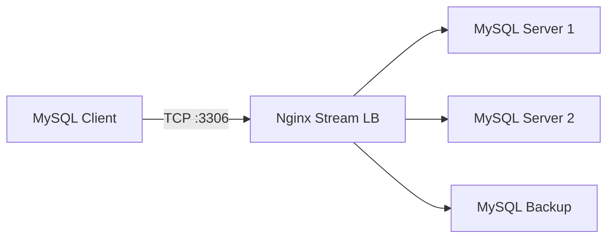

# How to Set Up Nginx as a TCP/UDP Load Balancer on RHEL

Author: [nawazdhandala](https://www.github.com/nawazdhandala)

Tags: RHEL, NGINX, TCP, UDP, Load Balancing, Linux

Description: Configure Nginx stream module on RHEL to load balance TCP and UDP traffic for databases, DNS, mail servers, and other non-HTTP services.

---

Nginx is not just for HTTP. The stream module enables TCP and UDP load balancing for services like databases, mail servers, DNS, and custom protocols. This guide covers setting up the Nginx stream module on RHEL.

## Prerequisites

- A RHEL system with Nginx installed
- Backend services running on TCP or UDP ports
- Root or sudo access

## Step 1: Verify Stream Module

```bash
# Check if the stream module is included
nginx -V 2>&1 | grep stream

# On RHEL, the stream module is included by default
# but may need to be loaded in the configuration
```

## Step 2: Enable the Stream Module

The stream configuration goes in a separate block (not inside http):

```nginx
# /etc/nginx/nginx.conf
# Add the stream block at the top level (same level as http)

stream {
    # Stream configuration goes here
}
```

Or use an include directive:

```nginx
# In /etc/nginx/nginx.conf, add at the top level:
include /etc/nginx/stream.d/*.conf;
```

```bash
# Create the stream configuration directory
sudo mkdir -p /etc/nginx/stream.d
```

## Step 3: TCP Load Balancing for a Database

```nginx
# /etc/nginx/stream.d/mysql.conf

# MySQL/MariaDB load balancing
upstream mysql_backends {
    # Least connections is ideal for database workloads
    least_conn;

    server 192.168.1.10:3306 max_fails=3 fail_timeout=30s;
    server 192.168.1.11:3306 max_fails=3 fail_timeout=30s;
    server 192.168.1.12:3306 backup;
}

server {
    # Listen on the MySQL port
    listen 3306;

    # Proxy to the upstream group
    proxy_pass mysql_backends;

    # Connection timeout
    proxy_connect_timeout 10s;

    # Timeout for established connections
    proxy_timeout 300s;
}
```



## Step 4: TCP Load Balancing for SSH

```nginx
# /etc/nginx/stream.d/ssh.conf

upstream ssh_backends {
    server 192.168.1.10:22;
    server 192.168.1.11:22;
}

server {
    listen 2222;
    proxy_pass ssh_backends;
    proxy_connect_timeout 5s;
    proxy_timeout 3600s;
}
```

## Step 5: UDP Load Balancing for DNS

```nginx
# /etc/nginx/stream.d/dns.conf

upstream dns_backends {
    server 192.168.1.10:53;
    server 192.168.1.11:53;
}

server {
    # Listen on UDP port 53
    listen 53 udp;

    # Proxy DNS queries to backends
    proxy_pass dns_backends;

    # DNS queries are small and fast
    proxy_timeout 5s;

    # Number of UDP datagrams expected from backend per client datagram
    proxy_responses 1;
}

# Also handle TCP DNS (for large responses)
server {
    listen 53;
    proxy_pass dns_backends;
    proxy_timeout 5s;
}
```

## Step 6: SSL/TLS Passthrough

Forward encrypted traffic without terminating SSL:

```nginx
# /etc/nginx/stream.d/ssl-passthrough.conf

upstream https_backends {
    server 192.168.1.10:443;
    server 192.168.1.11:443;
}

server {
    listen 443;
    proxy_pass https_backends;

    # Enable SSL preread to route based on SNI (Server Name Indication)
    ssl_preread on;
}
```

## Step 7: Route by SNI (Server Name Indication)

Route different domains to different backends based on the TLS SNI field:

```nginx
# /etc/nginx/stream.d/sni-routing.conf

map $ssl_preread_server_name $backend {
    app1.example.com    app1_backend;
    app2.example.com    app2_backend;
    default             default_backend;
}

upstream app1_backend {
    server 192.168.1.10:443;
}

upstream app2_backend {
    server 192.168.1.20:443;
}

upstream default_backend {
    server 192.168.1.30:443;
}

server {
    listen 443;
    ssl_preread on;
    proxy_pass $backend;
}
```

## Step 8: Health Checks and Logging

```nginx
# /etc/nginx/stream.d/mysql.conf

# Enable stream logging
log_format stream_log '$remote_addr [$time_local] '
                      '$protocol $status $bytes_sent $bytes_received '
                      '$session_time "$upstream_addr"';

upstream mysql_backends {
    server 192.168.1.10:3306 max_fails=3 fail_timeout=30s;
    server 192.168.1.11:3306 max_fails=3 fail_timeout=30s;
}

server {
    listen 3306;
    proxy_pass mysql_backends;

    # Log stream connections
    access_log /var/log/nginx/stream-mysql.log stream_log;

    # Error log
    error_log /var/log/nginx/stream-mysql-error.log;

    proxy_connect_timeout 10s;
    proxy_timeout 300s;
}
```

## Step 9: Configure SELinux and Firewall

```bash
# Allow Nginx to bind to non-standard ports
sudo semanage port -a -t http_port_t -p tcp 3306
sudo semanage port -a -t http_port_t -p udp 53

# Allow Nginx to connect to backend ports
sudo setsebool -P httpd_can_network_connect on

# Open firewall ports
sudo firewall-cmd --permanent --add-port=3306/tcp
sudo firewall-cmd --permanent --add-port=53/udp
sudo firewall-cmd --permanent --add-port=53/tcp
sudo firewall-cmd --reload
```

## Step 10: Test and Apply

```bash
# Test Nginx configuration
sudo nginx -t

# Reload Nginx
sudo systemctl reload nginx

# Test TCP load balancing (MySQL example)
mysql -h 127.0.0.1 -P 3306 -u testuser -p

# Test UDP load balancing (DNS example)
dig @127.0.0.1 example.com

# Monitor stream connections
sudo tail -f /var/log/nginx/stream-mysql.log
```

## Troubleshooting

```bash
# Check if Nginx is listening on the expected ports
sudo ss -tlnp | grep nginx
sudo ss -ulnp | grep nginx

# Check SELinux for port binding issues
sudo ausearch -m avc -ts recent | grep nginx

# Verify backend connectivity
nc -zv 192.168.1.10 3306

# Check stream error log
sudo tail -f /var/log/nginx/stream-mysql-error.log
```

## Summary

The Nginx stream module on RHEL provides TCP and UDP load balancing for any network service. You can load balance databases, DNS servers, mail servers, and any other TCP/UDP service. SNI-based routing allows multiplexing multiple TLS services on a single IP address. Health checks automatically remove failing backends from the pool.
