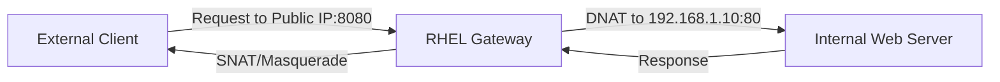

# How to Set Up Port Forwarding with nftables on RHEL

Author: [nawazdhandala](https://www.github.com/nawazdhandala)

Tags: RHEL, nftables, Port Forwarding, Firewall, Linux

Description: A hands-on guide to configuring port forwarding (DNAT and SNAT) using nftables on RHEL, covering common use cases like redirecting traffic to internal servers.

---

Port forwarding lets you redirect network traffic arriving on one port to a different port or host. On RHEL, nftables has replaced iptables as the default packet filtering framework. This guide walks you through setting up port forwarding rules with nftables so you can route external traffic to internal services.

## Prerequisites

Before you begin, make sure you have:

- A RHEL system with root or sudo access
- The nftables package installed (it ships by default on RHEL)
- IP forwarding enabled in the kernel
- Basic familiarity with networking concepts

## Understanding Port Forwarding with nftables

Port forwarding involves two main NAT operations:

- **DNAT (Destination NAT)**: Rewrites the destination address/port of incoming packets
- **SNAT (Source NAT)** or **Masquerade**: Rewrites the source address of outgoing packets so replies come back through the forwarding host



## Step 1: Enable IP Forwarding

The kernel needs to forward packets between network interfaces. Enable it temporarily and permanently.

```bash
# Check current status of IP forwarding
sysctl net.ipv4.ip_forward

# Enable IP forwarding immediately (non-persistent)
sudo sysctl -w net.ipv4.ip_forward=1

# Make it persistent across reboots
echo "net.ipv4.ip_forward = 1" | sudo tee /etc/sysctl.d/99-ip-forward.conf

# Apply the configuration
sudo sysctl --system
```

## Step 2: Verify nftables Is Running

```bash
# Check nftables service status
sudo systemctl status nftables

# Start and enable nftables if it is not running
sudo systemctl enable --now nftables

# List current ruleset to see what is already configured
sudo nft list ruleset
```

## Step 3: Create a NAT Table and Chains

nftables uses tables and chains to organize rules. You need a table with prerouting and postrouting chains for NAT.

```bash
# Create a new table for NAT rules
sudo nft add table ip nat

# Create the prerouting chain for DNAT (incoming traffic)
# The priority -100 ensures this runs before the filter chain
sudo nft add chain ip nat prerouting { type nat hook prerouting priority -100 \; }

# Create the postrouting chain for SNAT (outgoing traffic)
# The priority 100 ensures this runs after the filter chain
sudo nft add chain ip nat postrouting { type nat hook postrouting priority 100 \; }
```

## Step 4: Add Port Forwarding Rules

Here are several common port forwarding scenarios.

### Forward External Port 8080 to Internal Server Port 80

```bash
# Redirect traffic arriving on port 8080 to an internal web server
# Replace 192.168.1.10 with your actual internal server IP
sudo nft add rule ip nat prerouting tcp dport 8080 dnat to 192.168.1.10:80

# Masquerade outgoing traffic so the internal server can reply
sudo nft add rule ip nat postrouting ip daddr 192.168.1.10 tcp dport 80 masquerade
```

### Forward a Range of Ports

```bash
# Forward ports 3000-3010 to an internal development server
sudo nft add rule ip nat prerouting tcp dport 3000-3010 dnat to 192.168.1.20

# Add masquerade for the internal server
sudo nft add rule ip nat postrouting ip daddr 192.168.1.20 tcp dport 3000-3010 masquerade
```

### Forward UDP Traffic (DNS Example)

```bash
# Forward DNS queries (UDP port 53) to an internal DNS server
sudo nft add rule ip nat prerouting udp dport 53 dnat to 192.168.1.5:53

# Masquerade for the DNS server
sudo nft add rule ip nat postrouting ip daddr 192.168.1.5 udp dport 53 masquerade
```

### Forward Based on Source Interface

```bash
# Only forward traffic arriving on the external interface (eth0)
sudo nft add rule ip nat prerouting iifname "eth0" tcp dport 443 dnat to 192.168.1.10:443
```

## Step 5: Verify the Rules

```bash
# Display all NAT rules
sudo nft list table ip nat

# You should see output similar to:
# table ip nat {
#     chain prerouting {
#         type nat hook prerouting priority dstnat; policy accept;
#         tcp dport 8080 dnat to 192.168.1.10:80
#     }
#     chain postrouting {
#         type nat hook postrouting priority srcnat; policy accept;
#         ip daddr 192.168.1.10 tcp dport 80 masquerade
#     }
# }
```

## Step 6: Allow Forwarded Traffic in the Filter Table

If you have filter rules, you need to explicitly allow forwarded traffic.

```bash
# Create or use the existing filter table
sudo nft add table ip filter

# Create the forward chain if it does not exist
sudo nft add chain ip filter forward { type filter hook forward priority 0 \; policy drop \; }

# Allow forwarded traffic to the internal web server
sudo nft add rule ip filter forward ip daddr 192.168.1.10 tcp dport 80 accept

# Allow established and related return traffic
sudo nft add rule ip filter forward ct state established,related accept
```

## Step 7: Save the Configuration

nftables rules are lost on reboot unless you save them.

```bash
# Save the current ruleset to the default configuration file
sudo nft list ruleset | sudo tee /etc/nftables.conf

# Alternatively, save to a separate file and include it
sudo nft list ruleset | sudo tee /etc/nftables/port-forwarding.conf
```

To include a separate file, edit `/etc/nftables.conf`:

```bash
#!/usr/sbin/nft -f
# Flush existing rules
flush ruleset

# Include the port forwarding rules
include "/etc/nftables/port-forwarding.conf"
```

## Step 8: Test the Port Forwarding

From an external client, test that the forwarding works.

```bash
# Test TCP port forwarding with curl
curl http://your-public-ip:8080

# Test with netcat for raw TCP connectivity
nc -zv your-public-ip 8080

# Test UDP forwarding with dig (for the DNS example)
dig @your-public-ip example.com
```

## Complete nftables Configuration Example

Here is a full configuration file that ties everything together.

```bash
#!/usr/sbin/nft -f

# Clear all existing rules
flush ruleset

# NAT table for port forwarding
table ip nat {
    chain prerouting {
        type nat hook prerouting priority dstnat; policy accept;

        # Forward port 8080 to internal web server on port 80
        tcp dport 8080 dnat to 192.168.1.10:80

        # Forward HTTPS traffic to internal server
        iifname "eth0" tcp dport 443 dnat to 192.168.1.10:443
    }

    chain postrouting {
        type nat hook postrouting priority srcnat; policy accept;

        # Masquerade all traffic going out on the external interface
        oifname "eth0" masquerade
    }
}

# Filter table to control forwarded traffic
table ip filter {
    chain forward {
        type filter hook forward priority filter; policy drop;

        # Allow established and related connections
        ct state established,related accept

        # Allow new connections to internal web server
        ip daddr 192.168.1.10 tcp dport { 80, 443 } accept
    }
}
```

## Troubleshooting

If port forwarding is not working, check these common issues:

```bash
# Confirm IP forwarding is enabled
cat /proc/sys/net/ipv4/ip_forward

# Check that nftables rules are loaded
sudo nft list ruleset

# Monitor traffic with tcpdump to see if packets arrive
sudo tcpdump -i eth0 port 8080 -n

# Check for conflicting firewalld rules (firewalld uses nftables backend)
sudo firewall-cmd --list-all

# If firewalld is running, you may need to either disable it or use it
# instead of raw nftables commands
sudo systemctl status firewalld
```

## Summary

You now have port forwarding configured with nftables on RHEL. The key steps are enabling IP forwarding in the kernel, creating NAT prerouting rules for DNAT, adding postrouting rules for masquerade, and making sure the filter chain allows the forwarded traffic. Remember to save your configuration so it persists across reboots.
