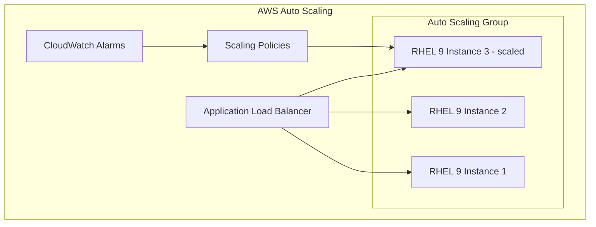

# How to Set Up RHEL 9 Auto-Scaling Groups on AWS

Author: [nawazdhandala](https://www.github.com/nawazdhandala)

Tags: RHEL, AWS, Auto Scaling, EC2, Cloud, Linux

Description: Configure AWS Auto Scaling Groups with RHEL 9 instances for automatic horizontal scaling based on demand.

---

Auto Scaling Groups (ASGs) on AWS automatically adjust the number of RHEL 9 instances based on demand. This guide covers creating a launch template with a properly configured RHEL 9 AMI and setting up scaling policies.

## Auto Scaling Architecture



## Step 1: Create a Launch Template

```bash
# Create a launch template for RHEL 9 instances
aws ec2 create-launch-template \
  --launch-template-name rhel9-web-template \
  --version-description "RHEL 9 web server v1" \
  --launch-template-data '{
    "ImageId": "ami-rhel9-id",
    "InstanceType": "m6i.large",
    "KeyName": "rhel9-key",
    "SecurityGroupIds": ["sg-0123456789abcdef0"],
    "MetadataOptions": {
      "HttpTokens": "required",
      "HttpPutResponseHopLimit": 1
    },
    "BlockDeviceMappings": [
      {
        "DeviceName": "/dev/sda1",
        "Ebs": {
          "VolumeSize": 50,
          "VolumeType": "gp3",
          "Encrypted": true
        }
      }
    ],
    "UserData": "'$(base64 -w0 cloud-init.yaml)'"
  }'
```

## Step 2: Create the Auto Scaling Group

```bash
# Create the ASG
aws autoscaling create-auto-scaling-group \
  --auto-scaling-group-name rhel9-web-asg \
  --launch-template "LaunchTemplateName=rhel9-web-template,Version=\$Latest" \
  --min-size 2 \
  --max-size 10 \
  --desired-capacity 2 \
  --vpc-zone-identifier "subnet-aaa,subnet-bbb" \
  --target-group-arns "arn:aws:elasticloadbalancing:..." \
  --health-check-type ELB \
  --health-check-grace-period 300 \
  --tags "Key=Name,Value=rhel9-web,PropagateAtLaunch=true"
```

## Step 3: Create Scaling Policies

```bash
# Scale out when CPU exceeds 70%
aws autoscaling put-scaling-policy \
  --auto-scaling-group-name rhel9-web-asg \
  --policy-name scale-out-cpu \
  --policy-type TargetTrackingScaling \
  --target-tracking-configuration '{
    "TargetValue": 70.0,
    "PredefinedMetricSpecification": {
      "PredefinedMetricType": "ASGAverageCPUUtilization"
    },
    "ScaleOutCooldown": 300,
    "ScaleInCooldown": 300
  }'

# Scale based on request count per target
aws autoscaling put-scaling-policy \
  --auto-scaling-group-name rhel9-web-asg \
  --policy-name scale-out-requests \
  --policy-type TargetTrackingScaling \
  --target-tracking-configuration '{
    "TargetValue": 1000.0,
    "PredefinedMetricSpecification": {
      "PredefinedMetricType": "ALBRequestCountPerTarget",
      "ResourceLabel": "app/my-alb/..."
    }
  }'
```

## Step 4: Configure Health Checks

```bash
# The cloud-init script should configure a health check endpoint
# Add this to your cloud-init user data:
cat <<'CLOUDINIT'
runcmd:
  # Install and configure a simple health check
  - dnf install -y nginx
  - echo "OK" > /usr/share/nginx/html/health
  - systemctl enable --now nginx
  - firewall-cmd --permanent --add-service=http
  - firewall-cmd --reload
CLOUDINIT
```

## Step 5: Monitor the Auto Scaling Group

```bash
# Check the current state of the ASG
aws autoscaling describe-auto-scaling-groups \
  --auto-scaling-group-names rhel9-web-asg \
  --query 'AutoScalingGroups[0].{
    DesiredCapacity:DesiredCapacity,
    MinSize:MinSize,
    MaxSize:MaxSize,
    Instances:Instances[*].{Id:InstanceId,State:LifecycleState,Health:HealthStatus}
  }'

# View scaling activity history
aws autoscaling describe-scaling-activities \
  --auto-scaling-group-name rhel9-web-asg \
  --max-items 10
```

## Conclusion

Auto Scaling Groups with RHEL 9 on AWS give you automatic horizontal scaling that responds to real-time demand. The key is creating a well-configured launch template with cloud-init user data that bootstraps each new instance identically. Use target tracking scaling policies for the simplest and most effective auto-scaling behavior.
