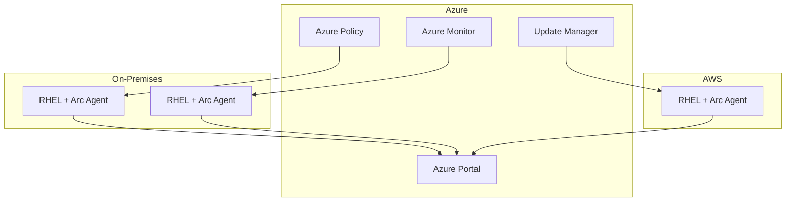

# How to Set Up RHEL with Azure Arc for Hybrid Management

Author: [nawazdhandala](https://www.github.com/nawazdhandala)

Tags: RHEL, Azure Arc, Hybrid Cloud, Management, Linux

Description: Connect RHEL servers to Azure Arc for unified management of on-premises and multi-cloud Linux servers from the Azure portal.

---

Azure Arc extends Azure management capabilities to RHEL servers running anywhere, whether on-premises, in other clouds, or at the edge. Once connected, you can use Azure Policy, Monitor, and Update Manager on your RHEL servers just like Azure VMs.

## Azure Arc Architecture



## Step 1: Generate the Installation Script

```bash
# From Azure CLI, generate the onboarding script
az connectedmachine generate-script \
  --resource-group rg-arc-servers \
  --location eastus \
  --subscription-id YOUR_SUBSCRIPTION_ID \
  --tags '{"Environment":"Production","OS":"RHEL9"}' \
  --output-file onboard-arc.sh
```

## Step 2: Install the Arc Agent on RHEL

```bash
# On the RHEL server, download and run the onboarding script
# The script installs the azcmagent and connects to Azure

# Install prerequisites
sudo dnf install -y curl openssl

# Download the Arc agent installer
curl -L https://aka.ms/azcmagent -o install_linux_azcmagent.sh

# Install the agent
sudo bash install_linux_azcmagent.sh

# Connect to Azure Arc
sudo azcmagent connect \
  --resource-group rg-arc-servers \
  --tenant-id YOUR_TENANT_ID \
  --location eastus \
  --subscription-id YOUR_SUBSCRIPTION_ID \
  --tags "OS=RHEL9,Environment=Production"

# Check the connection status
azcmagent show
```

## Step 3: Enable Azure Monitor for the Arc Server

```bash
# Install the Azure Monitor Agent extension
az connectedmachine extension create \
  --machine-name rhel9-onprem \
  --resource-group rg-arc-servers \
  --name AzureMonitorLinuxAgent \
  --type AzureMonitorLinuxAgent \
  --publisher Microsoft.Azure.Monitor

# Create a data collection rule
az monitor data-collection rule create \
  --name rhel9-arc-dcr \
  --resource-group rg-arc-servers \
  --location eastus \
  --description "Collect logs and metrics from Arc-enabled RHEL"
```

## Step 4: Apply Azure Policy

```bash
# Assign a policy to enforce configurations
az policy assignment create \
  --name "rhel9-compliance" \
  --policy "Audit Linux machines that do not have the specified applications installed" \
  --scope "/subscriptions/YOUR_SUB/resourceGroups/rg-arc-servers" \
  --params '{"ApplicationName": {"value": "firewalld"}}'
```

## Step 5: Use Update Manager

```bash
# Check for available updates via Azure
az connectedmachine assess-patches \
  --resource-group rg-arc-servers \
  --name rhel9-onprem

# Install updates through Azure Update Manager
az connectedmachine install-patches \
  --resource-group rg-arc-servers \
  --name rhel9-onprem \
  --maximum-duration "PT2H" \
  --reboot-setting "IfRequired" \
  --linux-parameters '{"classificationsToInclude":["Security","Critical"]}'
```

## Step 6: Verify Arc Status

```bash
# On the RHEL server
azcmagent show

# From Azure CLI
az connectedmachine show \
  --resource-group rg-arc-servers \
  --name rhel9-onprem \
  --query '{Status:status,Agent:agentVersion,OS:osName}'
```

## Conclusion

Azure Arc on RHEL gives you a single pane of glass for managing servers across environments. Whether your RHEL machines run on-premises, in AWS, GCP, or at the edge, Azure Arc brings Azure-native management capabilities to all of them. The integration with Azure Policy and Update Manager is particularly valuable for maintaining compliance at scale.
