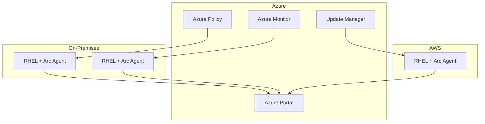

# How to Set Up RHEL with Azure Arc for Hybrid Management

Author: [nawazdhandala](https://www.github.com/nawazdhandala)

Tags: RHEL, Azure Arc, Hybrid Cloud, Management, Linux

Description: Connect RHEL servers to Azure Arc for unified management of on-premises and multi-cloud Linux servers from the Azure portal.

---

Azure Arc extends Azure management capabilities to RHEL servers running anywhere, whether on-premises, in other clouds, or at the edge. Once connected, you can use Azure Policy, Monitor, and Update Manager on your RHEL servers just like Azure VMs.

## Azure Arc Architecture


```mermaid
graph TB
    subgraph "Azure"
        Portal[Azure Portal]
        Policy[Azure Policy]
        Monitor[Azure Monitor]
        Update[Update Manager]
    end
    subgraph "On-Premises"
        Arc1[RHEL + Arc Agent]
        Arc2[RHEL + Arc Agent]
    end
    subgraph "AWS"
        Arc3[RHEL + Arc Agent]
    end
    Arc1 --> Portal
    Arc2 --> Portal
    Arc3 --> Portal
    Policy --> Arc1
    Monitor --> Arc2
    Update --> Arc3
```

## Step 1: Prepare the Azure CLI

```bash
# From your workstation, install the Azure CLI extension for Arc-enabled servers
az extension add --name connectedmachine
```

## Step 2: Install the Arc Agent on RHEL

```bash
# On the RHEL server, install the Azure Connected Machine agent
# Then connect it to Azure Arc

# Install prerequisites
sudo dnf install -y curl openssl

# Download the Arc agent installer
curl -L https://aka.ms/azcmagent -o ~/install_linux_azcmagent.sh

# Install the agent
sudo bash ~/install_linux_azcmagent.sh

# Connect to Azure Arc
sudo /opt/azcmagent/bin/azcmagent connect \
  --resource-group rg-arc-servers \
  --tenant-id YOUR_TENANT_ID \
  --location eastus \
  --subscription-id YOUR_SUBSCRIPTION_ID \
  --use-device-code \
  --tags "OS=RHEL9,Environment=Production"

# Check the connection status
sudo /opt/azcmagent/bin/azcmagent show
```

## Step 3: Enable Azure Monitor for the Arc Server

```bash
MACHINE_RESOURCE_ID=$(az connectedmachine show \
  --resource-group rg-arc-servers \
  --name rhel9-onprem \
  --query id \
  --output tsv)

# Install the Azure Monitor Agent extension
az connectedmachine extension create \
  --machine-name rhel9-onprem \
  --resource-group rg-arc-servers \
  --location eastus \
  --name AzureMonitorLinuxAgent \
  --type AzureMonitorLinuxAgent \
  --publisher Microsoft.Azure.Monitor

# Create a data collection rule for Azure Monitor metrics
cat > metrics-dcr.json <<'JSON'
{
  "properties": {
    "description": "Collect metrics from Arc-enabled RHEL",
    "destinations": {
      "azureMonitorMetrics": {
        "name": "azureMonitorMetrics-default"
      }
    },
    "dataFlows": [
      {
        "streams": [
          "Microsoft-InsightsMetrics"
        ],
        "destinations": [
          "azureMonitorMetrics-default"
        ]
      }
    ]
  }
}
JSON

DCR_ID=$(az monitor data-collection rule create \
  --name rhel9-arc-dcr \
  --resource-group rg-arc-servers \
  --location eastus \
  --kind Linux \
  --rule-file metrics-dcr.json \
  --query id \
  --output tsv)

# Associate the data collection rule with the Arc server
az monitor data-collection rule association create \
  --name rhel9-arc-dcr-association \
  --resource "$MACHINE_RESOURCE_ID" \
  --rule-id "$DCR_ID"
```

## Step 4: Apply Azure Policy

```bash
# Assign a built-in policy to audit installed applications
POLICY_ID=$(az policy definition list \
  --query "[?contains(displayName, 'specified applications installed') && contains(displayName, 'Linux')].id | [0]" \
  --output tsv)

az policy assignment create \
  --name "rhel9-compliance" \
  --policy "$POLICY_ID" \
  --scope "/subscriptions/YOUR_SUB/resourceGroups/rg-arc-servers" \
  --params '{"ApplicationName": {"value": "firewalld"}}'
```

## Step 5: Use Update Manager

```bash
# Check for available updates via Azure
az connectedmachine assess-patches \
  --resource-group rg-arc-servers \
  --name rhel9-onprem

# Install updates through Azure Update Manager
az connectedmachine install-patches \
  --resource-group rg-arc-servers \
  --name rhel9-onprem \
  --maximum-duration "PT2H" \
  --reboot-setting "IfRequired" \
  --linux-parameters '{"classificationsToInclude":["Security","Critical"]}'
```

## Step 6: Verify Arc Status

```bash
# On the RHEL server
sudo /opt/azcmagent/bin/azcmagent show

# From Azure CLI
az connectedmachine show \
  --resource-group rg-arc-servers \
  --name rhel9-onprem \
  --query '{Status:status,Agent:agentVersion,OS:osName}'
```

## Conclusion

Azure Arc on RHEL gives you a single pane of glass for managing servers across environments. Whether your RHEL machines run on-premises, in AWS, GCP, or at the edge, Azure Arc brings Azure-native management capabilities to all of them. The integration with Azure Policy and Update Manager is particularly valuable for maintaining compliance at scale.
