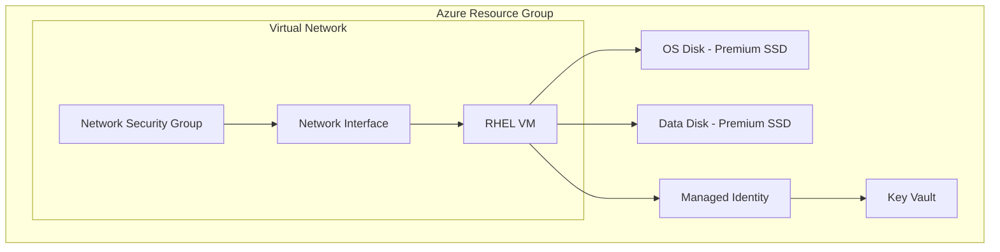

# How to Set Up RHEL on Azure Virtual Machines

Author: [nawazdhandala](https://www.github.com/nawazdhandala)

Tags: RHEL, Azure, Cloud, Virtual Machine, Linux

Description: Deploy and configure RHEL on Azure Virtual Machines with proper disk setup, networking, and integration with Azure services.

---

Azure provides first-class support for RHEL with on-demand and BYOS (Bring Your Own Subscription) options. This guide covers creating, configuring, and optimizing RHEL virtual machines in Azure.

## Azure RHEL Architecture


```mermaid
graph TB
    subgraph "Azure Resource Group"
        subgraph "Virtual Network"
            NSG[Network Security Group]
            VM[RHEL VM]
            NIC[Network Interface]
            NSG --> NIC --> VM
        end
        OSDisk[OS Disk - Premium SSD]
        DataDisk[Data Disk - Premium SSD]
        VM --> OSDisk
        VM --> DataDisk
        VM --> MI[Managed Identity]
        MI --> KV[Key Vault]
    end
```

## Step 1: Create the Virtual Machine

```bash
# Create a resource group

az group create --name rg-rhel9 --location eastus

# Create the VM with RHEL
az vm create \
  --resource-group rg-rhel9 \
  --name rhel9-vm \
  --image RedHat:RHEL:9-lvm-gen2:latest \
  --size Standard_D4s_v5 \
  --admin-username azureuser \
  --generate-ssh-keys \
  --os-disk-size-gb 64 \
  --storage-sku Premium_LRS \
  --nsg-rule SSH \
  --public-ip-sku Standard

# Attach a data disk
az vm disk attach \
  --resource-group rg-rhel9 \
  --vm-name rhel9-vm \
  --name rhel9-datadisk \
  --size-gb 256 \
  --sku Premium_LRS \
  --new
```

## Step 2: Configure the VM After Deployment

```bash
# SSH into the VM
ssh azureuser@<public-ip>

# Update the system
sudo dnf update -y

# Install Azure CLI and tools
sudo rpm --import https://packages.microsoft.com/keys/microsoft.asc
sudo dnf install -y https://packages.microsoft.com/config/rhel/9.0/packages-microsoft-prod.rpm
sudo dnf install -y azure-cli

# Format and mount the data disk
lsblk -o NAME,HCTL,SIZE,MOUNTPOINT | grep -i "sd"
sudo parted /dev/sdc --script mklabel gpt mkpart xfspart xfs 0% 100%
sudo partprobe /dev/sdc
sudo mkfs.xfs /dev/sdc1
sudo mkdir -p /data
UUID=$(sudo blkid -s UUID -o value /dev/sdc1)
echo "UUID=$UUID /data xfs defaults,nofail,noatime 1 2" | sudo tee -a /etc/fstab
sudo mount -a
```

## Step 3: Enable Azure Managed Identity

```bash
# Enable system-assigned managed identity
az vm identity assign \
  --resource-group rg-rhel9 \
  --name rhel9-vm

# Grant the VM access to Key Vault
az keyvault set-policy \
  --name my-keyvault \
  --object-id $(az vm show --resource-group rg-rhel9 --name rhel9-vm --query identity.principalId -o tsv) \
  --secret-permissions get list
```

## Step 4: Configure Network Security

```bash
# Create restrictive NSG rules
az network nsg rule create \
  --resource-group rg-rhel9 \
  --nsg-name rhel9-vmNSG \
  --name AllowHTTPS \
  --priority 100 \
  --protocol Tcp \
  --destination-port-ranges 443 \
  --access Allow

# On the VM, configure firewalld
sudo systemctl enable --now firewalld
sudo firewall-cmd --permanent --add-service=ssh
sudo firewall-cmd --permanent --add-service=https
sudo firewall-cmd --reload
```

## Step 5: Set Up Azure Monitor Agent

```bash
# Install the Azure Monitor Agent
az vm extension set \
  --resource-group rg-rhel9 \
  --vm-name rhel9-vm \
  --name AzureMonitorLinuxAgent \
  --publisher Microsoft.Azure.Monitor \
  --version 1.0

# Create a data collection rule for logs and metrics
az monitor data-collection rule create \
  --resource-group rg-rhel9 \
  --name rhel9-dcr \
  --location eastus \
  --kind Linux \
  --log-analytics name=centralWorkspace resource-id=/subscriptions/<subscription-id>/resourceGroups/rg-rhel9/providers/Microsoft.OperationalInsights/workspaces/myworkspace \
  --performance-counters name=linuxPerf streams=Microsoft-Perf sampling-frequency=60 counter-specifiers="\\Processor(_Total)\\% Processor Time" counter-specifiers="\\Memory\\Available MBytes" \
  --syslog name=linuxSyslog streams=Microsoft-Syslog facility-names=syslog log-levels=Warning log-levels=Error log-levels=Critical \
  --data-flows streams=Microsoft-Perf streams=Microsoft-Syslog destinations=centralWorkspace

# Associate the data collection rule with the VM
az monitor data-collection rule association create \
  --name rhel9-dcr-association \
  --rule-id /subscriptions/<subscription-id>/resourceGroups/rg-rhel9/providers/Microsoft.Insights/dataCollectionRules/rhel9-dcr \
  --resource /subscriptions/<subscription-id>/resourceGroups/rg-rhel9/providers/Microsoft.Compute/virtualMachines/rhel9-vm
```

## Step 6: Configure Accelerated Networking

```bash
# Check if accelerated networking is enabled
nic_id=$(az vm show --resource-group rg-rhel9 --name rhel9-vm \
  --query 'networkProfile.networkInterfaces[0].id' -o tsv)
az network nic show --ids "$nic_id" \
  --query enableAcceleratedNetworking -o tsv

# Enable it on the NIC (VM must be stopped first)
az vm deallocate --resource-group rg-rhel9 --name rhel9-vm
az network nic update \
  --ids "$nic_id" \
  --accelerated-networking true
az vm start --resource-group rg-rhel9 --name rhel9-vm
```

## Conclusion

RHEL on Azure integrates well with Azure services through managed identities, Azure Monitor, and accelerated networking. Using Premium SSD storage, proper NSG configuration, and the Azure Monitor Agent gives you a production-ready setup that is secure and observable from the Azure portal.
