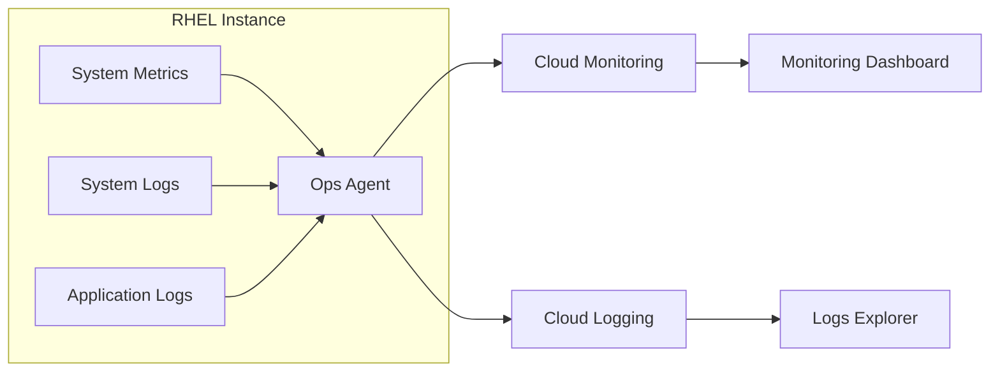

# How to Set Up RHEL with GCP Ops Agent for Monitoring

Author: [nawazdhandala](https://www.github.com/nawazdhandala)

Tags: RHEL, GCP, Monitoring, Ops Agent, Cloud, Linux

Description: Install and configure the Google Cloud Ops Agent on RHEL for integrated metrics collection and log management in Cloud Monitoring.

---

The Google Cloud Ops Agent combines metrics and logging into a single agent for RHEL instances running on GCP. It replaces the legacy Monitoring and Logging agents with a unified solution built on Fluent Bit and OpenTelemetry Collector.

## Ops Agent Architecture



## Step 1: Install the Ops Agent

```bash
# Download and run the installation script
curl -sSO https://dl.google.com/cloudagents/add-google-cloud-ops-agent-repo.sh
sudo bash add-google-cloud-ops-agent-repo.sh --also-install

# Verify the agent is running
sudo systemctl status google-cloud-ops-agent

# Check the agent version
google_cloud_ops_agent_engine --version 2>/dev/null || echo "Agent installed"
```

## Step 2: Configure Custom Metrics

```bash
# Edit the Ops Agent configuration
sudo tee /etc/google-cloud-ops-agent/config.yaml > /dev/null <<'CONFIG'
metrics:
  receivers:
    # Built-in host metrics (CPU, memory, disk, network)
    hostmetrics:
      type: hostmetrics
      collection_interval: 60s

    # Custom Prometheus metrics from your applications
    prometheus_app:
      type: prometheus
      config:
        scrape_configs:
          - job_name: 'myapp'
            scrape_interval: 30s
            static_configs:
              - targets: ['localhost:8080']

  service:
    pipelines:
      default_pipeline:
        receivers:
          - hostmetrics
      app_pipeline:
        receivers:
          - prometheus_app

logging:
  receivers:
    # System logs
    syslog:
      type: files
      include_paths:
        - /var/log/messages
        - /var/log/secure

    # Application logs
    app_logs:
      type: files
      include_paths:
        - /var/log/myapp/*.log
      record_log_file_path: true

  processors:
    # Parse JSON application logs
    json_parser:
      type: parse_json
      field: message

  service:
    pipelines:
      default_pipeline:
        receivers:
          - syslog
      app_pipeline:
        receivers:
          - app_logs
        processors:
          - json_parser
CONFIG

# Restart the agent to apply changes
sudo systemctl restart google-cloud-ops-agent
```

## Step 3: Configure Log-Based Metrics

```bash
# Create a log-based metric via gcloud
gcloud logging metrics create rhel9_error_count \
  --description="Count of error messages from RHEL" \
  --log-filter='resource.type="gce_instance" AND severity>=ERROR'
```

## Step 4: Set Up Alerting Policies

```bash
# Create an alerting policy for high CPU
gcloud alpha monitoring policies create \
  --display-name="RHEL High CPU" \
  --condition-display-name="CPU above 80%" \
  --condition-filter='metric.type="agent.googleapis.com/cpu/utilization" AND resource.type="gce_instance"' \
  --condition-threshold-value=0.8 \
  --condition-threshold-duration=300s \
  --notification-channels="projects/PROJECT_ID/notificationChannels/CHANNEL_ID"
```

## Step 5: Verify Data Collection

```bash
# Check if metrics are flowing
gcloud monitoring time-series list \
  --filter='metric.type="agent.googleapis.com/cpu/utilization"' \
  --limit=5

# Check if logs are being collected
gcloud logging read 'resource.type="gce_instance"' --limit=10

# Check the agent logs for errors
sudo journalctl -u google-cloud-ops-agent -n 50
```

## Conclusion

The GCP Ops Agent on RHEL provides unified metrics and logging that integrates directly with Cloud Monitoring and Cloud Logging. Its support for Prometheus scraping makes it easy to collect application metrics alongside system metrics without deploying additional infrastructure.
