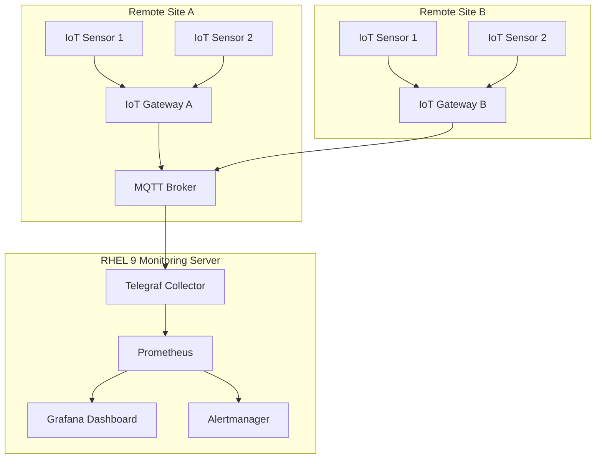

# How to Set Up RHEL 9 for Remote Monitoring of Distributed IoT Networks

Author: [nawazdhandala](https://www.github.com/nawazdhandala)

Tags: RHEL, IoT, Remote Monitoring, Prometheus, Grafana, Linux

Description: Learn how to configure RHEL 9 as a centralized monitoring hub for distributed IoT networks using Prometheus, Grafana, and MQTT collectors.

---

Managing IoT networks that span multiple locations requires a reliable monitoring platform. RHEL 9 provides the stability and performance needed to serve as the backbone for centralized monitoring of distributed IoT devices. In this guide, you will set up a complete monitoring stack that collects metrics from remote IoT gateways and visualizes them in real time.

## Architecture Overview



## Prerequisites

- A RHEL 9 server with at least 4 GB RAM and 2 CPUs
- Root or sudo access
- Network connectivity to your IoT gateways
- A valid RHEL subscription

## Step 1: Install the MQTT Broker

Mosquitto serves as the message broker that IoT gateways push data to.

```bash
# Enable the EPEL repository for Mosquitto
sudo dnf install -y https://dl.fedoraproject.org/pub/epel/epel-release-latest-9.noarch.rpm

# Install the Mosquitto MQTT broker
sudo dnf install -y mosquitto

# Start and enable Mosquitto
sudo systemctl enable --now mosquitto
```

Configure Mosquitto for remote access with authentication:

```bash
# Create a password file for MQTT authentication
sudo mosquitto_passwd -c /etc/mosquitto/passwd iot_collector

# Create a custom configuration file
sudo tee /etc/mosquitto/conf.d/remote.conf > /dev/null <<'EOF'
# Listen on all interfaces, port 1883
listener 1883 0.0.0.0

# Require username/password authentication
allow_anonymous false
password_file /etc/mosquitto/passwd

# Set maximum message size to 1MB for sensor payloads
message_size_limit 1048576

# Enable persistent storage for offline gateways
persistence true
persistence_location /var/lib/mosquitto/
EOF

# Restart Mosquitto to apply configuration
sudo systemctl restart mosquitto
```

## Step 2: Install Telegraf as the Metrics Collector

Telegraf bridges MQTT messages and Prometheus metrics.

```bash
# Add the InfluxData repository for Telegraf
cat <<'EOF' | sudo tee /etc/yum.repos.d/influxdata.repo
[influxdata]
name = InfluxData Repository
baseurl = https://repos.influxdata.com/rhel/9/x86_64/stable/
enabled = 1
gpgcheck = 1
gpgkey = https://repos.influxdata.com/influxdata-archive_compat.key
EOF

# Install Telegraf
sudo dnf install -y telegraf
```

Configure Telegraf to consume MQTT and expose Prometheus metrics:

```bash
# Back up the default configuration
sudo cp /etc/telegraf/telegraf.conf /etc/telegraf/telegraf.conf.bak

# Write a focused configuration for IoT monitoring
sudo tee /etc/telegraf/telegraf.conf > /dev/null <<'EOF'
# Global agent settings
[agent]
  interval = "10s"          # Collect metrics every 10 seconds
  flush_interval = "10s"    # Flush to outputs every 10 seconds
  hostname = "iot-monitor"

# MQTT Consumer - reads messages from IoT gateways
[[inputs.mqtt_consumer]]
  servers = ["tcp://127.0.0.1:1883"]
  topics = [
    "iot/+/temperature",    # Temperature sensors
    "iot/+/humidity",        # Humidity sensors
    "iot/+/status",          # Device status messages
    "iot/+/power"            # Power consumption data
  ]
  username = "iot_collector"
  password = "your_password_here"
  data_format = "json"
  # Tag each message with the gateway name from the topic
  topic_tag = "topic"

# Expose all collected metrics as a Prometheus endpoint
[[outputs.prometheus_client]]
  listen = ":9273"
  metric_version = 2
EOF

# Start and enable Telegraf
sudo systemctl enable --now telegraf
```

## Step 3: Install and Configure Prometheus

```bash
# Create a system user for Prometheus
sudo useradd --no-create-home --shell /bin/false prometheus

# Download and install Prometheus
cd /tmp
curl -LO https://github.com/prometheus/prometheus/releases/download/v2.50.0/prometheus-2.50.0.linux-amd64.tar.gz
tar xzf prometheus-2.50.0.linux-amd64.tar.gz
sudo cp prometheus-2.50.0.linux-amd64/prometheus /usr/local/bin/
sudo cp prometheus-2.50.0.linux-amd64/promtool /usr/local/bin/

# Create directories for Prometheus
sudo mkdir -p /etc/prometheus /var/lib/prometheus
sudo chown prometheus:prometheus /var/lib/prometheus
```

Create the Prometheus configuration:

```bash
sudo tee /etc/prometheus/prometheus.yml > /dev/null <<'EOF'
global:
  scrape_interval: 15s        # How often to scrape targets
  evaluation_interval: 15s    # How often to evaluate rules

# Alert rules for IoT monitoring
rule_files:
  - "iot_alerts.yml"

# Scrape configurations
scrape_configs:
  # Scrape Telegraf's Prometheus endpoint for IoT metrics
  - job_name: "iot_telegraf"
    static_configs:
      - targets: ["localhost:9273"]

  # Scrape Prometheus itself for self-monitoring
  - job_name: "prometheus"
    static_configs:
      - targets: ["localhost:9090"]
EOF

sudo chown prometheus:prometheus /etc/prometheus/prometheus.yml
```

Create alerting rules for IoT devices:

```bash
sudo tee /etc/prometheus/iot_alerts.yml > /dev/null <<'EOF'
groups:
  - name: iot_alerts
    rules:
      # Alert when a sensor stops reporting
      - alert: SensorOffline
        expr: up{job="iot_telegraf"} == 0
        for: 5m
        labels:
          severity: critical
        annotations:
          summary: "IoT sensor offline"
          description: "No data received from IoT sensors for 5 minutes."

      # Alert on high temperature readings
      - alert: HighTemperature
        expr: mqtt_consumer_temperature > 45
        for: 2m
        labels:
          severity: warning
        annotations:
          summary: "High temperature detected"
          description: "Temperature reading above 45 degrees for 2 minutes."
EOF

sudo chown prometheus:prometheus /etc/prometheus/iot_alerts.yml
```

Create a systemd service for Prometheus:

```bash
sudo tee /etc/systemd/system/prometheus.service > /dev/null <<'EOF'
[Unit]
Description=Prometheus Monitoring System
After=network-online.target

[Service]
User=prometheus
Group=prometheus
Type=simple
ExecStart=/usr/local/bin/prometheus \
  --config.file=/etc/prometheus/prometheus.yml \
  --storage.tsdb.path=/var/lib/prometheus/ \
  --storage.tsdb.retention.time=90d \
  --web.listen-address=:9090

[Install]
WantedBy=multi-user.target
EOF

sudo systemctl daemon-reload
sudo systemctl enable --now prometheus
```

## Step 4: Install Grafana for Visualization

```bash
# Add the Grafana repository
sudo tee /etc/yum.repos.d/grafana.repo > /dev/null <<'EOF'
[grafana]
name=Grafana OSS
baseurl=https://rpm.grafana.com
repo_gpgcheck=1
enabled=1
gpgcheck=1
gpgkey=https://rpm.grafana.com/gpg.key
EOF

# Install and start Grafana
sudo dnf install -y grafana
sudo systemctl enable --now grafana-server
```

## Step 5: Configure Firewall Rules

```bash
# Allow MQTT connections from IoT gateways
sudo firewall-cmd --permanent --add-port=1883/tcp

# Allow Grafana web interface access
sudo firewall-cmd --permanent --add-port=3000/tcp

# Allow Prometheus web interface (restrict in production)
sudo firewall-cmd --permanent --add-port=9090/tcp

# Reload firewall rules
sudo firewall-cmd --reload
```

## Step 6: Test the Setup with a Simulated IoT Device

You can test the pipeline by publishing sample MQTT messages:

```bash
# Install the Mosquitto clients for testing
sudo dnf install -y mosquitto

# Publish a simulated temperature reading
mosquitto_pub -h localhost -u iot_collector -P your_password_here \
  -t "iot/gateway01/temperature" \
  -m '{"value": 23.5, "unit": "celsius", "device_id": "sensor_001"}'

# Publish a simulated humidity reading
mosquitto_pub -h localhost -u iot_collector -P your_password_here \
  -t "iot/gateway01/humidity" \
  -m '{"value": 65.2, "unit": "percent", "device_id": "sensor_002"}'
```

After a few seconds, verify the metrics appear in Prometheus by visiting `http://your-server:9090` and querying `mqtt_consumer_temperature`.

## Step 7: Configure TLS for Secure MQTT Communication

For production deployments, encrypt MQTT traffic:

```bash
# Generate a self-signed certificate (use a CA-signed cert in production)
sudo mkdir -p /etc/mosquitto/certs
sudo openssl req -new -x509 -days 365 -nodes \
  -keyout /etc/mosquitto/certs/server.key \
  -out /etc/mosquitto/certs/server.crt \
  -subj "/CN=iot-monitor.example.com"

# Update Mosquitto configuration for TLS
sudo tee /etc/mosquitto/conf.d/tls.conf > /dev/null <<'EOF'
# TLS listener on port 8883
listener 8883 0.0.0.0
cafile /etc/mosquitto/certs/server.crt
certfile /etc/mosquitto/certs/server.crt
keyfile /etc/mosquitto/certs/server.key

# Require TLS 1.2 minimum
tls_version tlsv1.2
EOF

# Restart Mosquitto
sudo systemctl restart mosquitto

# Open the TLS port in the firewall
sudo firewall-cmd --permanent --add-port=8883/tcp
sudo firewall-cmd --reload
```

## Conclusion

You now have a fully functional IoT monitoring stack on RHEL 9. The setup collects data from distributed IoT gateways through MQTT, processes it with Telegraf, stores it in Prometheus, and visualizes it in Grafana. For production environments, add TLS encryption, set up Alertmanager for notifications, and consider using Prometheus federation if you have multiple monitoring sites.
