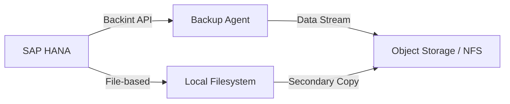

# How to Set Up SAP HANA Backup with Backint on RHEL

Author: [nawazdhandala](https://www.github.com/nawazdhandala)

Tags: RHEL, SAP HANA, Backups, Backint, Linux

Description: Configure SAP HANA backups using the Backint interface on RHEL for reliable database backup to third-party storage solutions.

---

SAP HANA's Backint interface provides a standardized way to back up your database to external storage solutions like Azure Blob Storage, AWS S3, or dedicated backup appliances. This guide covers setting up Backint-based backups on RHEL.

## Backup Architecture



## Prerequisites

- SAP HANA running on RHEL
- A Backint-certified backup agent (e.g., Azure Backup, AWS Backint Agent)
- Sufficient storage capacity for backup retention

## Step 1: Install the Backint Agent

Using AWS Backint Agent as an example:

```bash
# Download the AWS Backint Agent
cd /tmp
curl -LO https://s3.amazonaws.com/aws-sap-hana-backup/aws-backint-agent-latest.tar.gz

# Extract and install
sudo mkdir -p /opt/aws-backint-agent
sudo tar xzf aws-backint-agent-latest.tar.gz -C /opt/aws-backint-agent/

# Set ownership for the HANA admin user
sudo chown -R hdbadm:sapsys /opt/aws-backint-agent
```

## Step 2: Configure the Backint Agent

```bash
# Create the agent configuration
sudo su - hdbadm

cat <<'CONFIG' > /opt/aws-backint-agent/aws-backint-agent-config.yaml
# AWS Backint Agent Configuration
s3_bucket: "your-hana-backup-bucket"
region: "us-east-1"
# Use instance profile for authentication (preferred)
use_instance_profile: true

# Parallel upload settings for large databases
multipart_upload_part_size: 134217728   # 128 MB parts
max_concurrent_uploads: 4

# Encryption settings
server_side_encryption: "aws:kms"
kms_key_id: "arn:aws:kms:us-east-1:123456789:key/your-key-id"

# Compression
compress: true

# Logging
log_file: "/opt/aws-backint-agent/backint.log"
log_level: "info"
CONFIG
```

## Step 3: Configure SAP HANA to Use Backint

```bash
# As hdbadm, configure HANA global.ini for Backint
hdbsql -i 00 -u SYSTEM -p YourPassword <<'SQL'
-- Configure the Backint agent path
ALTER SYSTEM ALTER CONFIGURATION ('global.ini', 'SYSTEM')
SET ('backup', 'catalog_backup_using_backint') = 'true'
WITH RECONFIGURE;

ALTER SYSTEM ALTER CONFIGURATION ('global.ini', 'SYSTEM')
SET ('backup', 'data_backup_parameter_file') = '/opt/aws-backint-agent/aws-backint-agent-config.yaml'
WITH RECONFIGURE;

ALTER SYSTEM ALTER CONFIGURATION ('global.ini', 'SYSTEM')
SET ('backup', 'log_backup_using_backint') = 'true'
WITH RECONFIGURE;

ALTER SYSTEM ALTER CONFIGURATION ('global.ini', 'SYSTEM')
SET ('backup', 'log_backup_parameter_file') = '/opt/aws-backint-agent/aws-backint-agent-config.yaml'
WITH RECONFIGURE;
SQL
```

## Step 4: Execute a Full Backup

```bash
# Run a full data backup via Backint
hdbsql -i 00 -u SYSTEM -p YourPassword \
  "BACKUP DATA USING BACKINT ('COMPLETE_DATA_BACKUP')"

# Verify the backup in the catalog
hdbsql -i 00 -u SYSTEM -p YourPassword \
  "SELECT * FROM SYS.M_BACKUP_CATALOG ORDER BY UTC_START_TIME DESC"
```

## Step 5: Schedule Automatic Backups

```bash
# Create a backup script
cat <<'SCRIPT' > /opt/aws-backint-agent/run_backup.sh
#!/bin/bash
# SAP HANA automated backup script
TIMESTAMP=$(date +%Y%m%d_%H%M%S)

# Run the data backup
/usr/sap/HDB/HDB00/exe/hdbsql -i 00 -u BACKUP_USER -p BackupPass \
  "BACKUP DATA USING BACKINT ('AUTO_BACKUP_${TIMESTAMP}')"

# Check exit code
if [ $? -eq 0 ]; then
    echo "$(date): Backup completed successfully" >> /var/log/hana_backup.log
else
    echo "$(date): Backup FAILED" >> /var/log/hana_backup.log
    exit 1
fi
SCRIPT

chmod +x /opt/aws-backint-agent/run_backup.sh

# Schedule with cron (as hdbadm)
crontab -l 2>/dev/null; echo "0 2 * * * /opt/aws-backint-agent/run_backup.sh" | crontab -
```

## Step 6: Test Backup Recovery

```bash
# List available backups
hdbsql -i 00 -u SYSTEM -p YourPassword \
  "SELECT BACKUP_ID, UTC_START_TIME, ENTRY_TYPE_NAME, STATE_NAME FROM SYS.M_BACKUP_CATALOG WHERE ENTRY_TYPE_NAME = 'complete data backup' ORDER BY UTC_START_TIME DESC"

# Perform a test recovery (to a different system or tenant)
# Stop the tenant database first
hdbsql -i 00 -u SYSTEM -p YourPassword "ALTER SYSTEM STOP DATABASE TENANT_DB"

# Recover using Backint
hdbsql -i 00 -u SYSTEM -p YourPassword \
  "RECOVER DATA FOR TENANT_DB USING BACKINT UNTIL TIMESTAMP '2026-03-04 02:00:00' CLEAR LOG"
```

## Conclusion

Backint-based backup on RHEL provides a reliable and scalable way to protect your SAP HANA data. Whether you use cloud object storage or a dedicated backup appliance, the Backint interface keeps the configuration within HANA's standard backup framework. Always test your recovery procedures regularly.
