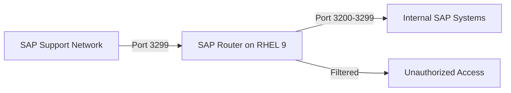

# How to Set Up SAP Router on RHEL 9

Author: [nawazdhandala](https://www.github.com/nawazdhandala)

Tags: RHEL, SAP Router, SAP, Network Security, Linux

Description: Step-by-step guide to installing and configuring SAP Router on RHEL 9 for secure communication between your SAP landscape and SAP support.

---

SAP Router acts as a network gateway between your internal SAP systems and the SAP support network. It provides an additional layer of security by controlling which connections are allowed. This guide walks you through setting up SAP Router on RHEL 9.

## Network Flow



## Prerequisites

- RHEL 9 server (can be minimal, 2 GB RAM is sufficient)
- SAP Router software from SAP Software Download Center
- SAP Crypto Library for SNC encryption
- Firewall access to port 3299

## Step 1: Create the SAP Router User

```bash
# Create a dedicated user for SAP Router
sudo groupadd -g 79 sapsys
sudo useradd -u 1010 -g sapsys -d /opt/saprouter -m -s /bin/bash saprouter

# Create the working directories
sudo mkdir -p /opt/saprouter/{bin,sec,log}
sudo chown -R saprouter:sapsys /opt/saprouter
```

## Step 2: Install SAP Router Binary

```bash
# Switch to the saprouter user
sudo su - saprouter

# Extract the SAP Router binary from the downloaded SAR archive
# The SAPCAR tool and saprouter SAR file should be in /tmp
/tmp/SAPCAR -xvf /tmp/saprouter_*.sar -R /opt/saprouter/bin/

# Extract the SAP Crypto Library for SNC support
/tmp/SAPCAR -xvf /tmp/SAPCRYPTOLIBP_*.SAR -R /opt/saprouter/sec/

# Set the environment variables
cat <<'PROFILE' >> ~/.bash_profile
# SAP Router environment
export SECUDIR=/opt/saprouter/sec
export SNC_LIB=/opt/saprouter/sec/libsapcrypto.so
export LD_LIBRARY_PATH=/opt/saprouter/sec:$LD_LIBRARY_PATH
export PATH=/opt/saprouter/bin:$PATH
PROFILE

source ~/.bash_profile
```

## Step 3: Generate the SNC Certificate

```bash
# As the saprouter user, generate the PSE (Personal Security Environment)
cd /opt/saprouter/sec

sapgenpse get_pse -v -p local.pse \
  -r certreq.txt \
  -x "YourPSEPassword" \
  "CN=saprouter.example.com, OU=SAP, O=YourCompany, C=US"

# Submit certreq.txt to SAP for signing via SAP support portal
# Once you receive the signed certificate, import it:
sapgenpse import_own_cert -c signed_cert.crt -p local.pse -x "YourPSEPassword"

# Create a credential file for the saprouter user
sapgenpse seclogin -p local.pse -x "YourPSEPassword"
```

## Step 4: Create the Route Permission Table

```bash
# Create the saprouttab file that controls routing permissions
cat <<'ROUTES' > /opt/saprouter/saprouttab
# SAP Router Permission Table
#
# Format: P|D  source_host  dest_host  dest_port  password
#
# P = Permit, D = Deny, S = Permit with SNC

# Allow SAP support to connect to your SAP systems
P  194.39.131.34  192.168.1.10  3200  SAP_SUPPORT_PASS
P  194.39.131.34  192.168.1.10  3299  SAP_SUPPORT_PASS
P  194.39.131.34  192.168.1.11  3200  SAP_SUPPORT_PASS

# Allow internal systems to reach SAP Marketplace
P  192.168.1.*  *.sap.com  443

# Deny everything else by default
D  *  *  *
ROUTES

chmod 600 /opt/saprouter/saprouttab
```

## Step 5: Create a systemd Service

```bash
# Create the systemd service file (as root)
sudo tee /etc/systemd/system/saprouter.service > /dev/null <<'SERVICE'
[Unit]
Description=SAP Router Service
After=network.target

[Service]
Type=forking
User=saprouter
Group=sapsys
Environment="SECUDIR=/opt/saprouter/sec"
Environment="SNC_LIB=/opt/saprouter/sec/libsapcrypto.so"
ExecStart=/opt/saprouter/bin/saprouter -r -S 3299 \
  -R /opt/saprouter/saprouttab \
  -G /opt/saprouter/log/saprouter.log \
  -T /opt/saprouter/log/saprouter_trace.log \
  -K "p:CN=saprouter.example.com, OU=SAP, O=YourCompany, C=US"
ExecStop=/opt/saprouter/bin/saprouter -s -p 3299
Restart=on-failure
RestartSec=30

[Install]
WantedBy=multi-user.target
SERVICE

# Reload systemd and start the service
sudo systemctl daemon-reload
sudo systemctl enable --now saprouter
```

## Step 6: Configure Firewall

```bash
# Allow SAP Router port
sudo firewall-cmd --permanent --add-port=3299/tcp

# Reload firewall
sudo firewall-cmd --reload

# Verify the port is open
sudo firewall-cmd --list-ports
```

## Step 7: Verify SAP Router Status

```bash
# Check if SAP Router is running
sudo su - saprouter -c 'saprouter -l -p 3299'

# Check the connected clients
sudo su - saprouter -c 'saprouter -n -p 3299'

# View the log for troubleshooting
tail -50 /opt/saprouter/log/saprouter.log
```

## Conclusion

SAP Router on RHEL 9 provides a secure gateway between your SAP landscape and external networks, including SAP support. The route permission table gives you granular control over which connections are allowed, and SNC encryption ensures that all traffic is protected in transit. Review and update your saprouttab regularly as your SAP landscape changes.
