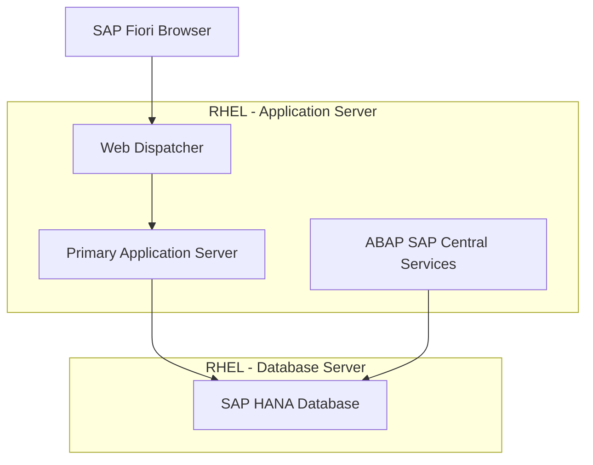

# How to Set Up SAP S/4HANA on RHEL

Author: [nawazdhandala](https://www.github.com/nawazdhandala)

Tags: RHEL, SAP S/4HANA, SAP HANA, Enterprise, Linux

Description: Complete guide to deploying SAP S/4HANA on RHEL, covering HANA database setup, application server installation, and initial configuration.

---

SAP S/4HANA is the next-generation ERP suite that runs exclusively on SAP HANA. Deploying it on RHEL requires preparing both the database and application tiers. This guide covers the end-to-end process.

## Deployment Architecture



## Prerequisites

- Two RHEL servers (or one large server for all-in-one)
- Database server: 128 GB+ RAM, 8+ CPUs
- Application server: 32 GB+ RAM, 4+ CPUs
- SAP S/4HANA installation media (Software Provisioning Manager)
- SAP HANA already installed on the database server

## Step 1: Prepare Both Servers

```bash
# On both servers, run the SAP preconfigure roles
sudo dnf install -y rhel-system-roles-sap ansible-core

# For the database server
cat <<'PLAY' > /tmp/prep-db.yml
---
- name: Prepare DB server
  hosts: localhost
  become: true
  roles:
    - sap_general_preconfigure
    - sap_hana_preconfigure
PLAY
sudo ansible-playbook /tmp/prep-db.yml

# For the application server
cat <<'PLAY' > /tmp/prep-app.yml
---
- name: Prepare App server
  hosts: localhost
  become: true
  roles:
    - sap_general_preconfigure
    - sap_netweaver_preconfigure
PLAY
sudo ansible-playbook /tmp/prep-app.yml
```

## Step 2: Configure Hostname Resolution

```bash
# On both servers, ensure proper hostname resolution
# Edit /etc/hosts on both machines
sudo tee -a /etc/hosts > /dev/null <<'HOSTS'
192.168.1.10  hanadb.example.com   hanadb
192.168.1.20  s4app.example.com    s4app
HOSTS

# Verify hostname resolution
ping -c 1 hanadb
ping -c 1 s4app
```

## Step 3: Prepare Storage on the Application Server

```bash
# Create filesystems for SAP application
sudo pvcreate /dev/sdb
sudo vgcreate vg_sap /dev/sdb
sudo lvcreate -L 50G -n lv_usr_sap vg_sap
sudo lvcreate -L 20G -n lv_sapmnt vg_sap

sudo mkfs.xfs /dev/vg_sap/lv_usr_sap
sudo mkfs.xfs /dev/vg_sap/lv_sapmnt

sudo mkdir -p /usr/sap /sapmnt
echo '/dev/vg_sap/lv_usr_sap /usr/sap xfs defaults 0 0' | sudo tee -a /etc/fstab
echo '/dev/vg_sap/lv_sapmnt /sapmnt xfs defaults 0 0' | sudo tee -a /etc/fstab
sudo mount -a
```

## Step 4: Run the Software Provisioning Manager (SWPM)

```bash
# Extract SWPM
cd /tmp
mkdir swpm && cd swpm
/tmp/SAPCAR -xvf /path/to/SWPM*.SAR

# Start the installation in browser mode
sudo ./sapinst SAPINST_HTTPS_PORT=4237

# Open the browser and navigate to:
# https://s4app:4237/sapinst/docs/index.html
```

The SWPM wizard will guide you through:
1. Selecting the S/4HANA product version
2. Specifying the HANA database connection
3. Configuring the ASCS instance
4. Setting up the Primary Application Server
5. Loading the initial data

## Step 5: Post-Installation Verification

```bash
# Check SAP processes on the application server
sudo su - sidadm -c 'sapcontrol -nr 00 -function GetProcessList'

# Verify the HANA connection
sudo su - sidadm -c 'R3trans -d'

# Check the SAP system in transaction SM51
# Log in to SAP GUI or Fiori launchpad to verify
```

## Step 6: Configure Web Dispatcher for Fiori

```bash
# The Web Dispatcher configuration for S/4HANA Fiori
sudo su - sidadm

# Edit the Web Dispatcher profile
cat <<'PROFILE' >> /usr/sap/SID/SYS/profile/SID_W00_s4app
# Fiori Launchpad settings
icm/HTTP/redirect_0 = PREFIX=/, FROM=*, FROMPROT=http, TOPROT=https, TOPORT=44300
wdisp/system_0 = SID=SID, MSHOST=s4app, MSPORT=3600, APTS=1
PROFILE
```

## Step 7: Configure Firewall

```bash
# Open SAP ports
sudo firewall-cmd --permanent --add-port=3200/tcp    # SAP GUI
sudo firewall-cmd --permanent --add-port=3300/tcp    # RFC
sudo firewall-cmd --permanent --add-port=8000/tcp    # ICM HTTP
sudo firewall-cmd --permanent --add-port=44300/tcp   # ICM HTTPS
sudo firewall-cmd --permanent --add-port=3600/tcp    # Message Server
sudo firewall-cmd --reload
```

## Conclusion

Deploying SAP S/4HANA on RHEL involves preparing both the database and application tiers with the correct OS settings, then running SAP's Software Provisioning Manager for the actual installation. The RHEL System Roles simplify the OS preparation significantly. After installation, configure the Web Dispatcher for Fiori access and set up monitoring for both the HANA database and the application server.
