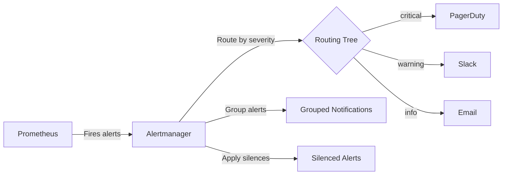

# How to Set Up Alertmanager for Prometheus on RHEL

Author: [nawazdhandala](https://www.github.com/nawazdhandala)

Tags: RHEL, Prometheus, Alertmanager, Monitoring, Alerting, Linux

Description: Learn how to install and configure Prometheus Alertmanager on RHEL to handle alert routing, grouping, silencing, and notifications via email, Slack, and webhooks.

---

Prometheus detects problems through alert rules, but it does not send notifications directly. That job belongs to Alertmanager. It receives alerts from Prometheus, groups related alerts together, applies silences and inhibitions, and routes notifications to the right channels like email, Slack, PagerDuty, or webhooks.

## How Alerting Works



## Step 1: Install Alertmanager

```bash
# Create a system user
sudo useradd --no-create-home --shell /bin/false alertmanager

# Create directories
sudo mkdir -p /etc/alertmanager /var/lib/alertmanager
sudo chown alertmanager:alertmanager /etc/alertmanager /var/lib/alertmanager

# Download Alertmanager
AM_VERSION="0.27.0"
cd /tmp
curl -LO "https://github.com/prometheus/alertmanager/releases/download/v${AM_VERSION}/alertmanager-${AM_VERSION}.linux-amd64.tar.gz"
tar xf "alertmanager-${AM_VERSION}.linux-amd64.tar.gz"
cd "alertmanager-${AM_VERSION}.linux-amd64"

# Install binaries
sudo cp alertmanager amtool /usr/local/bin/
sudo chown alertmanager:alertmanager /usr/local/bin/alertmanager /usr/local/bin/amtool

# Clean up
cd /tmp && rm -rf "alertmanager-${AM_VERSION}.linux-amd64"*
```

## Step 2: Configure Alertmanager

```bash
sudo vi /etc/alertmanager/alertmanager.yml
```

```yaml
# Global configuration
global:
  # Default SMTP settings for email notifications
  smtp_smarthost: "smtp.example.com:587"
  smtp_from: "alertmanager@example.com"
  smtp_auth_username: "alertmanager@example.com"
  smtp_auth_password: "your-smtp-password"
  smtp_require_tls: true

  # Default Slack webhook
  slack_api_url: "https://hooks.slack.com/services/YOUR/WEBHOOK/URL"

# Notification templates (optional)
templates:
  - "/etc/alertmanager/templates/*.tmpl"

# The routing tree
route:
  # Default receiver
  receiver: "email-team"

  # Group alerts by these labels
  group_by: ["alertname", "instance"]

  # Wait this long before sending the first notification for a new group
  group_wait: 30s

  # Wait this long before sending updates for a group
  group_interval: 5m

  # Wait this long before resending a notification
  repeat_interval: 4h

  # Child routes for specific alert routing
  routes:
    # Critical alerts go to PagerDuty and Slack
    - match:
        severity: critical
      receiver: "critical-alerts"
      group_wait: 10s
      repeat_interval: 1h

    # Warning alerts go to Slack
    - match:
        severity: warning
      receiver: "slack-warnings"
      repeat_interval: 4h

    # Info alerts go to email only
    - match:
        severity: info
      receiver: "email-team"
      repeat_interval: 12h

# Inhibition rules - suppress less severe alerts when critical is firing
inhibit_rules:
  - source_match:
      severity: "critical"
    target_match:
      severity: "warning"
    equal: ["alertname", "instance"]

# Receiver definitions
receivers:
  # Email receiver
  - name: "email-team"
    email_configs:
      - to: "ops-team@example.com"
        send_resolved: true

  # Slack receiver for warnings
  - name: "slack-warnings"
    slack_configs:
      - channel: "#alerts-warning"
        send_resolved: true
        title: '{{ template "slack.default.title" . }}'
        text: >-
          {{ range .Alerts }}
          *Alert:* {{ .Labels.alertname }}
          *Instance:* {{ .Labels.instance }}
          *Severity:* {{ .Labels.severity }}
          *Description:* {{ .Annotations.description }}
          {{ end }}

  # Critical alerts - Slack and email
  - name: "critical-alerts"
    slack_configs:
      - channel: "#alerts-critical"
        send_resolved: true
        color: '{{ if eq .Status "firing" }}danger{{ else }}good{{ end }}'
        title: '{{ if eq .Status "firing" }}FIRING{{ else }}RESOLVED{{ end }}: {{ .CommonLabels.alertname }}'
        text: >-
          {{ range .Alerts }}
          *Instance:* {{ .Labels.instance }}
          *Description:* {{ .Annotations.description }}
          {{ end }}
    email_configs:
      - to: "oncall@example.com"
        send_resolved: true
```

Set ownership and validate:

```bash
sudo chown alertmanager:alertmanager /etc/alertmanager/alertmanager.yml

# Validate the configuration
amtool check-config /etc/alertmanager/alertmanager.yml
```

## Step 3: Create the Systemd Service

```bash
sudo vi /etc/systemd/system/alertmanager.service
```

```ini
[Unit]
Description=Prometheus Alertmanager
Documentation=https://prometheus.io/docs/alerting/latest/alertmanager/
Wants=network-online.target
After=network-online.target

[Service]
User=alertmanager
Group=alertmanager
Type=simple
ExecStart=/usr/local/bin/alertmanager \
    --config.file=/etc/alertmanager/alertmanager.yml \
    --storage.path=/var/lib/alertmanager/ \
    --web.listen-address=:9093
Restart=always
RestartSec=5

[Install]
WantedBy=multi-user.target
```

```bash
# Start Alertmanager
sudo systemctl daemon-reload
sudo systemctl enable --now alertmanager

# Check status
sudo systemctl status alertmanager

# Open the firewall
sudo firewall-cmd --permanent --add-port=9093/tcp
sudo firewall-cmd --reload
```

## Step 4: Connect Prometheus to Alertmanager

Edit the Prometheus configuration:

```bash
sudo vi /etc/prometheus/prometheus.yml
```

```yaml
# Add the alerting section
alerting:
  alertmanagers:
    - static_configs:
        - targets:
            - "localhost:9093"

# Add rule files
rule_files:
  - "alert_rules.yml"
```

## Step 5: Create Prometheus Alert Rules

```bash
sudo vi /etc/prometheus/alert_rules.yml
```

```yaml
groups:
  - name: system_alerts
    rules:
      - alert: InstanceDown
        expr: up == 0
        for: 2m
        labels:
          severity: critical
        annotations:
          summary: "Instance {{ $labels.instance }} is down"
          description: "{{ $labels.instance }} has been unreachable for over 2 minutes."

      - alert: HighCPU
        expr: 100 - (avg by(instance) (rate(node_cpu_seconds_total{mode="idle"}[5m])) * 100) > 85
        for: 5m
        labels:
          severity: warning
        annotations:
          summary: "High CPU on {{ $labels.instance }}"
          description: "CPU usage is {{ $value | printf \"%.1f\" }}%."

      - alert: HighMemory
        expr: (1 - node_memory_MemAvailable_bytes / node_memory_MemTotal_bytes) * 100 > 90
        for: 5m
        labels:
          severity: warning
        annotations:
          summary: "High memory on {{ $labels.instance }}"
          description: "Memory usage is {{ $value | printf \"%.1f\" }}%."

      - alert: DiskFull
        expr: (1 - node_filesystem_avail_bytes{mountpoint="/"} / node_filesystem_size_bytes{mountpoint="/"}) * 100 > 95
        for: 2m
        labels:
          severity: critical
        annotations:
          summary: "Disk almost full on {{ $labels.instance }}"
          description: "Root filesystem is {{ $value | printf \"%.1f\" }}% full."
```

```bash
sudo chown prometheus:prometheus /etc/prometheus/alert_rules.yml
promtool check rules /etc/prometheus/alert_rules.yml
sudo systemctl restart prometheus
```

## Step 6: Test Alerting

### Send a Test Alert

```bash
# Send a test alert directly to Alertmanager
curl -X POST http://localhost:9093/api/v2/alerts \
  -H "Content-Type: application/json" \
  -d '[
    {
      "labels": {
        "alertname": "TestAlert",
        "severity": "warning",
        "instance": "test-server:9100"
      },
      "annotations": {
        "summary": "This is a test alert",
        "description": "Testing Alertmanager notifications"
      }
    }
  ]'
```

### View Active Alerts

```bash
# Check alerts via the Alertmanager API
curl -s http://localhost:9093/api/v2/alerts | python3 -m json.tool

# Use amtool to view alerts
amtool alert --alertmanager.url=http://localhost:9093

# Check Prometheus alerts
curl -s http://localhost:9090/api/v1/alerts | python3 -m json.tool
```

## Step 7: Manage Silences

Silences temporarily suppress notifications:

```bash
# Create a silence for a specific alert
amtool silence add \
    --alertmanager.url=http://localhost:9093 \
    --comment="Maintenance window" \
    --duration=2h \
    alertname=HighCPU instance="server1:9100"

# List active silences
amtool silence query --alertmanager.url=http://localhost:9093

# Remove a silence by ID
amtool silence expire --alertmanager.url=http://localhost:9093 SILENCE_ID
```

## Using Webhook Receivers

For custom integrations, use the webhook receiver:

```yaml
receivers:
  - name: "webhook-receiver"
    webhook_configs:
      - url: "http://your-app.example.com/webhook/alerts"
        send_resolved: true
        max_alerts: 10
```

## Troubleshooting

```bash
# Check Alertmanager logs
sudo journalctl -u alertmanager --no-pager -n 30

# Validate configuration
amtool check-config /etc/alertmanager/alertmanager.yml

# Check Alertmanager status
curl -s http://localhost:9093/api/v2/status | python3 -m json.tool

# Check Prometheus rule evaluation
curl -s http://localhost:9090/api/v1/rules | python3 -m json.tool | head -50
```

## Summary

Alertmanager on RHEL handles the notification side of Prometheus monitoring. It groups related alerts, routes them based on severity labels, supports silences for maintenance windows, and sends notifications through email, Slack, PagerDuty, and webhooks. The key to a good alerting setup is well-tuned routing rules with appropriate group intervals and repeat intervals to avoid notification fatigue.
