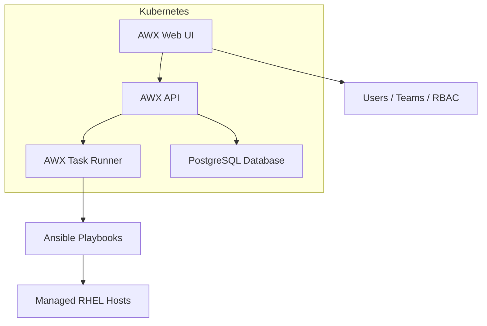

# How to Set Up Ansible AWX on RHEL

Author: [nawazdhandala](https://www.github.com/nawazdhandala)

Tags: RHEL, Ansible, AWX, Automation, Kubernetes, Linux

Description: Install and configure Ansible AWX on RHEL using the AWX Operator on a single-node Kubernetes cluster for a web-based automation platform.

---

AWX is the open-source upstream project for Red Hat Ansible Automation Platform. It gives you a web UI, REST API, role-based access control, and job scheduling for your Ansible playbooks. On RHEL, the recommended way to deploy AWX is using the AWX Operator on Kubernetes.

## Architecture



## Prerequisites

You need a RHEL system with at least:
- 4 CPU cores
- 8 GB RAM
- 40 GB disk space
- A container runtime (Podman or Docker)

## Step 1: Install Minikube (Single-Node K8s)

For a single-node deployment, Minikube is the simplest path:

```bash
# Install required packages
sudo dnf install -y curl conntrack

# Download minikube
curl -LO https://storage.googleapis.com/minikube/releases/latest/minikube-linux-amd64
sudo install minikube-linux-amd64 /usr/local/bin/minikube

# Start minikube with podman driver
minikube start --cpus=4 --memory=6g --driver=podman --addons=ingress

# Verify the cluster is running
minikube status
```

Alternatively, you can install kubectl:

```bash
# Install kubectl
curl -LO "https://dl.k8s.io/release/$(curl -L -s https://dl.k8s.io/release/stable.txt)/bin/linux/amd64/kubectl"
sudo install kubectl /usr/local/bin/kubectl

# Verify connectivity
kubectl get nodes
```

## Step 2: Install the AWX Operator

```bash
# Install kustomize
curl -s "https://raw.githubusercontent.com/kubernetes-sigs/kustomize/master/hack/install_kustomize.sh" | bash
sudo mv kustomize /usr/local/bin/

# Create a directory for the AWX deployment
mkdir -p ~/awx-deploy && cd ~/awx-deploy

# Create the kustomization file
cat > kustomization.yaml << KUSTOMIZE
apiVersion: kustomize.config.k8s.io/v1beta1
kind: Kustomization
resources:
  # Install the AWX Operator from GitHub
  - github.com/ansible/awx-operator/config/default?ref=2.12.2
# Set the namespace for the operator
namespace: awx
KUSTOMIZE

# Apply the operator
kubectl create namespace awx
kustomize build . | kubectl apply -f -

# Wait for the operator to be ready
kubectl -n awx wait --for=condition=available deployment/awx-operator-controller-manager --timeout=300s
```

## Step 3: Deploy AWX

```bash
# Create the AWX instance definition
cat > awx-instance.yaml << AWXDEF
apiVersion: awx.ansible.com/v1beta1
kind: AWX
metadata:
  name: awx
  namespace: awx
spec:
  # Number of web replicas
  replicas: 1
  # Admin account settings
  admin_user: admin
  # The password will be stored in a secret
  admin_password_secret: awx-admin-password
  # PostgreSQL settings
  postgres_storage_class: standard
  postgres_storage_requirements:
    requests:
      storage: 10Gi
  # Project persistence
  projects_persistence: true
  projects_storage_size: 5Gi
AWXDEF

# Create the admin password secret
kubectl -n awx create secret generic awx-admin-password \
  --from-literal=password='YourStrongPassword123!'

# Add AWX instance to kustomization
cat > kustomization.yaml << KUSTOMIZE
apiVersion: kustomize.config.k8s.io/v1beta1
kind: Kustomization
resources:
  - github.com/ansible/awx-operator/config/default?ref=2.12.2
  - awx-instance.yaml
namespace: awx
KUSTOMIZE

# Apply the full deployment
kustomize build . | kubectl apply -f -
```

## Step 4: Monitor the Deployment

```bash
# Watch the AWX pods come up
kubectl -n awx get pods -w

# Check the AWX operator logs for progress
kubectl -n awx logs -f deployment/awx-operator-controller-manager -c awx-manager

# Wait for all pods to be ready (this takes several minutes)
kubectl -n awx wait --for=condition=ready pod -l app.kubernetes.io/name=awx --timeout=600s
```

## Step 5: Access the Web UI

```bash
# Get the service URL
minikube service awx-service -n awx --url

# Or use port-forwarding
kubectl -n awx port-forward service/awx-service 8080:80 &

# The AWX UI is now available at http://localhost:8080
# Login with: admin / YourStrongPassword123!
```

## Step 6: Configure AWX

After logging in, set up the basics:

### Add an Inventory

```bash
# You can also use the AWX CLI (awxkit)
pip3 install awxkit

# Login to AWX
awx login --conf.host http://localhost:8080 \
  --conf.username admin \
  --conf.password 'YourStrongPassword123!'

# Create an inventory
awx inventory create --name "RHEL Servers" --organization Default

# Add hosts to the inventory
awx hosts create --name "web1.example.com" --inventory "RHEL Servers"
awx hosts create --name "web2.example.com" --inventory "RHEL Servers"
```

### Add Machine Credentials

In the web UI:
1. Go to Credentials
2. Click Add
3. Select "Machine" credential type
4. Enter the SSH key or password for your managed hosts

### Add a Project (Git Repository)

```bash
# Create a project linked to your Git repo
awx projects create \
  --name "RHEL Playbooks" \
  --organization Default \
  --scm_type git \
  --scm_url "https://git.example.com/ansible/rhel-playbooks.git" \
  --scm_branch main
```

### Create a Job Template

```bash
# Create a job template
awx job_templates create \
  --name "Patch RHEL Servers" \
  --project "RHEL Playbooks" \
  --playbook "playbook-patch.yml" \
  --inventory "RHEL Servers" \
  --credential "RHEL SSH Key"
```

## Step 7: Open the Firewall

```bash
# If accessing AWX from outside the server
sudo firewall-cmd --permanent --add-port=8080/tcp
sudo firewall-cmd --reload
```

## Verifying the Installation

```bash
# Check all AWX pods are running
kubectl -n awx get pods

# Expected output:
# awx-postgres-0                    1/1     Running   0
# awx-task-xxxxx                    4/4     Running   0
# awx-web-xxxxx                     3/3     Running   0
# awx-operator-controller-manager   2/2     Running   0

# Check AWX version
kubectl -n awx exec deployment/awx-web -- awx-manage version
```

## Wrapping Up

AWX on RHEL gives you a proper automation platform with a web interface, RBAC, audit logging, and job scheduling. The Kubernetes-based deployment with the AWX Operator is the supported path, and Minikube makes it practical on a single server. For production use, consider using a proper Kubernetes cluster or OpenShift instead of Minikube. The initial setup takes some effort, but once running, AWX makes it much easier for teams to collaborate on Ansible automation without everyone needing command-line access.
