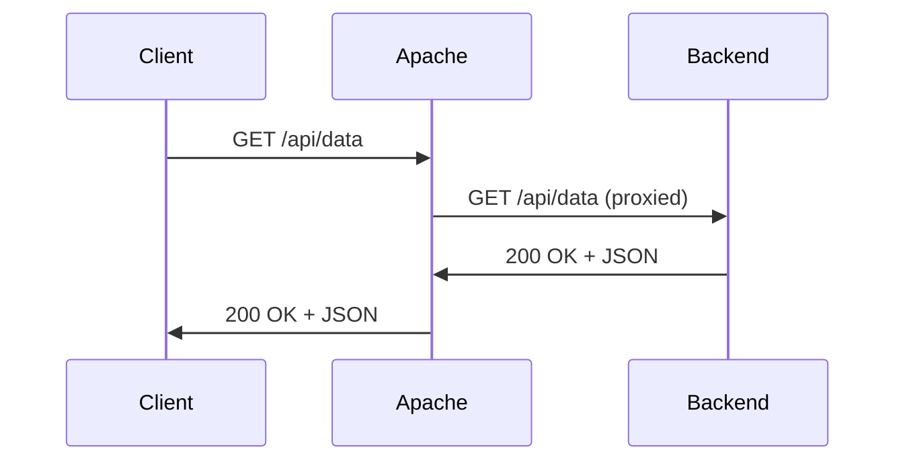

# How to Set Up Apache as a Reverse Proxy on RHEL

Author: [nawazdhandala](https://www.github.com/nawazdhandala)

Tags: RHEL, Apache, Reverse Proxy, Linux

Description: Learn how to configure Apache httpd as a reverse proxy to forward requests to backend application servers on RHEL.

---

## What Is a Reverse Proxy?

A reverse proxy sits between the client and your backend application servers. The client talks to Apache, and Apache forwards the request to the backend. The client never communicates directly with the backend. This is useful for TLS termination, load distribution, caching, and keeping your application servers off the public internet.

## Prerequisites

- RHEL with Apache httpd installed
- A backend application running on a local port (e.g., Node.js on port 3000)
- Root or sudo access

## Step 1 - Enable the Required Modules

Apache needs the proxy modules loaded. On RHEL, they are included but may not be active:

```bash
# Check if proxy modules are loaded
httpd -M | grep proxy
```

You should see `proxy_module`, `proxy_http_module`, and possibly others. These are loaded via `/etc/httpd/conf.modules.d/00-proxy.conf`. If the file exists, the modules are available.

## Step 2 - Basic Reverse Proxy Configuration

Create a virtual host that forwards all requests to a backend:

```bash
# Create a reverse proxy virtual host config
sudo tee /etc/httpd/conf.d/app-proxy.conf > /dev/null <<'EOF'
<VirtualHost *:80>
    ServerName app.example.com

    # Forward all requests to the Node.js backend on port 3000
    ProxyPreserveHost On
    ProxyPass / http://127.0.0.1:3000/
    ProxyPassReverse / http://127.0.0.1:3000/

    ErrorLog /var/log/httpd/app-proxy-error.log
    CustomLog /var/log/httpd/app-proxy-access.log combined
</VirtualHost>
EOF
```

`ProxyPreserveHost On` passes the original `Host` header to the backend, which most applications need to generate correct URLs.

## Step 3 - Proxy a Specific Path

Instead of proxying everything, you can forward only specific paths:

```apache
<VirtualHost *:80>
    ServerName www.example.com
    DocumentRoot /var/www/html

    # Only proxy /api requests to the backend
    ProxyPass /api http://127.0.0.1:3000/api
    ProxyPassReverse /api http://127.0.0.1:3000/api

    # Everything else is served from DocumentRoot
    <Directory /var/www/html>
        Require all granted
    </Directory>
</VirtualHost>
```

## Step 4 - Handle SELinux

SELinux on RHEL blocks Apache from making outgoing network connections by default. You need to enable the `httpd_can_network_connect` boolean:

```bash
# Allow Apache to make network connections to backend servers
sudo setsebool -P httpd_can_network_connect 1
```

Without this, you will get 503 errors and see `Permission denied` in the error log.

## Step 5 - Proxy with HTTPS Backend

If your backend uses HTTPS:

```apache
# Proxy to an HTTPS backend
SSLProxyEngine On
ProxyPass / https://127.0.0.1:8443/
ProxyPassReverse / https://127.0.0.1:8443/
```

If the backend uses a self-signed certificate:

```apache
# Skip certificate verification for internal backends
SSLProxyVerify none
SSLProxyCheckPeerCN off
SSLProxyCheckPeerName off
SSLProxyCheckPeerExpire off
```

Only use this for internal backends that you trust. Never disable verification for external services.

## Step 6 - Set Proxy Timeouts

Backend applications sometimes take a while to respond. Adjust the timeout:

```apache
# Increase proxy timeout to 120 seconds for slow backends
ProxyTimeout 120
```

## Step 7 - Pass Client IP to the Backend

By default, the backend sees Apache's IP as the client. Use mod_remoteip or set headers:

```apache
# Forward the real client IP to the backend
RequestHeader set X-Forwarded-For "%{REMOTE_ADDR}s"
RequestHeader set X-Forwarded-Proto "%{REQUEST_SCHEME}s"
```

Your backend application should be configured to trust these headers from Apache's IP.

## Reverse Proxy Flow



## Step 8 - Load Balancing Multiple Backends

Apache can distribute traffic across multiple backends:

```apache
# Load balance across three backend servers
<Proxy "balancer://myapp">
    BalancerMember http://127.0.0.1:3001
    BalancerMember http://127.0.0.1:3002
    BalancerMember http://127.0.0.1:3003
    ProxySet lbmethod=byrequests
</Proxy>

ProxyPass / balancer://myapp/
ProxyPassReverse / balancer://myapp/
```

## Step 9 - Test and Apply

```bash
# Validate the config
sudo apachectl configtest

# Reload Apache
sudo systemctl reload httpd
```

Test the proxy:

```bash
# Verify the proxy is working
curl -I http://app.example.com
```

Check the error log if you get 503 errors:

```bash
# Look for proxy errors
sudo tail -20 /var/log/httpd/app-proxy-error.log
```

## Wrap-Up

Running Apache as a reverse proxy is a common production pattern. It gives you flexibility to handle TLS, serve static files directly, and route requests to different backends based on the URL path. The two things people most often forget are the SELinux boolean and `ProxyPreserveHost`. Get those right and the rest is straightforward.
