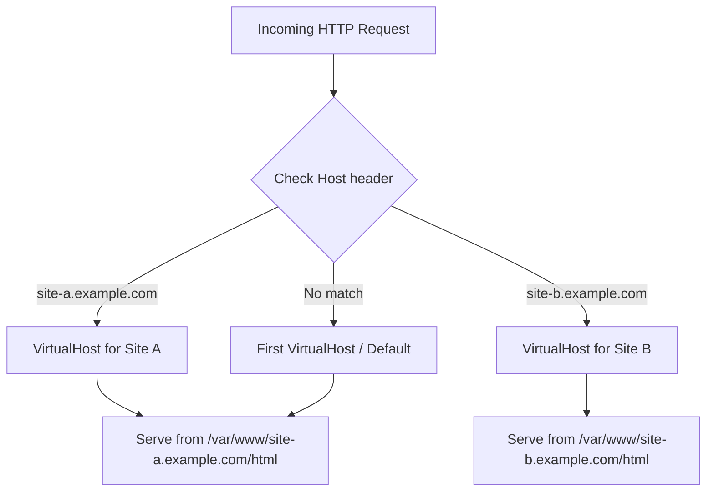

# How to Set Up Apache Virtual Hosts on RHEL 9

Author: [nawazdhandala](https://www.github.com/nawazdhandala)

Tags: RHEL, Apache, Virtual Hosts, Linux

Description: Learn how to serve multiple websites from a single Apache server on RHEL 9 using name-based virtual hosts.

---

## What Are Virtual Hosts?

Virtual hosts let you run multiple websites on a single Apache server. Each site gets its own configuration block, document root, and log files. When a browser sends a request, Apache uses the `Host` header to figure out which virtual host should handle it.

This is the standard way to host multiple domains on one box, and it works well whether you are running two sites or twenty.

## Prerequisites

- RHEL 9 with Apache httpd installed and running
- DNS records (or /etc/hosts entries) pointing your domains to the server IP
- Root or sudo access

## Step 1 - Create Document Roots

Set up separate directories for each site:

```bash
# Create document root directories for two sites
sudo mkdir -p /var/www/site-a.example.com/html
sudo mkdir -p /var/www/site-b.example.com/html
```

Add a test page to each:

```bash
# Create a simple index page for site-a
sudo tee /var/www/site-a.example.com/html/index.html > /dev/null <<'EOF'
<html><body><h1>Site A</h1></body></html>
EOF

# Create a simple index page for site-b
sudo tee /var/www/site-b.example.com/html/index.html > /dev/null <<'EOF'
<html><body><h1>Site B</h1></body></html>
EOF
```

Set ownership so Apache can read the files:

```bash
# Set proper ownership on both document roots
sudo chown -R apache:apache /var/www/site-a.example.com
sudo chown -R apache:apache /var/www/site-b.example.com
```

## Step 2 - Create Virtual Host Configuration Files

RHEL 9 uses `/etc/httpd/conf.d/` for drop-in config files. Create one file per site.

Configuration for site-a:

```bash
# Create the virtual host config for site-a
sudo tee /etc/httpd/conf.d/site-a.example.com.conf > /dev/null <<'EOF'
<VirtualHost *:80>
    ServerName site-a.example.com
    ServerAlias www.site-a.example.com
    DocumentRoot /var/www/site-a.example.com/html

    <Directory /var/www/site-a.example.com/html>
        AllowOverride All
        Require all granted
    </Directory>

    ErrorLog /var/log/httpd/site-a-error.log
    CustomLog /var/log/httpd/site-a-access.log combined
</VirtualHost>
EOF
```

Configuration for site-b:

```bash
# Create the virtual host config for site-b
sudo tee /etc/httpd/conf.d/site-b.example.com.conf > /dev/null <<'EOF'
<VirtualHost *:80>
    ServerName site-b.example.com
    ServerAlias www.site-b.example.com
    DocumentRoot /var/www/site-b.example.com/html

    <Directory /var/www/site-b.example.com/html>
        AllowOverride All
        Require all granted
    </Directory>

    ErrorLog /var/log/httpd/site-b-error.log
    CustomLog /var/log/httpd/site-b-access.log combined
</VirtualHost>
EOF
```

## Step 3 - Validate and Reload

Always check your config before reloading:

```bash
# Test Apache configuration for syntax errors
sudo apachectl configtest
```

If the output says `Syntax OK`, reload:

```bash
# Reload Apache to activate the new virtual hosts
sudo systemctl reload httpd
```

## Step 4 - Fix SELinux Labels

If you created the document roots outside `/var/www/html`, you need to make sure the SELinux context is correct:

```bash
# Restore SELinux labels on both document roots
sudo restorecon -Rv /var/www/site-a.example.com/
sudo restorecon -Rv /var/www/site-b.example.com/
```

Since we used paths under `/var/www/`, the labels should already be correct, but it does not hurt to verify.

## Step 5 - Test the Virtual Hosts

If you do not have DNS set up, add entries to your local machine's `/etc/hosts`:

```bash
# Add local DNS entries for testing (run on your client machine)
echo "192.168.1.100 site-a.example.com site-b.example.com" | sudo tee -a /etc/hosts
```

Now test with curl:

```bash
# Verify site-a responds correctly
curl -s http://site-a.example.com

# Verify site-b responds correctly
curl -s http://site-b.example.com
```

You should see the respective test pages for each domain.

## How Virtual Host Matching Works



## Setting a Default Virtual Host

The first `VirtualHost` block Apache encounters becomes the default for unmatched requests. If you want to control this explicitly, create a catch-all:

```bash
# Create a default virtual host that catches unmatched requests
sudo tee /etc/httpd/conf.d/00-default.conf > /dev/null <<'EOF'
<VirtualHost *:80>
    ServerName default.example.com
    DocumentRoot /var/www/html

    <Directory /var/www/html>
        Require all granted
    </Directory>
</VirtualHost>
EOF
```

The `00-` prefix ensures it loads first alphabetically.

## Useful Debugging Commands

```bash
# List all configured virtual hosts and their matching rules
httpd -S

# Check which modules are loaded
httpd -M
```

The `httpd -S` output is particularly helpful when you cannot figure out why a request is hitting the wrong virtual host.

## Wrap-Up

Name-based virtual hosts are straightforward on RHEL 9. One config file per site in `/etc/httpd/conf.d/`, a matching document root, and you are good to go. Keep your log files separate per site so troubleshooting stays manageable, and remember that the first virtual host acts as the default catch-all.
