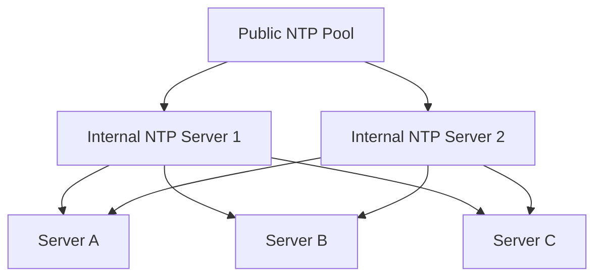
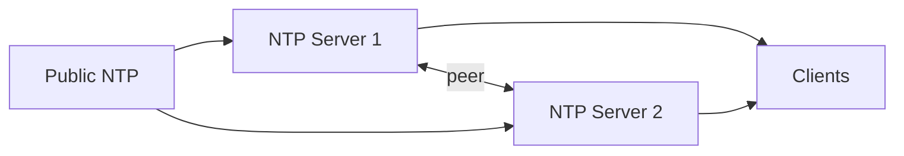

# How to Set Up a chrony NTP Server for Your Network on RHEL 9

Author: [nawazdhandala](https://www.github.com/nawazdhandala)

Tags: RHEL, chrony, NTP Server, Linux

Description: How to configure a RHEL 9 system as an NTP server using chrony to provide time synchronization to your local network.

---

Running your own NTP server is standard practice in any environment with more than a handful of servers. It reduces external network dependencies, gives you control over time accuracy, and keeps all your systems synchronized to the same source. On RHEL 9, chrony does double duty as both client and server with minimal configuration.

## Why Run a Local NTP Server

Instead of every server reaching out to the public NTP pool, you designate one or two systems as local time servers. They sync to external sources, and everything else syncs to them.



Benefits:

- Less external traffic
- Consistent time across your environment even if internet access goes down
- Easier to audit and control
- Required by some compliance frameworks

## Setting Up the NTP Server

### Step 1: Install and Enable chrony

chrony should already be installed. If not:

```bash
# Install chrony
sudo dnf install chrony
```

Enable and start it:

```bash
# Enable chrony to start on boot and start it now
sudo systemctl enable --now chronyd
```

### Step 2: Configure Upstream Sources

Edit `/etc/chrony.conf` to use reliable upstream NTP sources:

```bash
sudo vi /etc/chrony.conf
```

```
# Sync to multiple public NTP pools for redundancy
pool 0.rhel.pool.ntp.org iburst maxsources 4
pool 1.rhel.pool.ntp.org iburst maxsources 4

# If you have access to a stratum 1 server, prefer it
# server gps-ntp.corp.example.com iburst prefer

# Record the rate at which the system clock drifts
driftfile /var/lib/chrony/drift

# Step the clock on startup if offset is large
makestep 1.0 3

# Sync hardware clock
rtcsync

# Logging
log tracking measurements statistics
logdir /var/log/chrony
```

### Step 3: Allow Client Access

This is the key step that turns chrony from a client into a server. Add an `allow` directive specifying which networks can query this server:

```
# Allow NTP clients on the 10.0.0.0/8 network
allow 10.0.0.0/8

# Allow a specific subnet
allow 192.168.1.0/24

# Allow all (not recommended unless you know what you are doing)
# allow all
```

You can add multiple `allow` lines for different subnets.

To deny specific hosts within an allowed range:

```
# Deny a specific host
deny 10.0.1.50
```

### Step 4: Configure the Local Clock as a Fallback

If the server loses its upstream connection, you can configure it to serve time based on its own clock. This keeps clients synchronized to each other even if the time drifts slightly:

```
# Serve time from local clock if all upstream sources are lost
# Stratum 10 tells clients this is not highly accurate
local stratum 10
```

This is especially useful in environments where internet outages happen.

### Step 5: Restart chrony

```bash
# Restart to apply the new configuration
sudo systemctl restart chronyd
```

## Firewall Configuration

NTP uses UDP port 123. Open it for client access:

```bash
# Allow NTP through the firewall
sudo firewall-cmd --permanent --add-service=ntp
sudo firewall-cmd --reload
```

Verify:

```bash
# Confirm NTP is in the allowed services
sudo firewall-cmd --list-services
```

## Verifying the Server

### Check that chrony is Listening

```bash
# Verify chrony is listening on UDP 123
sudo ss -ulnp | grep 123
```

You should see `chronyd` listening on 0.0.0.0:123 (or :::123 for IPv6).

### Check Upstream Synchronization

```bash
# Show upstream NTP sources
chronyc sources -v
```

Make sure at least one source has an asterisk (`*`) indicating it is selected.

### Check Server Statistics

```bash
# Show how many clients are connected
chronyc clients
```

This shows all clients that have queried this server, along with their request counts.

### Check Detailed Tracking

```bash
# Show tracking details
chronyc tracking
```

The stratum should be one higher than your upstream source. If your upstream is stratum 2, this server will be stratum 3.

## Configuring Clients to Use Your Server

On each client system, edit `/etc/chrony.conf`:

```
# Point to the internal NTP servers
server ntp1.internal.example.com iburst
server ntp2.internal.example.com iburst
```

Remove or comment out any public pool entries if you want clients to only use internal servers.

Restart chrony on the clients:

```bash
# Restart chrony on the client
sudo systemctl restart chronyd
```

Verify from the client:

```bash
# Check that the client is syncing to the internal server
chronyc sources
```

## Setting Up a Redundant NTP Server

For production environments, run at least two NTP servers. Configure them identically for upstream sources, and have them peer with each other:

On NTP server 1 (10.0.0.1):

```
# Peer with NTP server 2
peer 10.0.0.2
```

On NTP server 2 (10.0.0.2):

```
# Peer with NTP server 1
peer 10.0.0.1
```

This way, if one server loses its upstream connection, the other can help keep it in sync.



## NTP Authentication for Clients

To prevent unauthorized clients from trusting a rogue NTP server, configure symmetric key authentication.

On the server, create keys:

```bash
# Edit the chrony key file
sudo vi /etc/chrony.keys
```

Add a key entry:

```
10 SHA1 HEX:E09A7B3C55D1F0E09A7B3C55D1F0E09A7B3C55D1
```

In `/etc/chrony.conf` on the server:

```
# Specify the key file
keyfile /etc/chrony.keys
```

On each client, add the same key file and reference it:

```
server ntp1.internal.example.com iburst key 10
keyfile /etc/chrony.keys
```

## Rate Limiting

If you serve many clients, consider rate limiting to prevent abuse:

```
# Limit NTP responses to prevent amplification attacks
ratelimit interval 1 burst 16
```

This limits each client to 1 request per second on average, with bursts of up to 16 packets.

## Monitoring the NTP Server

Keep an eye on your NTP server with these periodic checks:

```bash
# Quick health check script
#!/bin/bash
echo "=== NTP Server Health ==="
echo "Tracking:"
chronyc tracking | grep -E "Reference|Stratum|System time|Last offset"
echo ""
echo "Sources:"
chronyc sources
echo ""
echo "Client count:"
chronyc clients | wc -l
```

Monitor the stratum value. If it jumps to 10 (local clock), you have lost upstream connectivity and should investigate.

## Wrapping Up

Setting up an NTP server with chrony on RHEL 9 is straightforward. The key additions to a basic client config are the `allow` directive for client access and opening UDP port 123 in the firewall. For production, always run two servers in a peering arrangement and use the `local stratum 10` fallback to maintain internal consistency during upstream outages.
